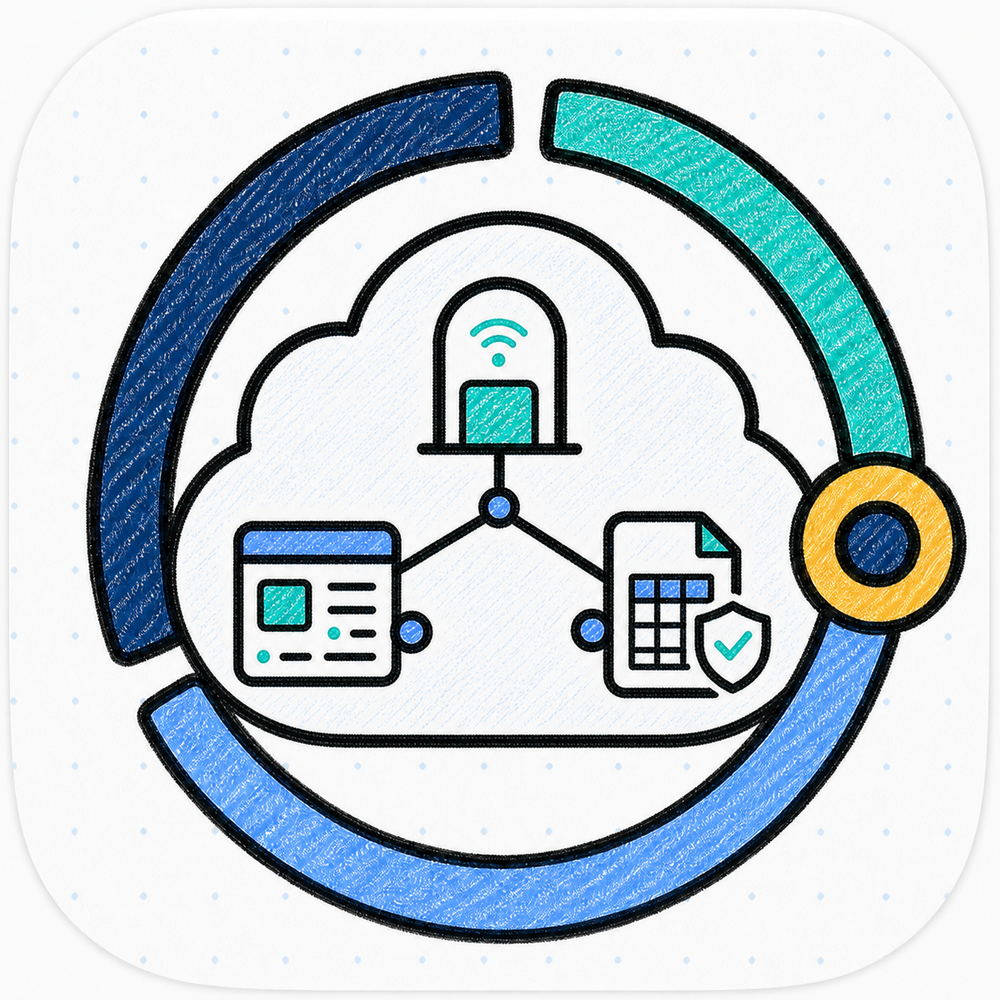
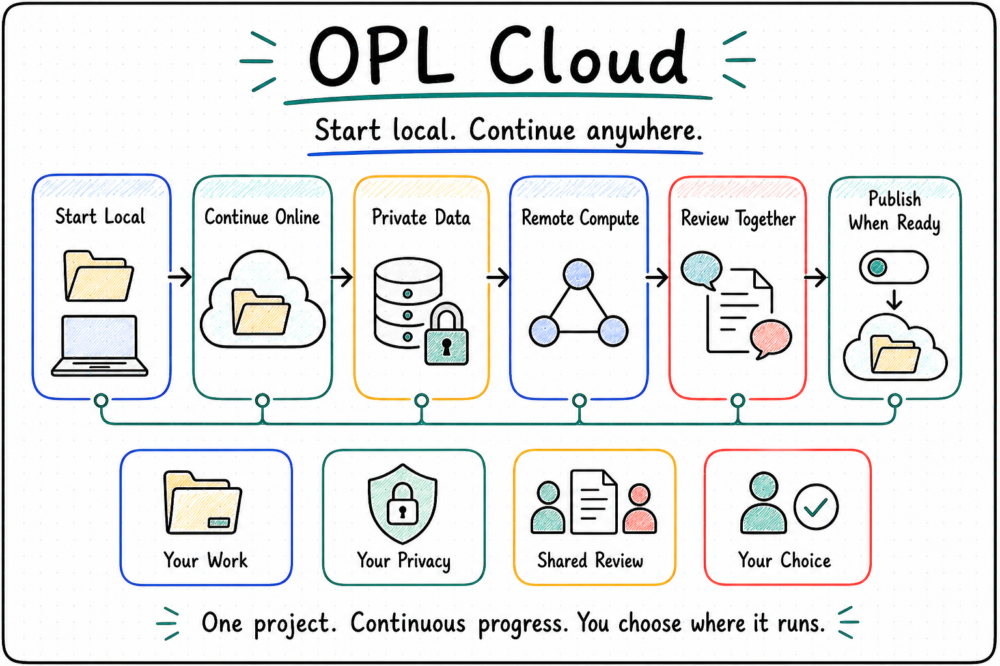

<p align="center">
  
</p>

<p align="center">
  <a href="./README.md"><strong>English</strong></a> | <a href="./README.zh-CN.md">中文</a>
</p>

<h1 align="center">OPL Cloud</h1>

<p align="center"><strong>Frontier AI infrastructure for One Person Lab</strong></p>
<p align="center">AI gateway · online workspace · agent serving · cloud console · resource fabric · evidence ledger</p>

<!--
Owner: `one-person-lab-cloud`
Purpose: `public_cloud_entry`
State: `active_public_entry`
Machine boundary: Human-readable product and architecture entry. Machine truth for App, Framework, Gateway services, Workspace runtime, billing, jobs, receipts, and release status remains with the owning repositories, services, contracts, runtime outputs, and owner receipts.
-->

<p align="center">
  
</p>

## Why OPL Cloud

One Person Lab is built for complex knowledge work: research, grants,
presentations, books, agents, and other projects that need progress, review,
revision, files, and evidence over many rounds.

OPL Cloud extends that work from a local workbench into online, collaboration, and
remote-resource workflows:

- Users access frontier AI capability through one stable OPL entry point.
- Users can work from OPL App locally or from OPL Workspace online with the
  same workbench model.
- Local App and cloud Workspace can both use the same literature, data, tool,
  compute, and evidence capabilities.
- Agent builders can publish an exact validated Agent revision as an API, Embed,
  or OPL-hosted UI without building a separate serving stack.
- Each user account has one primary OPL Workspace. Console manages that
  account's billing, permissions, quotas, approvals, and managed-resource policy.
- Remote jobs run on approved compute, storage, software environments, and
  external systems.
- Important results keep receipts, provenance, reviewer checks, and
  continuation entries.

**OPL Cloud is the cloud infrastructure layer for those workflows.**

## Public Role Boundary

This repository is the public navigation surface for the OPL Cloud target
product architecture and implementation family: OPL Gateway, OPL Workspace,
OPL Serve, OPL Console, OPL Fabric, and OPL Ledger. It explains why those
surfaces are separate and how they relate to OPL App, OPL Framework, MAS, and
domain systems. It does not imply that every documented service is already
delivered.

The Workspace identity is fixed at `1 user account -> 1 primary OPL
Workspace`. Collaboration shares refs, artifacts, approved resources, and
policy around user-owned workspaces; it does not create a separate multi-tenant
Web product. See [Workspace Identity And External SaaS Boundary](docs/workspace-identity-and-external-saas-boundary.md).

OPL Cloud is not a replacement for OPL Framework. Runtime truth for task
execution, App behavior, service state, Gateway APIs, Workspace runtime,
Console governance, Fabric resources, Ledger receipts, billing, release status,
and owner acceptance remains with the owning Framework, App, service
implementations, contracts, runtime outputs, and owner receipts.

Externally, OPL Cloud exposes OPL Gateway, OPL Workspace, OPL Serve, and OPL
Console as user-visible products. Internally, it provides OPL Fabric and OPL
Ledger as reusable platform capabilities. Local OPL App is the local workbench
surface, OPL Workspace is the cloud workbench surface, and OPL Serve publishes
an exact Agent revision to external consumers. OPL Console governs account
permission, billing, resource policy, and approval. OPL Packages owns
Agent/capability package manifest, digest, install, lock, update, rollback, and
repair. Cloud surfaces consume those refs and do not maintain a second package
registry.

## Product Map

| Layer | Brand | Role | Surface |
| --- | --- | --- | --- |
| AI access | **OPL Gateway** | Models, keys, routing, provider policy, and usage metering | Product |
| User workbench | **OPL Workspace / OPL App integration** | Cloud OPL App and local OPL App share the same project work, task session, artifact preview, and result delivery model | Product / local entry |
| Agent serving | **OPL Serve** | Publish an exact Agent revision as an API, Embed, or Hosted UI | Product |
| Management | **OPL Console** | User account, billing, quotas, single-Workspace lifecycle, and managed-resource policy | Product |
| Resource substrate | **OPL Fabric** | Connect, Compute, Storage, Environments, Gateway/App/Workspace adapters, connectors, and execution adapters | Platform |
| Evidence record | **OPL Ledger** | Job receipts, artifact provenance, reviewer gates, audit records, continuation refs | Platform |

## Module Boundaries

| Module | Position | Direct consumers |
| --- | --- | --- |
| OPL App | Local workbench and first-class Cloud capability caller | Users, MAS, domain agents |
| OPL Workspace | Cloud OPL App workbench using the same capability model as local OPL App | Users, MAS, domain agents |
| OPL Serve | Agent publishing product for external APIs, embeds, Hosted UI, revisions, deployments and traffic | Agent publishers, external consumer Apps and sites |
| OPL Fabric | General resource substrate for connectors, compute, storage, environments, and execution adapters | App, Workspace, Console, MAS, domain agents |
| OPL Connect | Connector capability inside Fabric for stable access, APIs, normalized source refs, error behavior, and rate-limit behavior | App, Workspace, MAS, domain agents; Console when governance applies |
| OPL Console | Governance surface for account-managed resources, credentials, quotas, approvals, billing, audit, and lifecycle | Users and operators |
| OPL Ledger | Receipt and provenance record for requests, source refs, outputs, review refs, and continuation entries | App, Workspace, Console, MAS, domain agents |
| OPL Packages | Framework-owned package manifest, digest, install, lock, update, rollback, and repair lifecycle | App, Workspace, Console, Fabric, domain agents consume refs/actions |
| MAS / ScholarSkills | Domain strategy, literature intent, quality judgment, evidence synthesis, writing, and review behavior | MAS workflows and domain users |

Console governs resources that are hosted by OPL Cloud or brought under
explicit managed policy. It is not the only call path. Local OPL App, cloud OPL
Workspace, Serve through Runway, MAS, and approved domain agents can call Fabric
and Connect through capability profiles. Ledger records receipts and provenance
from those calls; it does not own connector implementation or domain judgment.

## Core Highlights

**OPL Gateway stays top-level**<br/>
Gateway is the directly visible AI access, metering, and billing surface. It is
the first available capability foundation for OPL Cloud.

**OPL App and OPL Workspace are equivalent workbench surfaces**<br/>
OPL App is the local workbench. OPL Workspace is the cloud OPL App workbench.
Users open projects, start tasks, inspect job status, preview
artifacts, receive reviewer feedback, and collect deliverables from either
surface.

**OPL Serve turns an Agent revision into an external service**<br/>
Agent builders publish an exact OPL Package digest as a stable Agent Service,
immutable Revision, and controlled Deployment. External consumers use an API,
Embed, or optional Hosted UI. The public Agent Edge is separate from Workspace,
sandbox, and provider endpoints; every client uses the same service contract.

**OPL Console is the management plane for managed resources**<br/>
Console is the account and managed-resource governance surface. It manages
billing, permissions, the user's single Workspace lifecycle, connector
approvals, environment policy, and resource quotas. User-provided local, SSH,
HPC, literature, database, or tool resources can also use the standard Fabric
flow; when those resources enter explicit shared policy, Console becomes the
management surface. Console may permit an exact OPL Package ref but cannot
install, update, lock, or repair it.

**OPL Fabric does the resource work**<br/>
Fabric contains Connect, Compute, Storage, Environments, Gateway/App/Workspace
adapters, resource bindings, and execution adapters. OPL Connect provides
stable access to shared data sources, tool APIs, databases and institutional
systems. Ordinary users see productized choices such as literature search,
standard compute, GPU acceleration, private data buckets, or institutional HPC.

**OPL Ledger makes results accountable**<br/>
Ledger records the plan, approval, commands or code, environment, input refs,
output refs, reviewer results, owner, and continuation entry for meaningful
Cloud work.

## OPL Fabric

OPL Fabric is the resource and connector substrate behind OPL Cloud.

```text
OPL Fabric
├─ OPL Connect        databases, literature sources, tools, APIs, external resources
├─ OPL Compute        Docker, VM, GPU, SSH, HPC, managed workers
├─ OPL Environments   reproducible software environments and runtime templates
├─ Gateway adapters   AI access profiles, usage signals, provider policy links
├─ Package bindings   OPL Packages manifest/lock refs and resource requirements
└─ Workspace Storage      workspace volumes, private buckets, institutional storage refs
```

Together, these capabilities let OPL App and OPL Workspace connect materials,
use tools, obtain compute resources, and run tasks in the right software
environment.

OPL Connect carries stable shared access, API shape, normalized source refs,
credential boundaries, errors, retries, and rate limits. Domain-specific
access and normalization stay with the domain adapter when their semantics are
not generic. Medical PubMed access currently belongs to the MAS adapter; Cloud
does not expose a compatibility command or readiness claim for it.

## Skill-first Collaboration

OPL Cloud supports a skill-first capability path: MAS, ScholarSkills, and other
domain owners maintain strategy, quality judgment, and writing or review
behavior; OPL Connect handles stable connector access, API behavior,
normalization, source refs, errors, and rate limits; OPL Ledger records receipts
and provenance.

```text
domain skill prototype
-> stable connector behavior
-> OPL Connect inside OPL Fabric
-> MAS / Workspace / App capability profile call
-> normalized refs into MAS evidence workflow
-> optional OPL Ledger receipt refs
```

This keeps MAS and other domain systems in control of domain truth while mature
connector capabilities become reusable OPL Cloud platform capabilities.

## OPL Ledger

OPL Ledger is the evidence layer for remote work and result delivery.

Every meaningful App, Workspace, Serve, or Cloud-managed job can leave a
receipt:

```text
plan → approval → run → artifacts → reviewer checks → receipt → continuation
```

Ledger records what happened, which inputs and environments were used, which
outputs were produced, what checks ran, and how the work can be resumed or
reviewed later. Ledger records receipts and provenance; it does not replace the
domain truth, quality judgment, or delivery authority owned by MAS, MAG, RCA,
BookForge, or another domain owner.

## Core Delivery Path

OPL Cloud is organized around one complete delivery path with an optional
external-service branch:

1. Gateway: AI access, key management, routing, usage, and billing data.
2. Workspace: one primary online OPL App workbench per user account, with access, storage, and a resource plan.
3. Serve: exact Agent Revision publishing through API, Embed, or Hosted UI.
4. Console: user, policy, Gateway/Serve usage, and Workspace/service governance.
5. Fabric: compute paths, storage paths, software environments, and connector
   capabilities.
6. Ledger: inspectable receipts for App actions, Workspace actions, Serve
   deployments/invocations, and managed jobs.

HPC, GPU workers, literature databases, institutional storage, and software
environment catalogs can enter OPL Cloud through the same Fabric flow.

## Documentation

- [OPL Cloud Whitepaper](https://gaofeng21cn.github.io/one-person-lab-cloud/latest/whitepapers/opl-cloud-whitepaper.html)
- [OPL Cloud Whitepaper PDF](https://gaofeng21cn.github.io/one-person-lab-cloud/latest/whitepapers/opl-cloud-whitepaper.pdf)
- [Product Matrix](docs/product-matrix.md)
- [Architecture](docs/architecture.md)
- [Workspace Identity And External SaaS Boundary](docs/workspace-identity-and-external-saas-boundary.md)
- [Platform Capability Gaps](docs/platform-capability-gaps.md)
- [OPL Gateway](docs/opl-gateway.md)
- [OPL Workspace](docs/opl-workspace.md)
- [OPL Serve](docs/opl-serve.md)
- [OPL Console](docs/opl-console.md)
- [OPL Fabric](docs/opl-fabric.md)
- [OPL Connect](docs/opl-connect.md)
- [OPL Ledger](docs/opl-ledger.md)
- [OPL Agent Lifecycle](docs/agent-lifecycle.md)
- [Research Provenance](docs/research-provenance.md)
- [Shared Execution Contract](docs/contracts/shared-execution-contract.md)
- [Agent Service Publication Contract](docs/contracts/agent-service-publication-contract.md)
- [Ledger Receipt Schema](docs/contracts/ledger-receipt-schema.md)
- [Retired Agent Registry Entry](docs/contracts/agent-registry-entry.md)
- [Resource Ownership and Billing](docs/contracts/resource-ownership-and-billing.md)
- [Workspace Lifecycle](docs/workspace-lifecycle.md)
- [Console Governance and Billing](docs/console-governance-and-billing.md)
- [Fabric Adapter Contract](docs/fabric-adapter-contract.md)
- [Roadmap](docs/roadmap.md)

## Technical Entry

<details>
  <summary><strong>Developer and operator notes</strong></summary>

This repository currently contains product positioning, planning, branding, and
architecture documentation. Gateway services, the Serve control plane and Agent
Edge, Console implementation, Workspace runtime, Runway execution, Fabric
adapters, Ledger storage, and billing systems live in their owning implementation
surfaces.

Readiness, release, billing, runtime, security, and reproducibility claims come
from the owning service, repository, contract, runtime readback, or owner
receipt.

### Repository Layout

```text
one-person-lab-cloud/
  assets/              README and product visual assets
  docs/                Cloud product, architecture, and roadmap notes
  README.md            English public entry
  README.zh-CN.md      Chinese public entry
```

### Minimum Checks

```bash
python3 - <<'PY'
from pathlib import Path
import re
missing = []
for f in Path('.').rglob('*.md'):
    text = f.read_text(encoding='utf-8')
    for m in re.finditer(r'\[[^\]]+\]\(([^)#][^)]+)\)', text):
        target = m.group(1)
        if '://' in target or target.startswith('mailto:'):
            continue
        if not (f.parent / target).resolve().exists():
            missing.append((str(f), target))
if missing:
    raise SystemExit(missing)
print('local_links_ok')
PY
```

</details>
