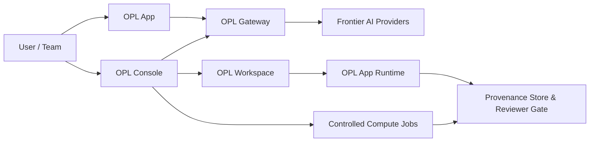

# OPL Cloud

OPL Cloud is the cloud infrastructure layer for One Person Lab.

It provides frontier AI access, online OPL workspaces, controlled compute,
usage metering, and reproducible evidence chains for AI-native research and
agent workflows.

## Product Matrix

| Product | Role | Status |
| --- | --- | --- |
| OPL Gateway | Frontier AI capability gateway, API access, token management, and usage metering | Available |
| OPL Console | Cloud management console for accounts, billing, workspaces, permissions, and operations | In development |
| OPL Workspace | Managed online OPL App workspace with isolated URL, account, password, compute, and storage | In development |

OPL Cloud is not a second OPL App. OPL App remains the local-first user
workspace. OPL Cloud provides the remote control plane, compute plane, gateway,
and evidence plane that can extend App and team workflows.

## Architecture

## Current Scope

- OPL Gateway is the first available Cloud component.
- OPL Console and OPL Workspace are under development.
- Public Gateway integration assets may live outside this repository until a
  dedicated implementation repository exists.
- This repository is the public product and architecture entry point for OPL
  Cloud.

## Design Principles

- Cloud is the control plane, not another chat app.
- Sensitive data should stay with the owner by default.
- Remote work should follow plan, approve, run, receipt.
- Artifacts should preserve enough provenance to be audited and resumed later.
- Capability packs should be curated around OPL domains, not exposed as a
  generic plugin marketplace.

## Documentation

- [Product Matrix](docs/product-matrix.md)
- [Architecture](docs/architecture.md)
- [OPL Gateway](docs/opl-gateway.md)
- [OPL Console](docs/opl-console.md)
- [OPL Workspace](docs/opl-workspace.md)
- [Research Provenance](docs/research-provenance.md)
- [Roadmap](docs/roadmap.md)

