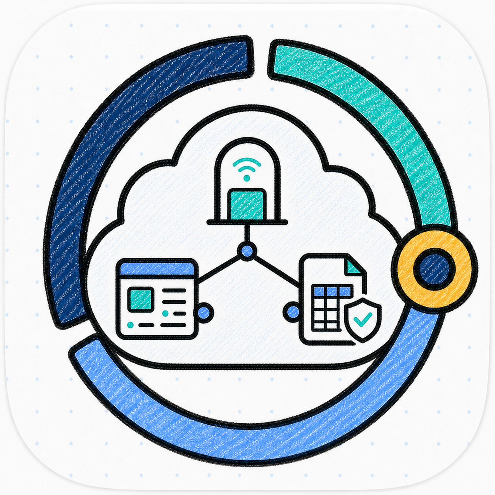
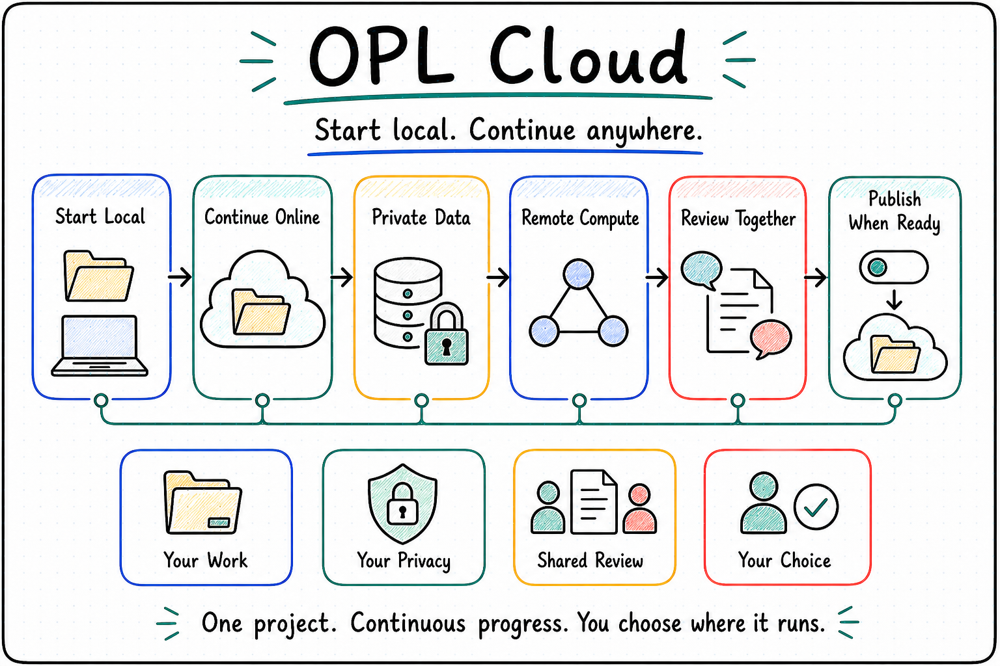

<p align="center">
  
</p>

<p align="center">
  <a href="./README.md"><strong>English</strong></a> | <a href="./README.zh-CN.md">中文</a>
</p>

<h1 align="center">OPL Cloud</h1>

<p align="center"><strong>Keep complex One Person Lab work moving in the cloud</strong></p>
<p align="center">AI access · Online workbenches · Agent services · Governed resources · Continuous evidence</p>

<!--
Owner: `one-person-lab-cloud`
Purpose: `public_cloud_entry`
State: `active_public_entry`
Machine boundary: Human-readable product and architecture entry. This repository also owns the Cloud implementation, but documentation, source, tests, or builds do not prove deployed service state, billing truth, release status, domain conclusions, or owner acceptance.
-->

<p align="center">
  
</p>

## Why OPL Cloud

Research, grants, presentations, books, and Agent development rarely finish in
one session or on one machine. Work may start locally, then need private data,
remote compute, and human review before becoming a service that others can use.
When those stages live in unrelated tools, project state, permissions, cost,
and evidence gradually fall out of sync.

OPL Cloud keeps those needs in one OPL work chain:

- continue a local OPL App project in an online OPL Workspace;
- use approved models, data sources, software environments, storage, and compute
  without moving the owner's authority;
- publish an exact, verified Agent Revision as an API, embed, or hosted UI;
- keep approval, usage, provenance, review, and continuation connected to the
  original work;
- leave professional judgment with the responsible domain Agent and human owner.

OPL Cloud is the fourth product layer in the stable OPL ecology and is under active implementation:
`OPL Base` supplies the Framework Host, `OPL App` supplies the local workbench,
`OPL Packages` supply installable capabilities, and Cloud adds online Workspace,
governance, hosted resources, collaboration, and Agent services. Cloud consumes
their owner references; it does not replace Base, publish Packages, or create a
second Cordis Host.

## Product Model

| User need | Product surface | Responsibility |
| --- | --- | --- |
| AI access and usage | **OPL Gateway** | Model access, routing, provider policy, and usage signals |
| Online project work | **OPL Workspace** | Zero or more independent cloud workbenches per account |
| External Agent use | **OPL Serve** | Exact Service, immutable Revision, Deployment, API, Embed, and Hosted UI |
| Account governance | **OPL Console** | Account policy, approvals, quota, billing, and managed-resource policy |
| Data, tools, and compute | **OPL Fabric** | Connect, Compute, Storage, Environments, and execution adapters |
| Evidence continuity | **OPL Ledger** | Receipts, provenance, review, and continuation refs |

Package owners retain stable identity, capabilities, entrypoints, and exact
published revisions. Configured native carriers retain physical installation,
update, removal, and fresh installed/callable readback. OPL Framework aggregates
discovery, carrier delegation, Package state, and shared execution semantics;
OPL Runway owns Invocation and Session execution lifecycle; domain Agents retain
professional policy, quality, artifact, and delivery authority. Cloud surfaces
consume those owner and carrier references without creating competing truth.

## MVP Focus

The first product slice is intentionally narrow: a thin Console for essential
Workspace, balance, and usage management; a real
`Console -> Control Plane -> Workspace launcher/provider -> local Docker`
creation and management path for OPL App/WebUI Workspaces; and authoritative
Gateway accounting through Sub2API without a second wallet. Self-service
signup, payment/top-up, and detailed UI refinement are later work.

The repository contains a `local-docker` Workspace provider for supported
Linux hosts. It requires Workspace storage on a dedicated ext4/XFS mount with
project quota enabled and fails readiness when the host cannot enforce it.

Source capability, a public Product Release, and a concrete Instance are three
different evidence layers. The only public Product Release, `v0.1.7`, predates
the current ten-asset Compose split and does not contain the current complete
Workspace installation path. See [current capability](docs/status.md) for
verified implementation and runtime facts, [installation](docs/installation.md)
for the exact public-release boundary, and the [roadmap](docs/roadmap.md) for
open end-to-end outcomes.

## One Continuous Work Chain

```text
Local OPL App project
-> continue in an online OPL Workspace when needed
-> use approved Gateway and Fabric capabilities
-> return results and review to the workbench
-> preserve review and continuation refs in Ledger
-> publish an exact Agent Revision through OPL Serve when the service is ready
```

Each account may own zero or more independent OPL Workspaces. Every Workspace
has its own stable identity, URL, runtime, resource binding, billing period,
credentials, and receipts. OPL Cloud imposes no fixed product-level Workspace
limit; every creation remains subject to balance, provider capacity, quota, and
policy. An account may also publish multiple Agent Services because a Service is
a deployment resource, not a Workspace.

## Repository Boundary

`one-person-lab-cloud` is the single OPL Cloud product and implementation
repository. It owns the public vision, target architecture, whitepaper, roadmap,
Console, Control Plane, Fabric, Ledger, Workspace delivery, machine contracts,
portable installation assets, GHCR images, GitHub Releases, and reusable
provider adapters. `opl-cloud` remains the short identifier for
npm packages, images, binaries, services, namespaces, environment variables,
and runner labels; it is not a second repository.

`opl-instance-medopl` is the only owner of the `medopl` instance's domains,
Tencent/TKE selection, enabled subset of Cloud-defined plans, production
environment and Secrets, deployment workflows, image pins, rollback, and
receipts. Cloud Control Plane owns versioned customer prices. The Instance
consumes an immutable Cloud product SHA and image digest without copying product
source.
A design, contract, generated artifact, passing test, or published image does
not prove that an instance is deployed or ready.

Capability, health, security, billing, release, and acceptance claims require
fresh implementation, machine-contract, runtime, and owner evidence. The
[roadmap](docs/roadmap.md) is the only current owner of open Cloud gaps and next
steps; it is not a readiness dashboard.

## Start Here

- [Read the OPL Cloud whitepaper](https://gaofeng21cn.github.io/one-person-lab/latest/whitepapers/opl-cloud-whitepaper.html)
- [Documentation and owner map](docs/README.md)
- [Architecture and authority boundaries](docs/architecture.md)
- [Current implementation capability](docs/status.md)
- [Public Release and Candidate installation boundaries](docs/installation.md)
- [Current gaps and next steps](docs/roadmap.md)
- [Workspace identity and external SaaS boundary](docs/workspace-identity-and-external-saas-boundary.md)

<details>
  <summary><strong>Development and operations</strong></summary>

### Repository Layout

```text
one-person-lab-cloud/
  apps/                Console user interface
  assets/              Public brand and user-journey assets
  contracts/           Whitepaper artifact profile
  deploy/              Portable installation and reusable adapter templates
  docs/                Product, implementation, planning, and provenance docs
  packages/contracts/  Current machine contracts
  scripts/             Whitepaper build and publication-request wrappers
  services/            Control Plane, Fabric, and Ledger
  tools/               Local, product-release, and reusable verification tools
```

Technical documentation starts at [docs/README.md](docs/README.md). Keep product
target, current implementation, instance configuration, and external owner truth
distinct; do not establish another Cloud writer.

### Contributing

Read [CONTRIBUTING.md](CONTRIBUTING.md) before opening a pull request. `main` is
protected by the strict `validate` aggregate check and resolved review
conversations; production and deployment claims still require their separate
authorization and evidence gates.

### Minimum Checks

```bash
node --experimental-strip-types scripts/build-opl-cloud-whitepaper.ts
npm test
npm run typecheck
npm run build
git diff --check
```

The whitepaper build proves artifact rendering only. Publication must use the
approved workflow and public exact-byte readback described in the
[whitepaper delivery evidence](docs/delivery/whitepapers/README.md).

</details>
