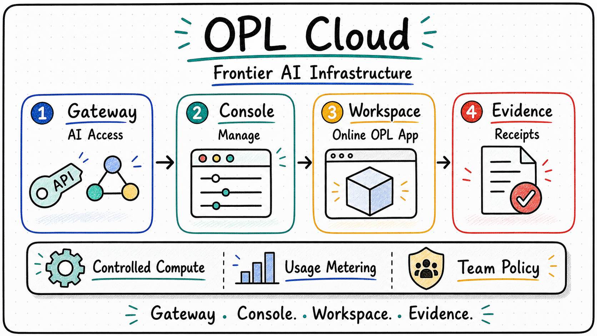

<p align="center">
  
</p>

<p align="center">
  <a href="./README.md">English</a> | <a href="./README.zh-CN.md"><strong>中文</strong></a>
</p>

<h1 align="center">OPL Cloud</h1>

<p align="center"><strong>One Person Lab 的云端前沿 AI 基础设施</strong></p>
<p align="center">AI 能力接入 · 在线 OPL 工作空间 · 受控计算 · 用量计量 · 可复现证据链</p>

<!--
Owner: `one-person-lab-cloud`
Purpose: `public_cloud_entry`
State: `active_public_entry`
Machine boundary: Human-readable product and architecture entry. Machine truth for App, Framework, Gateway services, Workspace runtime, billing, jobs, receipts, and release status remains with the owning repositories, services, contracts, runtime outputs, and owner receipts.
-->

## 为什么需要 OPL Cloud

One Person Lab 面向复杂知识工作：科研、基金、汇报、书籍、智能体和其他需要多轮推进、审查、修订、文件与证据的项目。

本地优先仍然重要。云端要解决的是另一组问题：

- 用户能否通过一个稳定的 OPL 入口使用前沿 AI 能力？
- 用户能否启动在线 OPL App 工作空间，而不需要理解 Docker 主机、计算节点和存储位置？
- 长时间运行的计算任务能否留下 receipt，而不是只留在日志里？
- 团队能否在一个控制台里管理用量、账单、权限和工作空间生命周期？
- 科研与智能体产物能否保留足够的 provenance，便于审查、复现和后续继续？

**OPL Cloud 是为这些问题设计的云端基础设施层。**

它不是第二个 OPL App。OPL App 仍然是 local-first 的用户工作空间；OPL Cloud 提供远端控制面、AI 能力入口、在线工作空间、受控计算路径与证据链能力，把 OPL 从单机体验扩展到在线和团队工作流。

## 核心亮点

**OPL Gateway 是 AI 能力基座**<br/>
Gateway 是第一个已可用的 Cloud 组件，提供前沿 AI API 统一接入、Token 管理、模型接入、用量可视化和 OPL 下游工作流支持。

**在线 OPL 工作空间**<br/>
OPL Workspace 是规划中的云端工作空间产品：每个 workspace 应提供独立 URL、账号、密码、计算配置、存储配置和打包计费。

**面向用户的控制台，而不是基础设施面板**<br/>
OPL Console 应管理账号、组织、账单、权限、Gateway 用量和 Workspace 生命周期。Docker 主机、计算节点和存储位置应留在产品边界之后，只有诊断需要时才暴露。

**受控计算和 receipt**<br/>
远端任务应遵循清晰的路径：计划、批准、执行、回收产物、留下 receipt。Local Docker、远端 VM、GPU worker、SSH 和类 HPC 执行可以逐步统一到同一套 job contract。

**面向科研和智能体工作流的证据链**<br/>
Cloud-side provenance 应保留输入、代码、命令、环境、owner、reviewer 检查和继续入口的 refs，但不把 Cloud 变成敏感原始数据的 owner。

**精选能力包，而不是插件市场**<br/>
OPL Cloud 应支持团队批准过的 MAS、MAG、RCA、BookForge 和未来 Foundry Agent capability packs。普通用户看到的是专业入口，而不是技能、连接器和 runtime 的原始清单。

## 产品矩阵

| 产品 | 定位 | 状态 |
| --- | --- | --- |
| **OPL Gateway** | 前沿 AI 能力入口，负责 API 接入、Token 管理、模型路由与用量计量 | 已可用 |
| **OPL Console** | 云端管理控制台，负责账号、组织、账单、权限、工作空间与运维管理 | 开发中 |
| **OPL Workspace** | 在线 OPL App 工作空间，提供独立 URL、凭证、计算、存储与计费包 | 开发中 |
| **Evidence Services** | Provenance store、reviewer gate、artifact receipt 与策略检查 | 规划中 |

## 产品边界

OPL Cloud 是产品总品牌和架构入口，不应该成为 OPL App、OPL Framework、domain agents 或 Gateway 服务内部实现的第二真相源。

| 仓库或产品 | 负责 |
| --- | --- |
| [`one-person-lab`](https://github.com/gaofeng21cn/one-person-lab) | OPL Framework、runtime contracts、CLI、stage execution、progress 和 evidence 接口 |
| [`one-person-lab-app`](https://github.com/gaofeng21cn/one-person-lab-app) | 桌面 App、Docker/WebUI 用户体验、打包、发布资产、GUI contracts |
| **OPL Gateway** | AI 能力接入、Token 管理、模型路由、用量计量和 Gateway integration assets |
| **OPL Console** | 云端账号、组织、账单、工作空间、权限和运维管理 |
| **OPL Workspace** | 在线 OPL App runtime 实例与 workspace 生命周期 |

在 dedicated OPL Gateway public repo 出现前，Gateway 的公开脚本和接入材料可以先作为 integration assets 被引用。本仓库负责把 OPL Cloud 的公开产品叙事、架构和路线图放在一起。

## 当前状态

- OPL Gateway 已可用，应被表达为 OPL Cloud 的 AI 能力基座，而不是普通 Token 平台。
- OPL Console 和 OPL Workspace 正在开发中。
- Research provenance、reviewer gate、job adapter 和 team capability packs 属于规划中的 Cloud 能力。
- 敏感数据默认留在用户 workspace、机构存储或私有 bucket；Cloud 默认保存 refs、metadata、lineage、receipts、usage 和 policy records，除非用户另行配置。

## 文档

- [产品矩阵](docs/product-matrix.md)
- [架构](docs/architecture.md)
- [OPL Gateway](docs/opl-gateway.md)
- [OPL Console](docs/opl-console.md)
- [OPL Workspace](docs/opl-workspace.md)
- [Research Provenance](docs/research-provenance.md)
- [Roadmap](docs/roadmap.md)

## 技术入口

<details>
  <summary><strong>Developer and operator notes</strong></summary>

本仓库当前承载产品与架构文档，不发布 Gateway 服务、Console 实现、Workspace runtime 或 billing system。

任何 readiness、release、billing、runtime 或 security claim，都必须回到对应 owner 的服务、仓库、contract、runtime readback 或 owner receipt。本仓库解释公开产品边界，不证明线上可用性。

### Repository Layout

```text
one-person-lab-cloud/
  assets/              README and product visual assets
  docs/                Cloud product, architecture, and roadmap notes
  README.md            English public entry
  README.zh-CN.md      Chinese public entry
```

</details>

