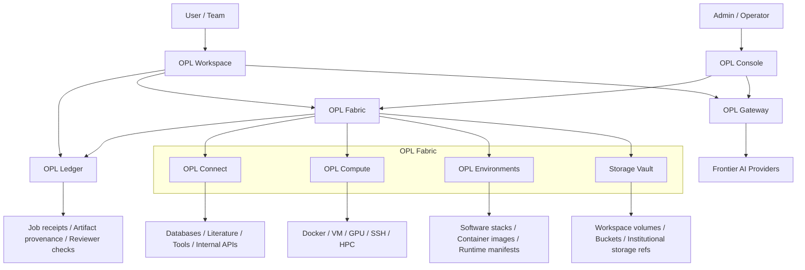

# OPL Cloud Architecture

OPL Cloud is organized around three product surfaces and two platform
capabilities.

```text
OPL Cloud
├─ OPL Gateway       frontier AI access, keys, routing, usage
├─ OPL Workspace     online OPL App workbench and artifact surface
├─ OPL Console       organization, billing, permissions, lifecycle, policy
├─ OPL Fabric        compute, storage, environments, connectors, adapters
└─ OPL Ledger        receipts, provenance, reviewer gates, audit records
```



## Surface Roles

| Surface | Role |
| --- | --- |
| OPL Gateway | AI access, model routing, key management, provider policy, and usage metering |
| OPL Workspace | Online OPL App workbench, project sessions, job status, artifact preview, and result delivery |
| OPL Console | Account, organization, billing, quota, permission, workspace lifecycle, connector approval, and resource policy |
| OPL Fabric | Compute pool, storage vault, environment catalog, connector registry, and execution adapters |
| OPL Ledger | Plan, approval, command/code, environment, input refs, output refs, reviewer result, owner, and continuation entry |

## Data Boundary

Cloud should store refs, metadata, lineage, receipts, usage, policy, and billing
records. Sensitive source data should remain in user workspaces, institutional
storage, or private buckets by default.

