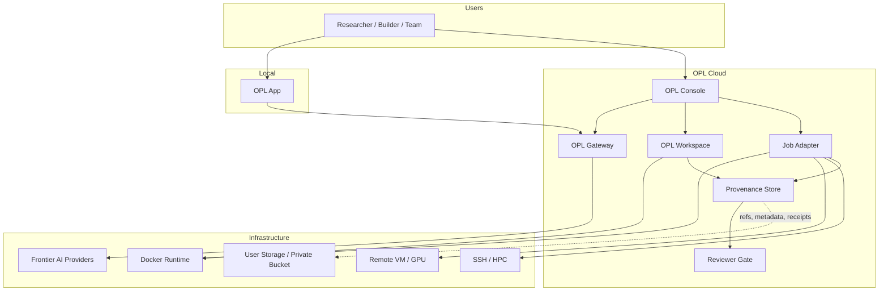

# OPL Cloud Architecture

OPL Cloud is organized around four platform surfaces:

1. Gateway: AI model access, token management, provider routing, and usage data.
2. Console: user, organization, billing, workspace, permission, and operations
   management.
3. Workspace: managed OPL App runtime instances with isolated URLs and
   credentials.
4. Evidence: job receipts, artifact provenance, reviewer checks, and audit
   records.

## Boundary

Cloud may store refs, metadata, lineage, receipts, usage, policy, and billing
records. Sensitive source data should remain in user-controlled workspace,
institutional storage, or private buckets unless explicitly configured
otherwise.

