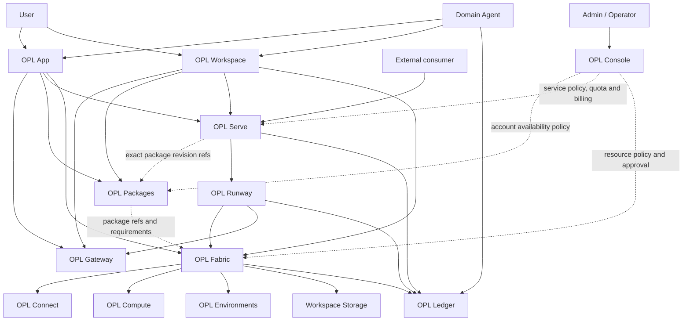

# OPL Cloud Architecture

OPL Cloud is the target product architecture and implementation-family
navigation surface for extending OPL work from a local App into online
workspaces, account-managed resources and remote execution. This document
defines responsibility boundaries; it does not claim that every service is
currently deployed.

```text
OPL Cloud
├─ OPL Gateway       user-visible AI access, routing and usage
├─ OPL Workspace     user-visible cloud workbench
├─ OPL Serve         Agent API, Embed and Hosted UI publishing
├─ OPL Console       account policy, approval, quota and billing
├─ OPL Fabric        Connect, Compute, Storage, Environments and adapters
└─ OPL Ledger        receipt and provenance refs

OPL Framework
├─ OPL Packages      manifest, digest, install, lock, update, rollback and repair
└─ OPL Runway       invocation, session and execution-provider lifecycle

Domain agents        domain strategy, quality verdict and delivery authority
```



## Surface Roles

| Surface | Owner responsibility | Explicit non-owner boundary |
| --- | --- | --- |
| OPL Gateway | AI access, routing, provider policy and usage signals | Package state and domain quality |
| OPL Workspace | Cloud workbench, project state, artifacts and user-visible status | Package lifecycle and resource truth |
| OPL Serve | Agent Service, immutable Revision, Deployment, endpoint, traffic and Hosted UI projection | Package lifecycle, sandbox internals and domain verdicts |
| OPL Console | Account, quota, approval, billing and managed-resource policy | Package install/update/repair and job execution |
| OPL Fabric | Connector, compute, storage and environment availability; resource binding and execution adapters | Package registry/lock and domain verdicts |
| OPL Ledger | Receipt, provenance, review and continuation refs | Source data, package truth and domain verdicts |
| OPL Packages | Discovery, validated manifest, digest, dependency closure, install, lock, update, rollback, repair and lifecycle receipt | Account policy and domain truth |
| OPL Runway | Invocation/session lifecycle and execution-provider routing | Service identity, package lifecycle and domain verdicts |
| Domain agent | Domain strategy, evidence judgment, quality verdict and delivery authority | Cloud infrastructure truth |

## Workspace Identity Boundary

Each user account owns exactly one primary OPL Workspace. Projects, tasks,
files, artifacts and continuation entries are contained within that Workspace;
they do not create additional Workspace instances. Collaboration shares refs,
approved resources and policy without creating a multi-tenant workbench truth.

The OPL App active shell provides the browser carrier. External multi-user SaaS
experiments are not Cloud implementation owners or maintenance targets. The
full decision and excluded repositories are recorded in
[Workspace Identity And External SaaS Boundary](workspace-identity-and-external-saas-boundary.md).

Agent Services do not change this identity. One account can publish multiple
Services because they are deployment resources for external consumers, not
additional Workspace instances or shared workbench truths.

## Service Publication Boundary

OPL Serve publishes an exact package revision through a dedicated Agent Edge:

```text
Agent Package exact digest
-> Service Entrypoint Contract
-> Agent Service
-> immutable Agent Revision
-> Deployment and traffic policy
-> API / Embed / Hosted UI
-> Invocation or Session
```

The Agent Edge owns public authentication, request validation, rate limits,
quota, routing, event streaming and signed Webhooks. Public traffic does not
terminate at a Workspace, sandbox, container or external provider session.

Runway owns the OPL Invocation and Session lifecycle and routes each exact
revision to an approved execution-provider adapter. The OPL-native Runway/Fabric
path and any external managed-Agent runtime remain adapters; their identifiers
are refs, not OPL Service or Deployment truth.

Hosted UI and Embed clients consume the same Serve API. They may project an
Agent's schemas, events, artifacts and publisher branding, but cannot bypass
Serve authentication, policy, quota or receipts.

## Execution Boundary

OPL App and OPL Workspace use the same resource execution pattern:

```text
plan -> approve -> execute -> monitor -> collect -> receipt
```

Console applies account or explicit shared policy when a workspace, connector
or resource is Cloud-hosted or managed. Fabric performs the approved resource
binding and execution. User-provided local, SSH or HPC resources can use the
same pattern without becoming Console-billed resources by default.

## Package Lifecycle Boundary

There is no Cloud-owned Agent Registry. `opl packages` is the only package
lifecycle and lock authority. Its validated manifest and lifecycle receipt are
the source for package identity, version, digest, dependencies and current
installation state.

Cloud surfaces consume those refs without redefining them:

- Console projects whether account policy permits a package ref and which
  quotas or managed resources may use it.
- Fabric reads package requirements and binds compute, storage, environments
  and connectors for a run.
- App and Workspace display current package state and actions from Framework.
- Ledger may record package lock and lifecycle receipt refs for later review.

None of these projections can install, update, roll back, repair or create a
second package registry truth.

## Connector And Domain Boundary

OPL Connect owns stable connector access, normalized source refs, credential
boundaries, errors, retries and rate limits. Domain-specific adapters and
domain agents own retrieval strategy, evidence selection, synthesis and quality
judgment. Ledger records refs only.

The current OPL connector surface and any domain-specific adapter must be read
from fresh Framework/domain contracts and runtime readback. A target connector
described in Cloud docs is not a readiness claim.

## Data Boundary

Cloud stores refs, metadata, lineage, receipts, usage and policy records.
Sensitive source data remains in user workspaces, institutional storage or
private buckets by default. A Cloud receipt points back to the owning source; it
does not become a second source of truth.

External service traffic adds a consumer identity, data classification,
retention, deletion and egress boundary. Serve and Console must resolve those
policies before Runway selects a provider or Fabric binds resources.

## Currentness Boundary

This repository explains the target product split. Service availability comes
from the corresponding implementation repo, API contract, runtime health and
owner receipt. Framework package state comes from `opl packages` readback.
Contract presence, documentation, a successful build or an empty queue does not
prove Cloud, package, domain or production readiness.
