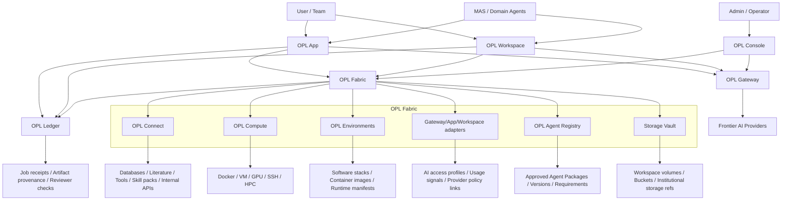

# OPL Cloud Architecture

OPL Cloud is organized around three Cloud product surfaces, one local workbench
consumer, domain-agent callers, and two platform capabilities.

```text
OPL Cloud
├─ OPL Gateway       user-visible frontier AI access, keys, routing, usage
├─ OPL Workspace     user-visible cloud Docker/WebUI OPL App surface
├─ OPL Console       user-visible organization, billing, permissions, lifecycle, policy
├─ OPL App           local workbench consumer of Cloud platform capabilities
├─ MAS / agents      domain strategy, evidence judgment, writing, review
├─ OPL Fabric        Connect, Compute, Storage, Environments, adapters, agents
└─ OPL Ledger        receipts, provenance, reviewer gates, audit records
```



## Surface Roles

| Surface | Role |
| --- | --- |
| OPL Gateway | User-visible AI access, model routing, key management, provider policy, and usage metering |
| OPL Workspace | User-visible cloud Docker/WebUI OPL App surface with isolated access URL, account, storage, and optional package |
| OPL Console | User-visible management surface for account, organization, billing, quota, permission, managed workspace lifecycle, connector approval, and resource policy |
| OPL App | Local OPL workbench surface that can directly use Gateway, Fabric, and Ledger capabilities |
| MAS / domain agents | Domain strategy, query intent, quality judgment, synthesis, writing, review behavior, and delivery authority |
| OPL Fabric | Connect, Compute, Storage, Environments, Gateway/App/Workspace adapters, agent registry, and execution adapters |
| OPL Ledger | Plan, approval, command/code, environment, input refs, output refs, reviewer result, owner, and continuation entry |

## Execution Boundary

OPL App and OPL Workspace use the same resource execution pattern:

```text
plan → approve → execute → monitor → collect → receipt
```

The pattern is a standard workbench and Fabric capability. Console becomes the
management surface when resources are OPL Cloud-hosted or organization-managed.
User-provided local, SSH, or HPC resources can use the same pattern without
being Console-billed resources by default.

## Reusable Platform Capabilities

OPL Fabric and OPL Ledger are shared platform capabilities, not private backend
modules of OPL Console. Console governs OPL Cloud-hosted or
organization-managed usage. App, Workspace, MAS, and other domain agents call
approved Fabric, Connect, and Ledger capabilities directly through capability
profiles when policy allows it.

The module organization is:

| Capability | Owner responsibility |
| --- | --- |
| OPL Fabric | General resource substrate: Connect, Compute, Storage, Environments, agent registry, and execution adapters |
| OPL Connect | Stable connector access, API behavior, normalized source refs, credential boundaries, errors, retries, and rate limits |
| OPL Console | Organization governance for managed resources, credentials, quotas, approvals, billing, audit, and lifecycle |
| OPL Ledger | Receipt and provenance refs; no connector implementation or domain-quality authority |
| OPL App / Workspace | Workbench entry points that call capabilities through profiles and present status, artifacts, and receipts |
| MAS / ScholarSkills | Domain strategy, evidence selection, quality floors, writing, and review |

For literature access, the intended flow is:

```text
MAS skill
-> OPL Connect PubMed read-only connector
-> normalized literature refs
-> MAS evidence workflow
-> optional OPL Ledger receipt refs
```

OPL App and OPL Workspace use the same Connect path through their workbench
capability profiles.

This lets high-frequency skill prototypes mature into stable platform
connectors without moving domain judgment into Fabric. Domain owners keep the
primary skill. Enhancement packs supply references, packs, and quality floors.
Connect handles stable access and connector semantics. Ledger records receipt
and provenance refs.

## Data Boundary

Cloud stores refs, metadata, lineage, receipts, usage, policy, and billing
records. Sensitive source data remains in user workspaces, institutional
storage, or private buckets by default.

## Agent Lifecycle Boundary

OPL Meta Agent can create an Agent Blueprint and Agent Package candidate. OPL
Console approves package versions and access policy. OPL Fabric records approved
packages in OPL Agent Registry and binds each App or Workspace Agent Instance
to compute, storage, environments, and connectors. OPL App or OPL Workspace
exposes the Agent Instance to users, and OPL Ledger records each Agent Run.
