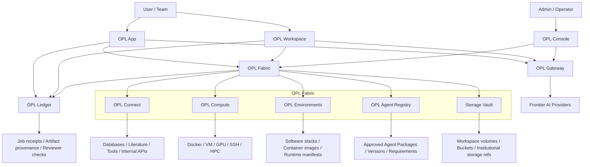

# OPL Cloud Architecture

OPL Cloud is organized around three product surfaces and two platform
capabilities.

```text
OPL Cloud
├─ OPL Gateway       frontier AI access, keys, routing, usage
├─ OPL App           local user workbench surface
├─ OPL Workspace     cloud Docker/WebUI OPL App surface
├─ OPL Console       organization, billing, permissions, lifecycle, policy
├─ OPL Fabric        compute, storage, environments, connectors, agents, adapters
└─ OPL Ledger        receipts, provenance, reviewer gates, audit records
```



## Surface Roles

| Surface | Role |
| --- | --- |
| OPL Gateway | AI access, model routing, key management, provider policy, and usage metering |
| OPL App | Local OPL workbench surface for project sessions, job status, artifact preview, and result delivery |
| OPL Workspace | Cloud Docker/WebUI OPL App surface with isolated access URL, account, storage, and optional package |
| OPL Console | Account, organization, billing, quota, permission, managed workspace lifecycle, connector approval, and resource policy |
| OPL Fabric | Compute pool, storage vault, environment catalog, connector registry, agent registry, and execution adapters |
| OPL Ledger | Plan, approval, command/code, environment, input refs, output refs, reviewer result, owner, and continuation entry |

## Execution Boundary

OPL App and OPL Workspace should use the same resource execution pattern:

```text
plan → approve → execute → monitor → collect → receipt
```

The pattern is a standard workbench and Fabric capability. Console becomes the
management surface when resources are OPL Cloud-hosted or organization-managed.
User-provided local, SSH, or HPC resources can use the same pattern without
being Console-billed resources by default.

## Reusable Platform Capabilities

OPL Fabric and OPL Ledger are shared platform capabilities, not private backend
modules of OPL Console. Console governs managed usage. App and Workspace can
call reusable capabilities directly through their capability profiles.

For literature access, the intended flow is:

```text
MAS agent
-> OPL App or OPL Workspace
-> OPL Connect / PubMed connector
-> normalized literature refs
-> MAS evidence workflow
-> OPL Ledger receipt refs when recorded
```

This lets high-frequency skill prototypes mature into stable platform
connectors without moving domain judgment into Fabric.

## Data Boundary

Cloud should store refs, metadata, lineage, receipts, usage, policy, and billing
records. Sensitive source data should remain in user workspaces, institutional
storage, or private buckets by default.

## Agent Lifecycle Boundary

OPL Meta Agent can create an Agent Blueprint and Agent Package candidate. OPL
Console approves package versions and access policy. OPL Fabric records approved
packages in OPL Agent Registry and binds each App or Workspace Agent Instance
to compute, storage, environments, and connectors. OPL App or OPL Workspace
exposes the Agent Instance to users, and OPL Ledger records each Agent Run.
