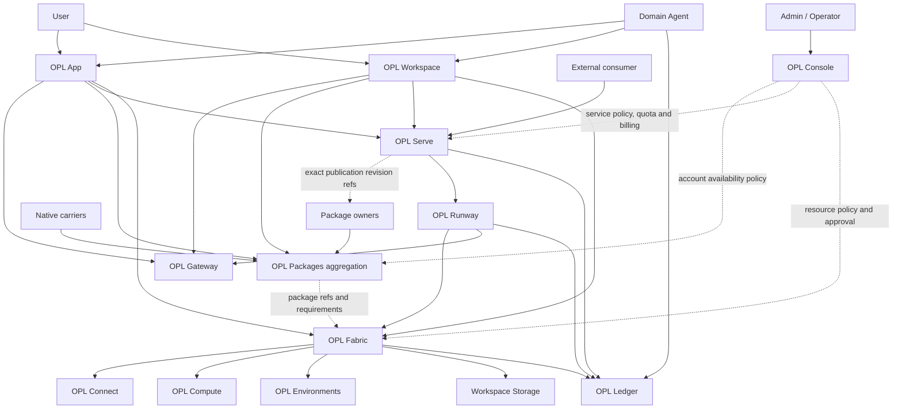

# OPL Cloud Architecture

Owner: `one-person-lab-cloud`
Purpose: `architecture_boundary`
State: `active_target_reference`
Machine boundary: Canonical human-readable target architecture; implementation
and readiness come from lower-layer owners and readback.

OPL Cloud is the target product architecture and implementation-family
navigation surface for extending OPL work from a local App into online
workspaces, account-managed resources and remote execution. This document
defines responsibility boundaries; it does not claim that every service is
currently deployed.

## OPL Family Position

The stable external product model is `OPL Base + OPL App + OPL Packages + OPL
Cloud`. OPL Cloud is the online product layer under active implementation;
individual Cloud capabilities are adopted according to the user's work. Internally these are separate
authorities:

```text
OPL Base           Framework runtime product; implemented by the scoped Framework Cordis Host
OPL Packages       independently published installable capabilities and owner revisions
OPL Framework      Host-side discovery/projection and runtime/state/action producer
one-person-lab-app App product, Client profile, GUI ABI and release authority
opl-aion-shell     current Stable AionUI Shell carrier
opl-studio         candidate DSH/Cordis Application Host and delivery carrier
OPL Cloud          Console, Control Plane, Fabric, Ledger and Workspace product
```

Cloud is not a second Framework Host and does not own the desktop App or either
Shell. A desktop or browser Shell may render Cloud projections through the same
App-owned contribution and state/action ABI, while Cloud services retain their
process, database, API, release and provider authorities. Changing the selected
App Shell therefore does not migrate Cloud authority or make Cloud a GUI plugin.

The name `Console` appears in two layers but does not identify one authority:
the Framework Console contribution is an in-process read-model/inspection
projection; OPL Console in this repository is the account and administrator
product for policy, quota, approval, Workspace and billing views.

## Family Capability Domains And Cloud Surfaces

Names such as Console, Workspace, Fabric, Ledger, Connect, Runway, and Packages
are OPL family capability domains: stable product and responsibility language
that may span Framework, App, Cloud, and domain products. They are not a fixed
count of Framework source modules, repositories, published packages, or Cordis
plugins. A domain keeps one conceptual name while each repository owns only its
explicit authority surface.

The composition model is:

```text
OPL family capability domain
  -> repository/product-specific authority surface
       -> versioned Package, service image, contract, or other artifact
            -> host-specific contribution where a host exists
                 -> curated product/profile composition
```

These boundaries are intentionally independent. A capability domain may have no
resident plugin, one artifact may contribute multiple plugins, and a Cloud
service may expose a typed API without becoming a Package or Cordis plugin.
Versioning and replacement follow the artifact with a real release cadence, not
the family domain name or a mechanically preserved module count.

For Cloud, the authority surfaces are concrete products and services:

| Family capability domain | Cloud authority surface | Boundary outside Cloud |
| --- | --- | --- |
| Console | Cloud Console and Control Plane own the account/control-plane product, Workspace policy, approval, quota and billing projection | Framework may expose operator/readiness/action projections; App owns local product interaction, neither owns Cloud policy or service state |
| Workspace | Control Plane owns Cloud Workspace entitlement, Launch and application deployment coordination; Fabric owns runtime/resource binding and readback | The selected application owns its business behavior and data formats; Framework owns only its scoped runtime composition |
| Fabric | Fabric owns provider-neutral remote resource facts, mutation ports and provider adapters | Framework and App consume typed adapters and cannot acquire provider or deployment authority |
| Ledger | Cloud Ledger owns Cloud receipts, reconciliation, idempotency, and caller-owned opaque provenance refs | Framework observers and product projections do not become the persistent Cloud Ledger or a review/continuation authority |
| Remote Companion / OPL Link | `opl-link/service` owns broker, pairing, capacity and provider transport authority | OPL Cloud only hosts Workspace/WebUI delivery and does not own a remote-companion route, provider, persistence or contract |
| Gateway / Wallet | Control Plane projects Gateway account data and coordinates settlement | Sub2API remains the external identity, spendable-wallet, Key, routing and usage authority |
| Packages / Connect / Runway | Cloud consumes exact owner refs, connector capabilities and execution results where required | Package owners, native carriers and Framework retain discovery, carrier currentness, connector access and invocation lifecycle |

This rebaseline keeps the family vocabulary useful without making a Cloud
directory, service, API, package, or plugin the owner of the whole brand.
```text
OPL Cloud
├─ OPL Gateway       user-visible AI access, routing and usage
├─ OPL Workspace     user-visible isolated application environment
├─ OPL Serve         Agent API, Embed and Hosted UI publishing
├─ OPL Console       account policy, approval, quota and billing
├─ OPL Fabric        Connect, Compute, Storage, Environments and adapters
└─ OPL Ledger        receipt and provenance refs

Package owners       identity, capabilities, entrypoints and publication revisions
Native carriers      install, update, remove and installed/callable readback

OPL Framework
├─ Package projection discovery, carrier delegation and state aggregation
└─ OPL Runway       invocation, session and execution-provider lifecycle

Domain agents        domain strategy, quality verdict and delivery authority
```

## Repository And Instance Topology

```text
one-person-lab-cloud
  product architecture, whitepaper, roadmap
  Console + Control Plane + Fabric + Ledger implementation
  reusable contracts, portable images and GitHub Releases
        | immutable product SHA + image digest
        v
opl-instance-medopl
  medopl customization, production environment, deployment, rollback and evidence
```

`one-person-lab-cloud` is the single product and implementation repository.
Console, Control Plane, Fabric, and Ledger remain logical service owners inside
it; similarly named prototype repositories are historical inputs, not parallel
current writers. The short identifier `opl-cloud` remains valid for packages,
images, binaries, services, namespaces, environment variables and runner
labels, but it is not a repository boundary.

An instance repository materializes one installation without copying product or
runtime code. It owns non-secret domains, provider selection, region and
resource profile, the enabled subset of Cloud-defined plans, image pins, secret
references, and deployment receipts. Cloud Control Plane owns the versioned
customer price catalog; an Instance cannot override it. An instance may run on
a hosted cloud or a supported Linux Docker host. macOS may run the
control-services profile, but Docker Desktop is not a supported Local-Docker
Workspace host under the current project-quota contract. Secrets remain in the
selected secret owner, never in the instance repository.

## Development And Supply-Chain Authority

GitHub Actions, dependency scanners, code scanners, and cloud coding agents are
development and evidence surfaces. They do not own OPL Cloud product intent,
module policy, runtime state, release identity, or instance production
authorization. Their output enters the repository through the same protected
branch, review-conversation, focused-test, and canonical-readback boundaries as
human-authored work.

The release trust boundary separates untrusted source, dependency, and image
build activity from the credentials that publish GHCR images and GitHub
Releases. Cloud owns the portable release and its verifiable identity. An
Instance consumes an exact Cloud release and independently owns deployment
approval and production readback. A content digest establishes immutability; an
approved repository or release manifest establishes source trust.

## Current Public Beta Cut

The reusable Cloud Core remains deliberately narrow: a thin Console, one
`local-docker` OPL Workspace path, and OPL Gateway accounting projected without
creating a second wallet. The current delivery target adds public account
registration with zero initial balance, administrator-operated wallet top-up,
and controlled Workspace purchase. Registration never purchases resources by
itself; the authoritative quote and Sub2API balance gate every purchase.

Customer-operated payment/top-up, shared multi-user Workspaces, HA, GPU, public
Agent Service publication, and broader managed-resource orchestration remain
later product layers rather than public-beta prerequisites.

Tencent/TKE is the medopl instance's current provider choice and production
implementation surface. Its source, workflow, and Instance evidence do not
define generic Cloud identity, MVP acceptance, or the portable provider
contract.

The portable product Release nevertheless contains and contract-tests both the
Local-Docker and Tencent/TKE adapters. They consume the same Cloud image and
provider-neutral contracts while receiving separate installation-owned
Workspace images, Provider Profiles, domains, and qualification receipts.


```mermaid
flowchart TB
  User[User] --> App[OPL App]
  User --> Workspace[OPL Workspace]
  Consumer[External consumer] --> Serve[OPL Serve]
  Admin[Admin / Operator] --> Console[OPL Console]
  Domain[Domain Agent] --> App
  Domain --> Workspace

  App --> Gateway[OPL Gateway]
  Workspace --> Gateway
  Owners[Package owners] --> Packages[OPL Packages aggregation]
  Carriers[Native carriers] --> Packages
  App --> Packages
  Workspace --> Packages
  Console -. account availability policy .-> Packages

  App --> Serve
  Workspace --> Serve
  Console -. service policy, quota and billing .-> Serve
  Serve -. exact publication revision refs .-> Owners
  Serve --> Runway[OPL Runway]

  App --> Fabric[OPL Fabric]
  Workspace --> Fabric
  Console -. resource policy and approval .-> Fabric
  Packages -. package refs and requirements .-> Fabric
  Runway --> Fabric
  Runway --> Gateway

  Fabric --> Connect[OPL Connect]
  Fabric --> Compute[OPL Compute]
  Fabric --> Environments[OPL Environments]
  Fabric --> Storage[Workspace Storage]
  Fabric --> Ledger[OPL Ledger]
  Runway --> Ledger
  Serve --> Ledger
  Domain --> Ledger
```

## Surface Roles

| Surface | Owner responsibility | Explicit non-owner boundary |
| --- | --- | --- |
| OPL Gateway | AI access, routing, provider policy and usage signals | Package state and domain quality |
| OPL Workspace | Application environment, access, entitlement and selected-deployment lifecycle | Application business state, Package lifecycle and provider resource truth |
| OPL Serve | Agent Service, immutable Revision, Deployment, endpoint, traffic and Hosted UI projection | Package lifecycle, sandbox internals and domain verdicts |
| OPL Console | Account onboarding, Workspace lifecycle, quota, approval, account-total billing view and managed-resource policy | Spendable wallet, package install/update/repair and resource execution |
| OPL Fabric | Provider-neutral connector, compute, storage and environment capabilities; resource binding and execution adapters | Customer balance, package identity, carrier state and domain verdicts |
| OPL Ledger | Receipt, opaque provenance, reconciliation and idempotency | Source data, package truth, review policy, continuation authorization and domain verdicts |
| Package owner | Stable identity, capabilities, entrypoints and exact publication revisions | Physical carrier state, Cloud policy and domain verdicts |
| Native carrier | Physical install, update, remove and fresh installed/callable readback | Package identity, Cloud policy and domain verdicts |
| OPL Packages | Carrier-neutral discovery, descriptor projection, configured-carrier delegation and fresh state aggregation | Parallel resolver/lock/currentness, account policy and domain truth |
| OPL Runway | Invocation/session lifecycle and execution-provider routing | Service identity, package lifecycle and domain verdicts |
| Domain agent | Domain strategy, evidence judgment, quality verdict and delivery authority | Cloud infrastructure truth |

## Workspace Application Boundary

A Workspace is an account-owned isolated application environment. It keeps its
identity, access entry, paid entitlement and owned data while its application
changes. OPL App is the default application and retains its own workbench,
Framework and Package authority. Other applications do not need to embed OPL,
Codex or an App Shell to run in a Workspace. This is an accepted target; the
[current Runtime ABI](implementation/workspace-runtime-access.md) still fixes
the OPL App port, credentials and mounts.

### Provisioning And Application Deployment

Resource provisioning and application installation are separate business
operations. A new Launch purchases and fulfills compute, storage, attachment
and the declared infrastructure readiness, then establishes the Workspace's
resource entitlement and purchase Receipt. It can complete with no application
installed; application health, an application password and an LLM Key are not
provisioning completion requirements.

In the initial scope, an authorized administrator selects a target Workspace,
registry connection, repository and image version, supplies the required
startup/configuration/data bindings and deploys onto those existing resources.
Account ownership alone does not grant application distribution authority;
customer self-service deployment is outside this scope. Deployment can fail or
be retried without repeating the purchase or reclassifying fulfilled resources
as an unfulfilled Launch. A convenience action that provisions and installs
composes two explicit operations; an installation failure does not erase
provisioning success.

Control Plane owns these independent business commands. Fabric separates
compute/storage provisioning ports from Runtime deployment/execution ports;
Runtime is another capability within the existing resource execution owner,
not logic embedded in resource purchase. No new process is needed to separate
these paths. Workspace resource readiness, deployment progress and application
availability are distinct projections, including a valid provisioned Workspace
with an empty current application binding.

### Control Plane Authority And Credential Boundary

Control Plane's application authority is admission and coordination. It decides
which application revisions are admitted, which Workspace holds which current
deployment binding, and how deployment, restore and lifecycle operations
proceed. Application business behavior and data formats stay with the
application publisher; execution and authoritative resource readback stay with
Fabric; wallet and gateway-key authority stay with Sub2API; evidence stays with
Ledger.

Control Plane stays one process. Separation is enforced by package boundaries,
typed contracts and owner-local persistence, not by new deployment units. A
process split is a later decision driven by measured scale or isolation need,
not a prerequisite for the business loops.

Control Plane's Fabric, Ledger and Sub2API service tokens are process-scoped.
They are never forwarded to applications, browser sessions or application
traffic. An application receives only the secrets its own deployment declares,
and administrator credentials do not reach the application runtime.

### Application And Deployment Identity

The initial scope is zero or one selected application deployment per Workspace;
that application may contain a primary service and private supporting services.
Independent applications within the same Workspace are a later product choice.
A web entry is optional for a worker-only application. An authorized
administrator may explicitly allow anonymous application access; that alone
does not create a Serve Service, Agent API revision or traffic-management
lifecycle. Serve publication remains a separate capability.

| Concept | Owns | Change boundary |
| --- | --- | --- |
| Workspace | Account identity, paid resource entitlement, optional current deployment, application exposure policy and stable data bindings | Provisioning can complete before installation; application replacement does not create another purchase or erase retained data |
| Application revision | Immutable deployment description and exact component image references published by the application owner | A change to images or the description creates a new revision |
| Application deployment | One Workspace's fixed deployment intent, non-secret configuration, Secret versions and resource/data references | Control Plane owns the operation/current selection; Fabric owns observed execution and physical bindings |
| Application data | Persistent volumes, restore inputs and their consistency/compatibility facts | Restore, schema migration and deletion have explicit data operations; a process restart has none of these effects |

The description declares executable image digests and platforms, startup,
service ports/probes, resource requirements, process identity and required
runtime capabilities, persistent or scratch mounts, configuration/Secret
inputs, private dependencies and permitted connections. Restore requirements
reference a versioned application-owned restore artifact and exact input data;
they do not embed an unbounded workflow language. Fields become machine
contracts only as the corresponding Control Plane and Fabric consumers are
implemented together.

OCI registries such as TCR retain the image and, where supported, its versioned
deployment-description artifact. Data archives use an approved artifact or
object store. Cloud persists admitted immutable references and installation
policy, not a second image/package registry. A tag can be a discovery input;
execution and recovery bind the resolved digest and platform. Upload success
proves artifact availability, not application readiness. New application revisions
are registered by an authorized administrator through Control Plane within
Instance-approved registry and admission policy; they do not require a Cloud
rebuild, product Release or a new application-specific provider branch. Console's basic input is registry,
repository and image/tag selection; the selected tag resolves to an immutable
reference, and required settings are explicitly supplied or taken from a
publisher's declared description. A simple image does not require a separate
OPL Package or marketplace publication before use. Selecting one Workspace's
revision does not change the installation default or another Workspace.
Each Workspace fixes its own desired revision, configuration and stable data
bindings. Pushing a new TCR tag/digest or changing an installation default never
updates an existing Workspace implicitly; every deployment targets an explicit
Workspace. The same application version may serve several Workspaces with
separate data, while those Workspaces may advance through versions independently.

Control Plane is the writer of application admission and per-Workspace desired
selection. Fabric receives the admitted immutable specification through its
authenticated typed execution boundary and checks the installation's registry,
resource and runtime capability constraints. Its target selection must not
remain a second environment-only per-image catalog that requires redeploying
Cloud whenever an administrator admits a new revision. Installation trust policy,
application availability, an optional installation default and a Workspace's
selected revision remain distinct facts. The legacy catalog retains only its
proven consumers and operations until their coordinated migration.

Admission validates the whole deployment, including supporting services and
restore peak requirements, against current resource limits, provider
capabilities and owner policy before side effects. Applications with unsupported
OS, GPU, kernel, device or host-privilege requirements receive an explicit
unsupported result; the adapter cannot guess settings or relax isolation.
Compose can supply application authoring inputs, but its host paths, Docker
socket access and arbitrary commands are not automatically platform authority.
An image is executable content and does not by itself describe its deployment.

### Access, Configuration And Network

Control-plane management authorization and application visitor authentication
are separate decisions. Management commands require their role-specific Cloud
authorization. Initial application distribution, updates, rollback and deployment
configuration/exposure changes require an authorized administrator; account
owners retain their separately authorized purchase and Workspace lifecycle
operations. Opening an application does not universally require a Cloud account.

An explicitly configured pass-through entry leaves visitor authentication to the
application: the current IBD UI can be anonymous, while OPL App can require its
own password. An optional private entry adds Cloud account/Workspace access
checks. These are exposure policies on a deployment, not requirements to modify
its image or implement an OPL-specific login. Entitlement, selected deployment
and runtime availability are still checked for public and private entries.
An anonymous application must not gain access to Cloud management operations.

Platform credentials are consumed at the management/private-entry boundary and
never forwarded to an application. Application cookies and declared application
authorization retain their own semantics, including IBD's anonymous browser
session. The current hardcoded OPL App cookie filter must therefore change even
when no new platform login is enabled.

Use an isolated browser origin for each Workspace's binding to an application.
Root URLs, relative assets, storage, service workers and application sessions
then retain their normal origin semantics. Compatible updates to that application
may retain its origin; switching to an unrelated application gets a new origin
so the old application's service worker or browser storage cannot control the
replacement. The stable Console entry may redirect to the current origin.
Instance owns DNS/TLS; the current Control Plane proxy can implement the access
boundary without first introducing a new routing service. Preserve the
external Host/scheme through a trusted proxy boundary, constrain cookie scope,
and isolate application origins from Console authentication. Existing path-based
entries require a deliberate compatibility migration, not HTML or cookie-name
rewriting for each application.

An application declares configuration and Secret inputs using its own formats.
Its publisher or authorized configuration owner supplies the exact contents;
Fabric binds protected versions as files or environment entries. Fabric does
not interpret Codex TOML or domain-specific credentials. Gateway use is an
optional application capability: Sub2API remains the Key/wallet authority and
Control Plane coordinates an explicitly selected binding. Non-LLM applications
do not require an OPL Gateway integration. Rotation affects the declared binding
and its actual consumers, with exact version readback.

Application packaging is the publisher's choice. A single OCI may contain
several supervised processes and read-only knowledge/model assets; alternatively
several OCI services may run on the same existing CVM. A component declaration
does not imply buying another machine. Cloud needs the actual startup, resource,
mount and lifecycle facts, not a mandatory container count. The currently
published IBD image omits its knowledge services/data; combining them would
produce a different application image digest and require new qualification.

Private dependencies are explicitly owned application services or authorized
external service bindings. Fabric projects service discovery and the admitted
connection graph through the selected provider. Allowing a RAGFlow dependency
does not grant general private-network access. Shared services keep their own
owner, tenant boundary and lifecycle; a Workspace cannot delete them.

### Data And Recovery

Image replacement normally changes program/runtime files while reusing the
same persistent volume bindings. Database records, uploaded documents, mutable
knowledge indexes and retained outputs belong on those volumes. Container
writable layers and tmpfs are not retained data; pushing an image to TCR does
not continuously capture subsequent application writes. Read-only knowledge
assets or initial seed data may be included in an image, but initialization must
not overwrite an existing live volume on upgrade.

For Tencent/TKE, retained application writes use Workspace-owned CBS storage
through Fabric StorageVolume, PV/PVC and explicit application mount bindings.
The current adapter already creates a static CBS PV with `Retain` and mounts
one claim at OPL App's `/data` and `/projects`; general applications need their
own declared paths. A disk's existence does not persist writes outside those
mounts. Other providers expose equivalent persistent-volume capabilities
without putting CBS identities into the provider-neutral domain model.

Logical data identity belongs to the Workspace and its application data set,
not to an image tag, digest or deployment attempt. Ordinary updates reuse the
same storage/claim identities and logical directory bindings. Multiple private
services may use separate data directories on the same CBS disk when the
provider's attachment, topology and workload constraints permit it; they do
not each require another purchase. Different Workspaces never share writable
application data implicitly. Switching to an unrelated application preserves
but isolates the old data set, with separate bindings for the new application.
Existing OPL App directories keep their exact bindings during migration.

CBS persistence and PV `Retain` do not provide a backup or override paid
retention, explicit data deletion or provider reclamation. Image updates have
no authority to delete/recreate a retained disk or reinitialize its data.

Restore means importing existing data from a delivery backup, another machine
or a recovery snapshot into explicit targets. Reattaching an existing healthy
volume during restart/update is normal deployment, not restoration. A genuinely
empty installation needs initialization, not a fabricated backup-restore step.

Application data outlives a container replacement according to its declared
retention policy and paid Workspace lifecycle. Initial restoration binds exact
input checksums, restore-artifact identity and new, empty target volumes. The
application owner supplies the data-consistency algorithm and validation;
Fabric runs the bounded restore workload and owns volume/execution readback,
while Control Plane coordinates the operation and Ledger records evidence refs.
Database contents or knowledge collections do not become Fabric domain state.

A successful restore is reused by its identity. An uncertain restore result
requires owner readback before retry; it cannot be inferred from a directory's
existence. Restart and image-only rollback never replay restoration. Schema
migration is separate from image identity: reverting an image is allowed only
with evidence that it can use the retained data, otherwise restoration targets a
separate volume set before an explicitly authorized binding change. Replacing
OPL App with an unrelated application preserves the old data and does not mount
it into the new application without a declared, authorized binding.

Scratch state remains scratch when the application declares it. In particular,
a persistent mount alone cannot make an in-memory application session durable.
Importing an application delivery dataset is separate from restoring Cloud's
Control Plane/Fabric/Ledger databases and does not promise automatic backup or
post-expiry retention.

### DDD Model And Consistency Boundaries

Bounded contexts follow authority, not a new service for each noun. Control
Plane owns Workspace management and application admission; Fabric owns resource
execution; Ledger owns evidence. Application publication and data formats are
upstream application-owner facts, and Sub2API remains the external wallet/Key
context. Console is a presentation adapter. Instance is the installation and
operations owner, not another writer of Workspace business state.

| Model | Kind and owner | Invariant |
| --- | --- | --- |
| Workspace | Control Plane aggregate root | Owns account/entitlement, optional current deployment reference, exposure policy, lifecycle version and deployment reservation. Provisioned with no deployment is valid; expired/deleting state cannot admit or activate another runtime. |
| Application revision | Immutable publisher-owned description admitted by Control Plane | Exact descriptor and component digests are fixed. Cloud registration owns availability/permission to use that revision, not the application's upstream release identity or implementation. |
| Application deployment | Workspace-scoped entity and durable Control Plane operation | Fixes predecessor, target revision, configuration digest, Secret versions, data references, idempotency identity and expected Workspace version. Its progress does not independently define the Workspace's current application. |
| Data restore | Separate durable Control Plane operation | Fixes restore artifact, input consistency set and new target bindings; application-owned validation and Fabric execution readback precede successful binding. Restart/update cannot implicitly create this operation. |
| Runtime group | Fabric evolution of the existing Workspace Runtime model | Binds deployment identity/specification to all required service instances and entrypoints; Fabric alone determines their observed resource identities and readiness. |
| Volume, attachment and Secret binding | Existing Fabric resource owners, referenced by a runtime or restore operation | Physical ownership, version, allowed consumers and lifecycle remain authoritative here; logical data names are not provider identities. |
| Image/platform/probe/resource/mount/Secret/data reference | Typed value objects | Validated immutable facts passed only where consumed; none requires its own service, repository or workflow engine. |

The Workspace aggregate is the consistency gate for the current binding. The
deployment entity uses the existing durable operation/lease/store mechanisms;
adding it does not justify a parallel business state machine. Domain rules
operate on typed owner facts, while application services coordinate repositories
and HTTP ports. Database row shape, Kubernetes objects and Docker responses do
not become domain models shared across services.

### Independent Facts And Completion

The read model keeps these facts separate; the labels below describe business
meaning and do not prescribe new wire enums or database columns.

| Fact | Authority | Meaning |
| --- | --- | --- |
| Paid entitlement and lifecycle version | Control Plane, anchored to confirmed Sub2API settlement | Whether the Workspace may consume its resources and admit an operation. |
| Resource fulfillment and current resource condition | Fabric readback; Control Plane records accepted fulfillment | Which compute, storage and attachments were delivered and which exist now. |
| Selected application and desired specification | Control Plane Workspace aggregate | An optional current deployment and the exact reserved successor, including logical data bindings. |
| Observed application availability | Fabric execution/entry facts projected through Control Plane access policy | Which components and entry actually work for the selected specification now. |
| Operation and evidence completion | Owning durable operation and Ledger receipt readback | Whether provisioning, deployment or restore completed and whether its result was recorded. |

Resource provisioning validates resource requirements without an application
image, application health or Gateway Key at either side of the Control Plane /
Fabric boundary. Both owners' preflight, command integrity, decoder and readback
must support that contract; skipping application stages only in Control Plane
does not establish the separation. Retained operations still validate against
their own original contract.

A resource-ready Workspace can have no selected application. A failed deployment
leaves confirmed purchase fulfillment intact. During an interrupted replacement,
the retained predecessor binding is history/current selection evidence, while
actual availability may be false. A missing Receipt remains explicit evidence
work and resumes only that write. These combinations must survive persistence,
restart and customer/operator reads without a single overloaded `running` flag.

### Engineering Layers Within Existing Owners

These are responsibility boundaries inside the current Go services, not a
requirement to create a new package or process per row. Control Plane separates
purchase/fulfillment and Workspace application management as cohesive domain
capabilities; they share the Workspace entitlement reference while keeping their
operation identities, results and completion conditions separate. Fabric keeps
resource provisioning and Runtime execution behind distinct capability ports.

| Layer | Control Plane responsibility | Fabric responsibility |
| --- | --- | --- |
| Domain | Typed Workspace rules for entitlement, administrator distribution, expected predecessor, data-binding compatibility, reservation and current selection. A policy consumes declared application compatibility facts; it does not infer database formats. | Resource ownership, attachments, admitted execution identities, capability constraints and valid physical lifecycle transitions. No application-specific business rules. |
| Application services | Provision, register/preview/deploy, restore, rotate and manage lifecycle by coordinating the domain, repositories and typed HTTP clients. Resume the same durable operation after uncertain results. | Coordinate resource or Runtime operations, Secret/data binding and readback through narrow provider ports and existing operation journals. |
| Inbound adapters | HTTP authentication/authorization context, request decoding, use-case invocation and response DTOs in `internal/server`; these handlers do not become the owner of new deployment rules. Console only presents those DTOs. | Typed internal HTTP endpoints in `internal/http`; validate the caller and contract before executing the owning use case. |
| Outbound adapters | Repository implementations over owner-local Ent/PostgreSQL, plus existing Fabric/Ledger/Sub2API clients. No writes to another service's tables. | Owner-local persistence and Tencent/TKE or Local-Docker adapters; translate execution intent to actual provider objects and observed facts. |
| Contracts | Only current cross-owner command/observation and integrity facts enter `packages/contracts`; local domain models and ORM entities stay private. | Consume the same versioned facts, report actual outcomes, and preserve retained request identities during migration. |

Domain dependencies point inward: domain code does not import HTTP, Ent,
Kubernetes or Docker adapters. Application services call narrow ports; service
composition supplies the concrete adapters. Extract the rules on the live paths
being changed rather than performing an unrelated repository-wide layer rewrite.

The primary migration splits two proofs that current callers combine:

- The original successful Launch proves purchase, accepted price/period,
  initial resource fulfillment and its Receipt. It remains immutable history.
- The Workspace's versioned current deployment plus matching Fabric readback
  proves which application, services, entry and credentials are usable now.

New provisioning operations end at resource fulfillment and Workspace resource
activation; application installation is a later independent command against
that entitlement. They do not require an image or model credential. Application
failure does not trigger a second debit, implicit resource deletion or a failed-
purchase refund. Application changes append deployment evidence and never
rewrite the Launch to describe a different historical purchase. Existing
successful and non-terminal Launches retain the completion obligations of their
original contract, including their original Runtime binding where applicable;
introduce the new provisioning contract without silently relaxing old records.

### Commands And Transaction Boundaries

Command names here express proposed use cases, not already published APIs.
`ProvisionWorkspace` owns purchase and resource fulfillment independently of
`DeployWorkspaceApplication`. `RegisterApplicationRevision` admits an exact publisher revision;
`PreviewApplicationDeployment` checks declared configuration, data compatibility,
provider capabilities, selected exposure policy and resource fit without
mutation. Registry inspection
uses the authorized artifact/resource boundary; registry credentials never
become customer input or application environment by implication.

`DeployWorkspaceApplication` fixes the target and expected predecessor. Within
the Workspace transaction it checks administrator distribution permission,
target ownership, current entitlement, conflicting operations and version, then
reserves a durable operation before dispatch.
Each external mutation rechecks its applicable authorization and resource
binding; a preview is not a permanent capacity or entitlement grant.

Fabric prepares only the admitted resource/data/Secret bindings, runs an
explicit restore when selected, and applies the declared component group.
Provider capabilities translate that request to Kubernetes or Docker and read
back the same specification. Application health, data-validation success and
platform access readiness are distinct facts; all required facts must match
before Control Plane activates the deployment under its selected exposure
policy. This activation changes the current application binding, not the
already completed resource purchase.

Activation uses the Workspace version and operation reservation to atomically
commit its current deployment reference and the deployment result in the
Control Plane database. It rechecks entitlement after execution. No database
transaction spans Fabric HTTP calls. A response loss resumes the same persisted
identity; observed success from a superseded operation cannot overwrite a later
binding. Ledger receipt failure retries only evidence recording.

`RollbackWorkspaceApplication` is a new explicitly targeted deployment with a
data-compatibility check, not replay of an old operation. `RestoreApplicationData`
fixes new empty targets and application-owned validation independently. A
schema migration, if required by an actual application revision, has its own
explicit data action and compatibility proof; restoring an old snapshot never
silently overwrites the live volume set.

Renewal, expiry, deletion, Secret rotation and recovery use the same Workspace
serialization and Fabric command fencing. Expiry first closes access and
fences new creation, start, replacement and activation; authorized suspension,
cleanup and owner readback remain available. Confirmed renewal obtains the
current entitlement fence before recovery. Suspension covers owned components,
including non-active deployment candidates and restore workloads. Delete
inventories all current, incomplete and retained owned deployment resources,
not only the selected primary service; external shared dependencies are excluded.
Key rotation targets only declared Secret consumers. The original financial
period and Receipt remain the settlement anchor for these commands.

A configuration, Secret-version or exposure change records a successor immutable
deployment specification through the same Workspace reservation/version rules.
The owning change operation may reuse the application revision, physical Runtime
and data bindings; it does not imply recreating containers when the admitted
capability supports an in-place binding change. The old intent and Receipt stay
immutable. Fabric confirms the changed consumers/entry before Control Plane
selects the successor; desired and observed versions remain separately visible
while the operation is incomplete. Existing rotation uses this same operation
mechanism instead of mutating a historical deployment's fixed Secret version.

A replacement preview states its interruption strategy and capacity needs.
Overlapping deployments are not assumed possible on the existing plan or with
exclusive data mounts. If the old runtime has stopped during a replacement,
its retained current pointer does not imply availability; owner readback still
controls access. Persisted operation facts such as activation or restore
verification are sufficient domain events for current callers; this design
requires neither event sourcing nor a new global event bus.

### Implementation Seams

These are existing code owners to change during implementation. New model and
command names above do not claim that corresponding types already exist.

| Owner | Current seams | Required responsibility change |
| --- | --- | --- |
| Control Plane domain and repositories | `services/control-plane/internal/domain/`, `internal/controlplane/`, `ent/schema/`, `internal/server/workspace_store.go` and `ent_state_store_workspace.go` | Cohesive owner-local domain rules and application services for the live use case; the current Workspace projection and thin delegates do not themselves establish these layers. Ent/store adapters implement typed persistence and atomic reservation/activation. Keep actual provider state out. |
| Control Plane current orchestration entrypoints | `workspace_launch_fabric_stages.go`, `workspace_launch_activation.go`, `workspace_runtime_image_replacement.go`, `workspace_image_release_policy.go`, `workspace_renewal.go`, `workspace_delete.go` under `services/control-plane/internal/server/` | Move changed use cases behind typed application services; end new provisioning at resource fulfillment; install/switch/rollback use a separate deployment operation. Preserve old Launch contracts and separate historical purchase proof from current deployment proof; lifecycle covers the entire owned component/data set. |
| Control Plane access and clients | `services/control-plane/internal/server/workspace_gateway.go`, `routes_workspace.go`, `internal/clients/` | Authenticate management operations; apply the chosen application exposure policy and preserve application login/session behavior. Use current Fabric entry/Secret bindings instead of the original Launch's Runtime; map typed cross-owner results. |
| Fabric resource fulfillment | `services/fabric/internal/fabric/workspace_launch_stage_engine.go`, `workspace_launch_stage.go`, `internal/http/server.go`, capability ports and owner stores; CP client `services/control-plane/internal/clients/fabric_workspace_launch.go` | Resource-only preflight, typed input/integrity, persistence/decoder and compute/storage/attachment execution/readback move together. Image admission applies to application execution; the new resource contract cannot inherit the old required-image check. |
| Fabric Runtime | `services/fabric/internal/fabric/provider_port.go`, `workspace_runtime_read_engine.go`, `workspace_runtime_image_replacement.go`, `tencent_provider.go`, `tencent_provider_runtime.go`, `local_docker_runtime.go` and owner stores | Declared component-group creation, readback, power/deletion, general Secret binding and bounded restore execution. Manifest generation and authoritative validation change together; dependency digests participate in retention/cleanup. |
| Contracts | `packages/contracts/go/`, the current Workspace Runtime ABI and image-release contracts | Versioned deployment/entry/resource observation DTOs and integrity bindings consumed by both services; preserve retained request identities and migrate consumers together. No shared ORM entities or business reducers. |
| Console | `apps/console-ui/src/api/`, `src/app/`, `src/pages/AdminPages.tsx` and Workspace views | Extend the existing administrator Workspace controls with target registry/image selection, configuration/data inputs, preview and deployment progress. Preserve the resource list; show resource readiness separately from current application/version and availability. Customer views expose current access/status without distribution controls. No provider or application-format policy in the browser. |
| Ledger | `services/ledger/internal/ledger/` and its existing HTTP receipt surface | Record owner-produced deployment/restore evidence through existing receipts; extend only consumed payload validation where needed, without an application-state model. |

Fabric provider adapters are anti-corruption layers: they translate stable
runtime/resource requests into provider-specific objects, identifiers and
errors. Control Plane's Fabric/Sub2API/Ledger clients translate public results
into their owning domain facts. Application descriptors and restore artifacts
serve the corresponding boundary to application-specific conventions; generic
Cloud code must not branch on `opl-app`, IBD, RAGFlow or Codex formats to decide
how to operate them. OPL App conventions move into its explicit description.

### Existing Owners And Migration

The administrator Console selects an admitted application revision,
configuration, data source and target Workspace through Control Plane product
APIs. It presents the exact planned scope, resource fit, restore progress and application readiness.
Control Plane adds application deployment/data coordination to its existing
durable Workspace operations. Fabric extends its typed Runtime/resource ports
and provider adapters for the declared services, volumes, Secrets and network.
Ledger keeps opaque immutable evidence; no new generic workflow engine, service,
wallet, Framework Host or provider writer is required by this change.

Every Workspace-owned component and restore workload participates in the same
ownership, serialization, expiry, renewal and deletion boundaries. Replacing an
application within existing entitlement is not another resource purchase;
additional paid capacity needs its own admitted and authorized operation.
Readback binds the entire desired deployment revision and required services,
not merely the primary container image or a non-empty HTTP page.

Existing OPL App deployments, successful/non-terminal Launches, credentials,
data paths and receipts retain their proven bindings. Introduce an explicit OPL
App application revision and migrate only from exact retained owner facts;
never rewrite financial history or synthesize a successful new deployment from
configuration alone. Migration includes the owner-local schema, retained-row
decoders and evidence format as well as the runtime branch: new resource-only
operations and purchase Receipts cannot require image/Runtime/application
credentials, while old operations retain their original version and obligations.

All real consumers must move to the appropriate proof before the split is
complete:

| Consumer | Proof used after migration |
| --- | --- |
| Purchase result, settlement and original resource fulfillment | Retained Launch/purchase Receipt and current entitlement, without using historical application health as current availability. |
| Resource-ready Workspace query, renewal and deletion | Workspace resource/entitlement references and Fabric resource readback; no application Runtime is required for an empty Workspace. |
| Application entry, runtime status and replacement | Versioned current deployment and matching Fabric Runtime/entry readback. An initial Launch Runtime is historical evidence. |
| Credential reveal/rotation, Gateway Secret binding and network recovery | The current deployment's declared capabilities and confirmed binding versions. No implicit OPL App or Gateway requirement. |
| Expiry/recovery and deletion with installed applications | Current entitlement plus all owned current, incomplete and retained deployment/restore resources. Stop/delete scope cannot be limited to the first Launch container. |

The fixed ABI and image-only operation are retired only
after their live callers and persisted operations have a verified successor.
Provider support is declared per capability; Tencent/TKE success does not prove
Local-Docker parity. Implementation and qualification remain open in
[the application roadmap](roadmap.md#workspace-application-decoupling).

## Host, Client, And Cloud Authority Boundary

Framework owns the Cordis Host only within
`framework_runtime_package_graph_and_app_projection`. Studio independently owns
its DSH/Cordis Application Host within
`dsh_profile_plugin_lifecycle_codex_and_delivery_transport_composition`.
The authoritative family definition is the Framework
[`host_scope_boundary`](https://github.com/gaofeng21cn/one-person-lab/blob/main/contracts/opl-framework/cordis-architecture-profile.json).

The Hosts cooperate through public App state/action, authentication and channel
callback contracts. Studio owns its application composition, native Codex and
delivery transport; it does not acquire Framework runtime, Package discovery or
currentness, App product/state/action, domain, or release authority. The Hosts do
not share registries, session state, currentness, or internal service graphs.
AionUI remains the Stable Shell; renderer choice cannot redefine Cloud APIs or
service state.

Cloud integrations use typed public APIs with explicit identity, capability,
idempotency and owner readback. Cloud processes, databases, provider mutation,
wallet coordination and release authority remain in their existing owners.
The selected Instance supplies Fabric's provider profile.

## Core And Extension Boundary

The MVP Core is one installable vertical product path:

```text
thin Console
-> Control Plane
-> Workspace launcher/provider
-> local Docker OPL App/WebUI Workspace
-> Gateway balance, usage, and debit authority in Sub2API
-> minimal Ledger receipts and reconciliation evidence
```

Core completion requires a real Workspace create, readback, access, and delete
path on a supported Linux Docker host. Starting the Cloud control services with
Compose is distribution plumbing and cannot satisfy this boundary. Console
remains limited to the Workspace, balance, and usage controls needed by that
path. Delete performs no wallet mutation; Sub2API remains the only spendable
wallet, and Ledger does not become a second wallet or accounting engine.

Extensions include Tencent/TKE and generic Kubernetes provider adapters,
managed or institution-owned resources, OPL Serve, customer-operated payment,
detailed Console refinement, and Ledger evidence verticals not required by the
Core path. The current public-beta cut selects self-service signup and
administrator top-up while retaining Sub2API as the single wallet authority.
An instance selects deployment extensions without redefining the Core product.
`opl-instance-medopl` selects the Tencent/TKE extension for the medopl instance;
Tencent/TKE is not a prerequisite for the local Core journey, but it is a
supported adapter of the portable Release.

This section owns the stable Core/Extension technical boundary. Current
capability belongs to [status](status.md), while gaps and priority belong only
to the [roadmap](roadmap.md).

## Launch Authority And Physical Ownership

One Workspace Launch has one durable Control Plane operation and state machine.
Create and Resume enter the same Reconciler, but the Reconciler coordinates
separate physical owners rather than implementing their work:

```text
services/control-plane
  business stage cursor + attempt/lease/CAS + settlement coordination
        |-- typed public Fabric HTTP contract --> services/fabric
        |                                        immutable launch/stage binding
        |                                        operation store + resource stages
        |                                        provider adapter mutation/readback
        |                                              |
        |                                              +-> local-docker, Tencent/TKE, or another adapter
        |-- typed public Ledger HTTP contract --> services/ledger
        |                                        append-only receipt/evidence/refs
        +-- typed external client -------------> Sub2API
                                                 identity/wallet/Key/Usage
```

The following Launch, deletion and renewal details describe the current
implementation and retained Launch contracts. They do not make an application,
Key or Runtime mandatory for new resource-only provisioning. The target split
and empty-Workspace lifecycle are owned by
[Provisioning And Application Deployment](#provisioning-and-application-deployment);
existing operations retain their original completion and cleanup obligations.

The current durable business chain is `preflight -> key -> debit -> ensure compute
allocation -> storage -> attachment -> secret -> runtime -> activation ->
receipt -> succeeded`. Preflight is the read-only admission gate before the
first external write. Runtime supplies the authoritative Workspace URL as
readback/projection; URL is not a separate mutation stage.

For Tencent prepaid resources, preflight must prove both the live deployment
identity and its payment authority before Debit. The Candidate-bound deployment
attestation includes the exact required Tag actions and Tencent system policy
`QcloudCVMFinanceAccess`. Compute and storage preflight both re-read the live
STS identity and current CAM attachment and reject a missing, inactive, or
mismatched policy. Price inquiry alone is not payment proof and cannot admit a
customer charge.

Workspace deletion is another durable Control Plane operation, not an
acceptance-runner cleanup. `workspace.delete.v2` first matches the immutable
succeeded Launch and its exact Launch Receipt. Runtime, compute, storage, and
attachment identity remain bound to that Launch; the current Workspace Key and
Gateway Secret identity come from the current Workspace projection and a strict
completed Rotation lineage back to the Launch Key. Delete then coordinates
`runtime + Secret absence -> attachment absence -> storage absence -> compute
absence -> Workspace absence -> workspace.deleted.v1
Receipt -> complete`. Workspace absence atomically removes its exact Control
Plane compute, storage, and attachment projections. Every stage preserves the
same account, operation, Workspace, Launch Receipt, Runtime, current Key, and
provider-neutral resource identities. Fabric owns resource/Secret observations,
mutation, and authoritative absence; Gateway Keys remain in Sub2API, and this
operation performs no Gateway or wallet mutation; Ledger records the
non-financial deletion Receipt. Delete and Key Rotation are durably mutually
exclusive before either claim can cross an external mutation boundary. Delete,
Cancel Renewal, and Refund are independent operations. Any typed pending,
conflict, or error that cannot authoritatively converge fails closed.

The persisted customer Delete authorizes background continuation after the
request or session ends. Remaining Runtime objects may disappear independently;
Fabric validates every remaining object's exact ownership and confirms final
absence, including standalone Secrets and volume bindings. Delayed compute
absence is polled on the same operation without another destroy dispatch.
Customer progress remains pending until the deletion Receipt is confirmed.

Unpaid expiry closes new access and existing proxied streams at the paid-period
boundary. Control Plane also commands Fabric to stop the original Runtime and
records owner readback; it does not buy resources or delete data as a substitute
for stopping use. Runtime power binds account, Workspace, Runtime operation and
paid-through period, serializes with deletion, and fences stale periods. An
explicit customer renewal authorization can recover the original order only
while its resources still exist and its next anchored period is still current.
Sub2API confirms the original debit, Fabric confirms renewal and Runtime ready,
and only then Control Plane restores entitlement. Adding balance alone never
authorizes recovery. Customers must download their data before expiry; there is
no promised free retention period or post-expiry data recovery.

An operator may end an unfulfilled Launch on its original operation. Control
Plane first freezes normal continuation by CAS; Fabric then fences the original
Launch. The Gateway Key may remain; cleanup removes its Fabric Secret binding.
Fabric confirms partial resource absence, the existing wallet settlement owner returns only the original
account's unrefunded charge, and Ledger records `billing.workspace_closed.v1`.
A ready Runtime or activated Workspace follows successful-result recovery,
including missing receipt completion. Unknown money or resources
cannot authorize terminal failure, refund or pool-claim release. This closure
path is distinct from normal customer deletion of a succeeded Workspace.

Control Plane owns only the Launch cursor, attempt and lease state, CAS,
account/settlement coordination, and customer projection. Fabric owns compute,
storage, attachment, Secret binding, Runtime, its operation store, provider and
Kubernetes mutation, and authoritative resource readback. Ledger retains
append-only receipts, reconciliation, idempotency, and caller-owned opaque
provenance refs; those refs cannot authorize or advance Launch. Control Plane's
typed continuation authorization remains a separate owner-owned path. Sub2API
remains the external identity, wallet, Key, and Usage authority.

Each Control Plane-to-Fabric stage call uses an explicit, immutable,
provider-neutral binding for the Launch operation, account and Workspace,
stage/action, stable stage operation/idempotency identity, request hash, and
expected resource binding. Fabric persists it before a provider write, returns
it with readback, and lets the selected adapter map it to provider identities.
Control Plane cannot infer resource ownership from idempotency suffixes,
unscoped operation listings, provider tags, or Machine/CVM/Node/CBS fields.

Recovery continues the original Launch through the same Reconciler. An
immutable authorization binds the original version, stage, attempt, resource
identity and idempotency key. Readback, replay and mutation are separate
permissions; unknown or conflicting owner facts never justify an unproven
purchase or provider write. Runtime image recovery preserves the original
non-Runtime resources and advances only after authoritative readiness.

The implemented eligibility, authorization lineage, budgets, image repair and
operator boundaries have one reference:
[Workspace Launch recovery](implementation/workspace-launch-recovery.md).
They are implementation policy, not a second target architecture. Durable
money, Secret and resource guarantees remain in [invariants](invariants.md).

## Modularity And Simplification Boundary

Each implementation module is paid for by a current product responsibility,
real caller, public contract, persisted-state obligation, or independently
deployable owner boundary. Repository co-location does not permit cross-service
imports or shared domain state, while a future possibility does not by itself
justify a route, schema, store, worker, facade, workflow, or compatibility layer.
Code without one of those payers is implementation evidence only, not target
architecture, and enters the roadmap as a keep, shrink, or delete candidate.

Modules stay cohesive around their owned capability and communicate through
typed product or service contracts. Internal file splits may reduce change
collisions, but must not create cross-module packages, mirror another owner's
truth, or duplicate launch/recovery, wallet, provider, or receipt authority.
One durable Reconciler never justifies moving Fabric resource reducers,
operation derivation, mutations, or provider facts into Control Plane.
Once real callers move to a successor, the old route, DTO, facade, schema, and
test path retire as one bounded change rather than a permanent fallback.

Physical deployment isolation, product feature development, and internal
cohesion are independent lanes. They may proceed concurrently and converge at a
shared contract, canonical integration, or exact deployment qualification. An
unfinished isolation or refactor lane is not a global development prerequisite.
Current priorities and admission decisions belong only to
[the roadmap](roadmap.md).

## Workspace Identity Boundary

Each user account may own zero or more independent OPL Workspaces. Every
Workspace has its own stable identity, URL, runtime, storage, provider binding,
billing period, credentials, lifecycle, and receipts. OPL Cloud sets no fixed
product-level count limit; balance, provider capacity, quota, and account
policy still govern each creation. Projects, tasks, files, artifacts, and
continuation entries remain inside their selected Workspace and do not become
Workspace identity.

When OPL App is selected, its active shell provides the browser carrier. Other
applications retain their own interfaces under the application boundary above.
The complete identity decision is recorded in
[Workspace Identity And External SaaS Boundary](workspace-identity-and-external-saas-boundary.md).

Agent Services do not change this identity. Workspaces and Services can both be
zero-to-many per account, but Services remain deployment resources for external
consumers rather than workbench instances.

## Service Publication Boundary

OPL Serve publishes an exact package revision through a dedicated Agent Edge:

```text
Agent Package exact digest
-> Service Entrypoint Contract
-> Agent Service
-> immutable Agent Revision
-> Deployment and traffic policy
-> API / Embed / Hosted UI
-> Invocation or Session
```

The Agent Edge owns public authentication, request validation, rate limits,
quota, routing, event streaming and signed Webhooks. Public traffic does not
terminate at a Workspace, sandbox, container or external provider session.

Runway owns the OPL Invocation and Session lifecycle and routes each exact
revision to an approved execution-provider adapter. The OPL-native Runway/Fabric
path and any external managed-Agent runtime remain adapters; their identifiers
are refs, not OPL Service or Deployment truth.

Hosted UI and Embed clients consume the same Serve API. They may project an
Agent's schemas, events, artifacts and publisher branding, but cannot bypass
Serve authentication, policy, quota or receipts.

## Execution Boundary

OPL App and OPL Workspace use the same resource execution pattern:

```text
plan -> approve -> execute -> monitor -> collect -> receipt
```

Console applies account or explicit shared policy when a workspace, connector
or resource is Cloud-hosted or managed. Fabric performs the approved resource
binding and execution. User-provided local, SSH or HPC resources can use the
same pattern without becoming Console-billed resources by default.

Fabric exposes a provider-neutral capability interface. Core requires a real
`local-docker` profile; an instance may additionally select an extension such
as `tencent-tke` or generic `kubernetes`. Provider identifiers, diagnostics, retries, and recovery
mutations stay inside the adapter. Control Plane persists the selected provider
profile ref per Workspace and uses one Launch business state machine; Fabric
persists each stage-operation binding and provider-resource mapping. Neither
generic product identity nor Control Plane contains Tencent resource names.

## Balance And Billing Boundary

Gateway is the only spendable account-balance owner. Cloud Control Plane owns
the versioned customer price catalog, quotes, account-total billing projection,
and settlement policy, and initiates one monthly settlement per Workspace and
billing period. Console only presents Control Plane DTOs. Fabric reports
resource/provider facts and owns no wallet, balance, or customer price. Ledger
records append-only charge, refund, resource, and reconciliation receipts
without becoming a second balance store or pricing engine.

## Package Lifecycle Boundary

There is no Cloud-owned Agent Registry. Package identity, capabilities,
entrypoints and exact publication revisions come from the Package owner.
Physical install/update/remove and installed/callable state come from fresh
readback of the configured native carrier. Framework `opl packages` discovers
descriptors, delegates carrier actions and aggregates those owner/carrier
projections; it is not a second resolver, lock or currentness authority.

Cloud contracts consume only current Package-owner and native-carrier
interfaces. Retired Framework lock, payload and parallel lifecycle projections
are not Cloud dependencies or readiness gates.

Cloud surfaces consume those refs without redefining them:

- Console projects whether account policy permits a package ref and which
  quotas or managed resources may use it.
- Fabric reads package requirements and binds compute, storage, environments
  and connectors for a run.
- App and Workspace display owner identity plus fresh carrier state and actions
  aggregated by Framework.
- Ledger may record exact publication, carrier-action and carrier-readback refs
  for later review.

None of these projections can install, update, remove, repair or create a
second package or carrier truth. Mutations route to the configured carrier.

## Connector And Domain Boundary

OPL Connect owns stable connector access, normalized source refs, credential
boundaries, errors, retries and rate limits. Domain-specific adapters and
domain agents own retrieval strategy, evidence selection, synthesis and quality
judgment. Ledger records refs only.

The current OPL connector surface and any domain-specific adapter must be read
from fresh Framework/domain contracts and runtime readback. A target connector
described in Cloud docs is not a readiness claim.

## Data Boundary

Cloud stores refs, metadata, lineage, receipts, usage and policy records.
Sensitive source data remains in user workspaces, institutional storage or
private buckets by default. A Cloud receipt points back to the owning source; it
does not become a second source of truth.

External service traffic adds a consumer identity, data classification,
retention, deletion and egress boundary. Serve and Console must resolve those
policies before Runway selects a provider or Fabric binds resources.

## Currentness Boundary

This repository explains the target product split. Service availability comes
from the corresponding implementation repo, API contract, runtime health and
owner receipt. Package currentness comes from the owning publication surface and
fresh native-carrier readback, exposed through Framework aggregation where
available.

## Account Admission And Workspace Purchase

Sub2API remains the Gateway identity and spendable-wallet authority. Control
Plane owns the Cloud Account and the separate `workspacePurchaseEnabled` fact;
the existence of a remote identity, a local Account, or an existing Workspace
does not grant new-purchase permission. Operator provisioning explicitly selects
`full_cloud_customer` or `gateway_only`, and grant/revoke actions are audited.
The launch route reads this Control Plane fact before any billing or Fabric
mutation. Revocation affects only future purchases. Account migration must preserve persisted eligibility and audit custody;
Launch admission reads the Control Plane fact rather than an Instance-specific
per-account allowlist.
Contract presence, documentation, a successful build or an empty queue does not
prove Cloud, package, domain or production readiness.
