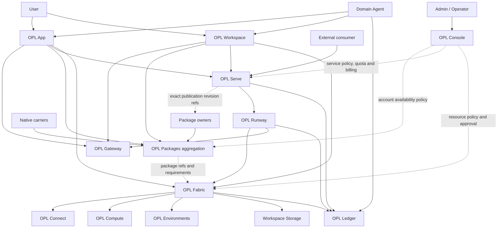

# OPL Cloud Architecture

Owner: `one-person-lab-cloud`
Purpose: `architecture_boundary`
State: `active_target_reference`
Machine boundary: Canonical human-readable target architecture; implementation
and readiness come from lower-layer owners and readback.

OPL Cloud is the target product architecture and implementation-family
navigation surface for extending OPL work from a local App into online
workspaces, account-managed resources and remote execution. This document
defines responsibility boundaries; it does not claim that every service is
currently deployed.

## OPL Family Position

The stable external product model is `OPL Base + OPL App + OPL Packages + OPL
Cloud`. OPL Cloud is the online product layer under active implementation;
individual Cloud capabilities are adopted according to the user's work. Internally these are separate
authorities:

```text
OPL Base           Framework runtime product; implemented by the scoped Framework Cordis Host
OPL Packages       independently published installable capabilities and owner revisions
OPL Framework      Host-side discovery/projection and runtime/state/action producer
one-person-lab-app App product, Client profile, GUI ABI and release authority
opl-aion-shell     current Stable AionUI Shell carrier
opl-studio         candidate DSH/Cordis Application Host and delivery carrier
OPL Cloud          Console, Control Plane, Fabric, Ledger and Workspace product
```

Cloud is not a second Framework Host and does not own the desktop App or either
Shell. A desktop or browser Shell may render Cloud projections through the same
App-owned contribution and state/action ABI, while Cloud services retain their
process, database, API, release and provider authorities. Changing the selected
App Shell therefore does not migrate Cloud authority or make Cloud a GUI plugin.

The name `Console` appears in two layers but does not identify one authority:
the Framework Console contribution is an in-process read-model/inspection
projection; OPL Console in this repository is the account and administrator
product for policy, quota, approval, Workspace and billing views.

## Family Capability Domains And Cloud Surfaces

Names such as Console, Workspace, Fabric, Ledger, Connect, Runway, and Packages
are OPL family capability domains: stable product and responsibility language
that may span Framework, App, Cloud, and domain products. They are not a fixed
count of Framework source modules, repositories, published packages, or Cordis
plugins. A domain keeps one conceptual name while each repository owns only its
explicit authority surface.

The composition model is:

```text
OPL family capability domain
  -> repository/product-specific authority surface
       -> versioned Package, service image, contract, or other artifact
            -> host-specific contribution where a host exists
                 -> curated product/profile composition
```

These boundaries are intentionally independent. A capability domain may have no
resident plugin, one artifact may contribute multiple plugins, and a Cloud
service may expose a typed API without becoming a Package or Cordis plugin.
Versioning and replacement follow the artifact with a real release cadence, not
the family domain name or a mechanically preserved module count.

For Cloud, the authority surfaces are concrete products and services:

| Family capability domain | Cloud authority surface | Boundary outside Cloud |
| --- | --- | --- |
| Console | Cloud Console and Control Plane own the account/control-plane product, Workspace policy, approval, quota and billing projection | Framework may expose operator/readiness/action projections; App owns local product interaction, neither owns Cloud policy or service state |
| Workspace | Control Plane owns Cloud Workspace entitlement and Launch coordination; Fabric owns runtime/resource binding and readback | App/Workspace runtime owns project and workbench behavior; Framework owns only shared runtime composition |
| Fabric | Fabric owns provider-neutral remote resource facts, mutation ports and provider adapters | Framework and App consume typed adapters and cannot acquire provider or deployment authority |
| Ledger | Cloud Ledger owns Cloud receipts, reconciliation, idempotency, and caller-owned opaque provenance refs | Framework observers and product projections do not become the persistent Cloud Ledger or a review/continuation authority |
| Remote Companion / OPL Link | `opl-link/service` owns broker, pairing, capacity and provider transport authority | OPL Cloud only hosts Workspace/WebUI delivery and does not own a remote-companion route, provider, persistence or contract |
| Gateway / Wallet | Control Plane projects Gateway account data and coordinates settlement | Sub2API remains the external identity, spendable-wallet, Key, routing and usage authority |
| Packages / Connect / Runway | Cloud consumes exact owner refs, connector capabilities and execution results where required | Package owners, native carriers and Framework retain discovery, carrier currentness, connector access and invocation lifecycle |

This rebaseline keeps the family vocabulary useful without making a Cloud
directory, service, API, package, or plugin the owner of the whole brand.
```text
OPL Cloud
├─ OPL Gateway       user-visible AI access, routing and usage
├─ OPL Workspace     user-visible cloud workbench
├─ OPL Serve         Agent API, Embed and Hosted UI publishing
├─ OPL Console       account policy, approval, quota and billing
├─ OPL Fabric        Connect, Compute, Storage, Environments and adapters
└─ OPL Ledger        receipt and provenance refs

Package owners       identity, capabilities, entrypoints and publication revisions
Native carriers      install, update, remove and installed/callable readback

OPL Framework
├─ Package projection discovery, carrier delegation and state aggregation
└─ OPL Runway       invocation, session and execution-provider lifecycle

Domain agents        domain strategy, quality verdict and delivery authority
```

## Repository And Instance Topology

```text
one-person-lab-cloud
  product architecture, whitepaper, roadmap
  Console + Control Plane + Fabric + Ledger implementation
  reusable contracts, portable images and GitHub Releases
        | immutable product SHA + image digest
        v
opl-instance-medopl
  medopl customization, production environment, deployment, rollback and evidence
```

`one-person-lab-cloud` is the single product and implementation repository.
Console, Control Plane, Fabric, and Ledger remain logical service owners inside
it; similarly named prototype repositories are historical inputs, not parallel
current writers. The short identifier `opl-cloud` remains valid for packages,
images, binaries, services, namespaces, environment variables and runner
labels, but it is not a repository boundary.

An instance repository materializes one installation without copying product or
runtime code. It owns non-secret domains, provider selection, region and
resource profile, the enabled subset of Cloud-defined plans, image pins, secret
references, and deployment receipts. Cloud Control Plane owns the versioned
customer price catalog; an Instance cannot override it. An instance may run on
a hosted cloud or a supported Linux Docker host. macOS may run the
control-services profile, but Docker Desktop is not a supported Local-Docker
Workspace host under the current project-quota contract. Secrets remain in the
selected secret owner, never in the instance repository.

## Development And Supply-Chain Authority

GitHub Actions, dependency scanners, code scanners, and cloud coding agents are
development and evidence surfaces. They do not own OPL Cloud product intent,
module policy, runtime state, release identity, or instance production
authorization. Their output enters the repository through the same protected
branch, review-conversation, focused-test, and canonical-readback boundaries as
human-authored work.

The release trust boundary separates untrusted source, dependency, and image
build activity from the credentials that publish GHCR images and GitHub
Releases. Cloud owns the portable release and its verifiable identity. An
Instance consumes an exact Cloud release and independently owns deployment
approval and production readback. A content digest establishes immutability; an
approved repository or release manifest establishes source trust.

## Current Public Beta Cut

The reusable Cloud Core remains deliberately narrow: a thin Console, one
`local-docker` OPL Workspace path, and OPL Gateway accounting projected without
creating a second wallet. The current delivery target adds public account
registration with zero initial balance, administrator-operated wallet top-up,
and controlled Workspace purchase. Registration never purchases resources by
itself; the authoritative quote and Sub2API balance gate every purchase.

Customer-operated payment/top-up, shared multi-user Workspaces, HA, GPU, public
Agent Service publication, and broader managed-resource orchestration remain
later product layers rather than public-beta prerequisites.

Tencent/TKE is the medopl instance's current provider choice and production
implementation surface. Its source, workflow, and Instance evidence do not
define generic Cloud identity, MVP acceptance, or the portable provider
contract.

The portable product Release nevertheless contains and contract-tests both the
Local-Docker and Tencent/TKE adapters. They consume the same Cloud image and
provider-neutral contracts while receiving separate installation-owned
Workspace images, Provider Profiles, domains, and qualification receipts.


```mermaid
flowchart TB
  User[User] --> App[OPL App]
  User --> Workspace[OPL Workspace]
  Consumer[External consumer] --> Serve[OPL Serve]
  Admin[Admin / Operator] --> Console[OPL Console]
  Domain[Domain Agent] --> App
  Domain --> Workspace

  App --> Gateway[OPL Gateway]
  Workspace --> Gateway
  Owners[Package owners] --> Packages[OPL Packages aggregation]
  Carriers[Native carriers] --> Packages
  App --> Packages
  Workspace --> Packages
  Console -. account availability policy .-> Packages

  App --> Serve
  Workspace --> Serve
  Console -. service policy, quota and billing .-> Serve
  Serve -. exact publication revision refs .-> Owners
  Serve --> Runway[OPL Runway]

  App --> Fabric[OPL Fabric]
  Workspace --> Fabric
  Console -. resource policy and approval .-> Fabric
  Packages -. package refs and requirements .-> Fabric
  Runway --> Fabric
  Runway --> Gateway

  Fabric --> Connect[OPL Connect]
  Fabric --> Compute[OPL Compute]
  Fabric --> Environments[OPL Environments]
  Fabric --> Storage[Workspace Storage]
  Fabric --> Ledger[OPL Ledger]
  Runway --> Ledger
  Serve --> Ledger
  Domain --> Ledger
```

## Surface Roles

| Surface | Owner responsibility | Explicit non-owner boundary |
| --- | --- | --- |
| OPL Gateway | AI access, routing, provider policy and usage signals | Package state and domain quality |
| OPL Workspace | Cloud workbench, project state, artifacts and user-visible status | Package lifecycle and resource truth |
| OPL Serve | Agent Service, immutable Revision, Deployment, endpoint, traffic and Hosted UI projection | Package lifecycle, sandbox internals and domain verdicts |
| OPL Console | Account onboarding, Workspace lifecycle, quota, approval, account-total billing view and managed-resource policy | Spendable wallet, package install/update/repair and resource execution |
| OPL Fabric | Provider-neutral connector, compute, storage and environment capabilities; resource binding and execution adapters | Customer balance, package identity, carrier state and domain verdicts |
| OPL Ledger | Receipt, opaque provenance, reconciliation and idempotency | Source data, package truth, review policy, continuation authorization and domain verdicts |
| Package owner | Stable identity, capabilities, entrypoints and exact publication revisions | Physical carrier state, Cloud policy and domain verdicts |
| Native carrier | Physical install, update, remove and fresh installed/callable readback | Package identity, Cloud policy and domain verdicts |
| OPL Packages | Carrier-neutral discovery, descriptor projection, configured-carrier delegation and fresh state aggregation | Parallel resolver/lock/currentness, account policy and domain truth |
| OPL Runway | Invocation/session lifecycle and execution-provider routing | Service identity, package lifecycle and domain verdicts |
| Domain agent | Domain strategy, evidence judgment, quality verdict and delivery authority | Cloud infrastructure truth |

## Host, Client, And Cloud Authority Boundary

Framework owns the Cordis Host only within
`framework_runtime_package_graph_and_app_projection`. Studio independently owns
its DSH/Cordis Application Host within
`dsh_profile_plugin_lifecycle_codex_and_delivery_transport_composition`.
The authoritative family definition is the Framework
[`host_scope_boundary`](https://github.com/gaofeng21cn/one-person-lab/blob/main/contracts/opl-framework/cordis-architecture-profile.json).

The Hosts cooperate through public App state/action, authentication and channel
callback contracts. Studio owns its application composition, native Codex and
delivery transport; it does not acquire Framework runtime, Package discovery or
currentness, App product/state/action, domain, or release authority. The Hosts do
not share registries, session state, currentness, or internal service graphs.
AionUI remains the Stable Shell; renderer choice cannot redefine Cloud APIs or
service state.

Cloud integrations use typed public APIs with explicit identity, capability,
idempotency and owner readback. Cloud processes, databases, provider mutation,
wallet coordination and release authority remain in their existing owners.
The selected Instance supplies Fabric's provider profile.

## Core And Extension Boundary

The MVP Core is one installable vertical product path:

```text
thin Console
-> Control Plane
-> Workspace launcher/provider
-> local Docker OPL App/WebUI Workspace
-> Gateway balance, usage, and debit authority in Sub2API
-> minimal Ledger receipts and reconciliation evidence
```

Core completion requires a real Workspace create, readback, access, and delete
path on a supported Linux Docker host. Starting the Cloud control services with
Compose is distribution plumbing and cannot satisfy this boundary. Console
remains limited to the Workspace, balance, and usage controls needed by that
path. Delete performs no wallet mutation; Sub2API remains the only spendable
wallet, and Ledger does not become a second wallet or accounting engine.

Extensions include Tencent/TKE and generic Kubernetes provider adapters,
managed or institution-owned resources, OPL Serve, customer-operated payment,
detailed Console refinement, and Ledger evidence verticals not required by the
Core path. The current public-beta cut selects self-service signup and
administrator top-up while retaining Sub2API as the single wallet authority.
An instance selects deployment extensions without redefining the Core product.
`opl-instance-medopl` selects the Tencent/TKE extension for the medopl instance;
Tencent/TKE is not a prerequisite for the local Core journey, but it is a
supported adapter of the portable Release.

This section owns the stable Core/Extension technical boundary. Current
capability belongs to [status](status.md), while gaps and priority belong only
to the [roadmap](roadmap.md).

## Launch Authority And Physical Ownership

One Workspace Launch has one durable Control Plane operation and state machine.
Create and Resume enter the same Reconciler, but the Reconciler coordinates
separate physical owners rather than implementing their work:

```text
services/control-plane
  business stage cursor + attempt/lease/CAS + settlement coordination
        |-- typed public Fabric HTTP contract --> services/fabric
        |                                        immutable launch/stage binding
        |                                        operation store + resource stages
        |                                        provider adapter mutation/readback
        |                                              |
        |                                              +-> local-docker, Tencent/TKE, or another adapter
        |-- typed public Ledger HTTP contract --> services/ledger
        |                                        append-only receipt/evidence/refs
        +-- typed external client -------------> Sub2API
                                                 identity/wallet/Key/Usage
```

The durable business chain is `preflight -> key -> debit -> ensure compute
allocation -> storage -> attachment -> secret -> runtime -> activation ->
receipt -> succeeded`. Preflight is the read-only admission gate before the
first external write. Runtime supplies the authoritative Workspace URL as
readback/projection; URL is not a separate mutation stage.

For Tencent prepaid resources, preflight must prove both the live deployment
identity and its payment authority before Debit. The Candidate-bound deployment
attestation includes the exact required Tag actions and Tencent system policy
`QcloudCVMFinanceAccess`. Compute and storage preflight both re-read the live
STS identity and current CAM attachment and reject a missing, inactive, or
mismatched policy. Price inquiry alone is not payment proof and cannot admit a
customer charge.

Workspace deletion is another durable Control Plane operation, not an
acceptance-runner cleanup. `workspace.delete.v2` first matches the immutable
succeeded Launch and its exact Launch Receipt. Runtime, compute, storage, and
attachment identity remain bound to that Launch; the current Workspace Key and
Gateway Secret identity come from the current Workspace projection and a strict
completed Rotation lineage back to the Launch Key. Delete then coordinates
`runtime + Secret absence -> attachment absence -> storage absence -> compute
absence -> Sub2API Key absence -> Workspace absence -> workspace.deleted.v1
Receipt -> complete`. Workspace absence atomically removes its exact Control
Plane compute, storage, and attachment projections. Every stage preserves the
same account, operation, Workspace, Launch Receipt, Runtime, current Key, and
provider-neutral resource identities. Fabric owns resource/Secret observations,
mutation, and authoritative absence; Sub2API owns only the exact Key deletion
in this operation and performs no wallet mutation; Ledger records the
non-financial deletion Receipt. Delete and Key Rotation are durably mutually
exclusive before either claim can cross an external mutation boundary. Delete,
Cancel Renewal, and Refund are independent operations. Any typed pending,
conflict, or error that cannot authoritatively converge fails closed.

The persisted customer Delete authorizes background continuation after the
request or session ends. Remaining Runtime objects may disappear independently;
Fabric validates every remaining object's exact ownership and confirms final
absence, including standalone Secrets and volume bindings. Delayed compute
absence is polled on the same operation without another destroy dispatch.
Customer progress remains pending until the deletion Receipt is confirmed.

Unpaid expiry closes new access and existing proxied streams at the paid-period
boundary. Control Plane also commands Fabric to stop the original Runtime and
records owner readback; it does not buy resources or delete data as a substitute
for stopping use. Runtime power binds account, Workspace, Runtime operation and
paid-through period, serializes with deletion, and fences stale periods. An
explicit customer renewal authorization can recover the original order only
while its resources still exist and its next anchored period is still current.
Sub2API confirms the original debit, Fabric confirms renewal and Runtime ready,
and only then Control Plane restores entitlement. Adding balance alone never
authorizes recovery. Customers must download their data before expiry; there is
no promised free retention period or post-expiry data recovery.

An operator may end an unfulfilled Launch on its original operation. Control
Plane first freezes normal continuation by CAS; Fabric then fences the original
Launch before Sub2API revokes the exact Workspace Key. Fabric confirms partial
resource absence, the existing wallet settlement owner returns only the original
account's unrefunded charge, and Ledger records `billing.workspace_closed.v1`.
A ready Runtime or activated Workspace follows successful-result recovery,
including missing receipt completion. Unknown money, Key identity or resources
cannot authorize terminal failure, refund or pool-claim release. This closure
path is distinct from normal customer deletion of a succeeded Workspace.

Control Plane owns only the Launch cursor, attempt and lease state, CAS,
account/settlement coordination, and customer projection. Fabric owns compute,
storage, attachment, Secret binding, Runtime, its operation store, provider and
Kubernetes mutation, and authoritative resource readback. Ledger retains
append-only receipts, reconciliation, idempotency, and caller-owned opaque
provenance refs; those refs cannot authorize or advance Launch. Control Plane's
typed continuation authorization remains a separate owner-owned path. Sub2API
remains the external identity, wallet, Key, and Usage authority.

Each Control Plane-to-Fabric stage call uses an explicit, immutable,
provider-neutral binding for the Launch operation, account and Workspace,
stage/action, stable stage operation/idempotency identity, request hash, and
expected resource binding. Fabric persists it before a provider write, returns
it with readback, and lets the selected adapter map it to provider identities.
Control Plane cannot infer resource ownership from idempotency suffixes,
unscoped operation listings, provider tags, or Machine/CVM/Node/CBS fields.

Recovery continues the original Launch through the same Reconciler. An
immutable authorization binds the original version, stage, attempt, resource
identity and idempotency key. Readback, replay and mutation are separate
permissions; unknown or conflicting owner facts never justify an unproven
purchase or provider write. Runtime image recovery preserves the original
non-Runtime resources and advances only after authoritative readiness.

The implemented eligibility, authorization lineage, budgets, image repair and
operator boundaries have one reference:
[Workspace Launch recovery](implementation/workspace-launch-recovery.md).
They are implementation policy, not a second target architecture. Durable
money, Secret and resource guarantees remain in [invariants](invariants.md).

## Modularity And Simplification Boundary

Each implementation module is paid for by a current product responsibility,
real caller, public contract, persisted-state obligation, or independently
deployable owner boundary. Repository co-location does not permit cross-service
imports or shared domain state, while a future possibility does not by itself
justify a route, schema, store, worker, facade, workflow, or compatibility layer.
Code without one of those payers is implementation evidence only, not target
architecture, and enters the roadmap as a keep, shrink, or delete candidate.

Modules stay cohesive around their owned capability and communicate through
typed product or service contracts. Internal file splits may reduce change
collisions, but must not create cross-module packages, mirror another owner's
truth, or duplicate launch/recovery, wallet, provider, or receipt authority.
One durable Reconciler never justifies moving Fabric resource reducers,
operation derivation, mutations, or provider facts into Control Plane.
Once real callers move to a successor, the old route, DTO, facade, schema, and
test path retire as one bounded change rather than a permanent fallback.

Physical deployment isolation, product feature development, and internal
cohesion are independent lanes. They may proceed concurrently and converge at a
shared contract, canonical integration, or exact deployment qualification. An
unfinished isolation or refactor lane is not a global development prerequisite.
Current priorities and admission decisions belong only to
[the roadmap](roadmap.md).

## Workspace Identity Boundary

Each user account may own zero or more independent OPL Workspaces. Every
Workspace has its own stable identity, URL, runtime, storage, provider binding,
billing period, credentials, lifecycle, and receipts. OPL Cloud sets no fixed
product-level count limit; balance, provider capacity, quota, and account
policy still govern each creation. Projects, tasks, files, artifacts, and
continuation entries remain inside their selected Workspace and do not become
Workspace identity.

The OPL App active shell provides the browser carrier. The complete identity
decision is recorded in
[Workspace Identity And External SaaS Boundary](workspace-identity-and-external-saas-boundary.md).

Agent Services do not change this identity. Workspaces and Services can both be
zero-to-many per account, but Services remain deployment resources for external
consumers rather than workbench instances.

## Service Publication Boundary

OPL Serve publishes an exact package revision through a dedicated Agent Edge:

```text
Agent Package exact digest
-> Service Entrypoint Contract
-> Agent Service
-> immutable Agent Revision
-> Deployment and traffic policy
-> API / Embed / Hosted UI
-> Invocation or Session
```

The Agent Edge owns public authentication, request validation, rate limits,
quota, routing, event streaming and signed Webhooks. Public traffic does not
terminate at a Workspace, sandbox, container or external provider session.

Runway owns the OPL Invocation and Session lifecycle and routes each exact
revision to an approved execution-provider adapter. The OPL-native Runway/Fabric
path and any external managed-Agent runtime remain adapters; their identifiers
are refs, not OPL Service or Deployment truth.

Hosted UI and Embed clients consume the same Serve API. They may project an
Agent's schemas, events, artifacts and publisher branding, but cannot bypass
Serve authentication, policy, quota or receipts.

## Execution Boundary

OPL App and OPL Workspace use the same resource execution pattern:

```text
plan -> approve -> execute -> monitor -> collect -> receipt
```

Console applies account or explicit shared policy when a workspace, connector
or resource is Cloud-hosted or managed. Fabric performs the approved resource
binding and execution. User-provided local, SSH or HPC resources can use the
same pattern without becoming Console-billed resources by default.

Fabric exposes a provider-neutral capability interface. Core requires a real
`local-docker` profile; an instance may additionally select an extension such
as `tencent-tke` or generic `kubernetes`. Provider identifiers, diagnostics, retries, and recovery
mutations stay inside the adapter. Control Plane persists the selected provider
profile ref per Workspace and uses one Launch business state machine; Fabric
persists each stage-operation binding and provider-resource mapping. Neither
generic product identity nor Control Plane contains Tencent resource names.

## Balance And Billing Boundary

Gateway is the only spendable account-balance owner. Cloud Control Plane owns
the versioned customer price catalog, quotes, account-total billing projection,
and settlement policy, and initiates one monthly settlement per Workspace and
billing period. Console only presents Control Plane DTOs. Fabric reports
resource/provider facts and owns no wallet, balance, or customer price. Ledger
records append-only charge, refund, resource, and reconciliation receipts
without becoming a second balance store or pricing engine.

## Package Lifecycle Boundary

There is no Cloud-owned Agent Registry. Package identity, capabilities,
entrypoints and exact publication revisions come from the Package owner.
Physical install/update/remove and installed/callable state come from fresh
readback of the configured native carrier. Framework `opl packages` discovers
descriptors, delegates carrier actions and aggregates those owner/carrier
projections; it is not a second resolver, lock or currentness authority.

Cloud contracts consume only current Package-owner and native-carrier
interfaces. Retired Framework lock, payload and parallel lifecycle projections
are not Cloud dependencies or readiness gates.

Cloud surfaces consume those refs without redefining them:

- Console projects whether account policy permits a package ref and which
  quotas or managed resources may use it.
- Fabric reads package requirements and binds compute, storage, environments
  and connectors for a run.
- App and Workspace display owner identity plus fresh carrier state and actions
  aggregated by Framework.
- Ledger may record exact publication, carrier-action and carrier-readback refs
  for later review.

None of these projections can install, update, remove, repair or create a
second package or carrier truth. Mutations route to the configured carrier.

## Connector And Domain Boundary

OPL Connect owns stable connector access, normalized source refs, credential
boundaries, errors, retries and rate limits. Domain-specific adapters and
domain agents own retrieval strategy, evidence selection, synthesis and quality
judgment. Ledger records refs only.

The current OPL connector surface and any domain-specific adapter must be read
from fresh Framework/domain contracts and runtime readback. A target connector
described in Cloud docs is not a readiness claim.

## Data Boundary

Cloud stores refs, metadata, lineage, receipts, usage and policy records.
Sensitive source data remains in user workspaces, institutional storage or
private buckets by default. A Cloud receipt points back to the owning source; it
does not become a second source of truth.

External service traffic adds a consumer identity, data classification,
retention, deletion and egress boundary. Serve and Console must resolve those
policies before Runway selects a provider or Fabric binds resources.

## Currentness Boundary

This repository explains the target product split. Service availability comes
from the corresponding implementation repo, API contract, runtime health and
owner receipt. Package currentness comes from the owning publication surface and
fresh native-carrier readback, exposed through Framework aggregation where
available.

## Account Admission And Workspace Purchase

Sub2API remains the Gateway identity and spendable-wallet authority. Control
Plane owns the Cloud Account and the separate `workspacePurchaseEnabled` fact;
the existence of a remote identity, a local Account, or an existing Workspace
does not grant new-purchase permission. Operator provisioning explicitly selects
`full_cloud_customer` or `gateway_only`, and grant/revoke actions are audited.
The launch route reads this Control Plane fact before any billing or Fabric
mutation. Revocation affects only future purchases. Account migration must preserve persisted eligibility and audit custody;
Launch admission reads the Control Plane fact rather than an Instance-specific
per-account allowlist.
Contract presence, documentation, a successful build or an empty queue does not
prove Cloud, package, domain or production readiness.
