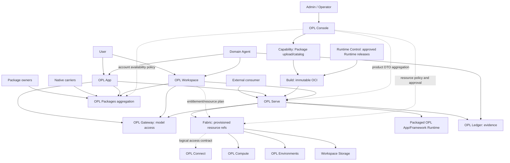

# OPL Cloud Architecture

Owner: `opl-cloud`
Purpose: `architecture_boundary`
State: `active_target_reference`
Machine boundary: Canonical human-readable target architecture; implementation
and readiness come from lower-layer owners and readback.

OPL Cloud is the target product architecture and implementation-family
navigation surface for extending OPL work from a local App into online
workspaces, account-managed resources and remote execution. This document
defines responsibility boundaries; it does not claim that every service is
currently deployed.

## OPL Family Position

The stable external product model is `OPL Base + OPL App + OPL Packages + OPL
Cloud`. OPL Cloud is the online product layer under active implementation;
individual Cloud capabilities are adopted according to the user's work. Internally these are separate
authorities:

```text
OPL Base           Framework runtime product; implemented by the scoped Framework Cordis Host
OPL Packages       independently published installable capabilities and owner revisions
OPL Framework      Host-side discovery/projection and runtime/state/action producer
one-person-lab-app App product, Client profile, GUI ABI and release authority
opl-aion-shell     retired migration baseline and historical fixtures
opl-studio         active DSH/Cordis Application Host and App delivery carrier
OPL Cloud          Console/BFF, domain services and retained migration paths
```

Cloud does not acquire Framework or Studio Host authority and does not own the
desktop App or its Shell. A desktop or browser Shell may render Cloud projections through the same
App-owned contribution and state/action ABI, while Cloud services retain their
process, database, API, release and provider authorities. Changing the selected
App Shell therefore does not migrate Cloud authority or make Cloud a GUI plugin.

The name `Console` appears in two layers but does not identify one authority:
the Framework Console contribution is an in-process read-model/inspection
projection; OPL Console in this repository is the account and administrator
product for policy, quota, approval, Workspace and billing views.

## Family Capability Domains And Cloud Surfaces

Names such as Console, Workspace, Fabric, Ledger, Connect, Runway, and Packages
are OPL family capability domains: stable product and responsibility language
that may span Framework, App, Cloud, and domain products. They are not a fixed
count of Framework source modules, repositories, published packages, or Cordis
plugins. A domain keeps one conceptual name while each repository owns only its
explicit authority surface.

The composition model is:

```text
OPL family capability domain
  -> repository/product-specific authority surface
       -> versioned Package, service image, contract, or other artifact
            -> host-specific contribution where a host exists
                 -> curated product/profile composition
```

These boundaries are intentionally independent. A capability domain may have no
resident plugin, one artifact may contribute multiple plugins, and a Cloud
service may expose a typed API without becoming a Package or Cordis plugin.
Versioning and replacement follow the artifact with a real release cadence, not
the family domain name or a mechanically preserved module count.

For Cloud, the authority surfaces are concrete products and services:

| Family capability domain | Cloud authority surface | Boundary outside Cloud |
| --- | --- | --- |
| Console | Console UI/BFF exposes typed account, Workspace, policy, quota and billing facts from their domain owners; Control Plane retains unmigrated callers | Framework may expose operator/readiness/action projections; App owns local product interaction, neither owns Cloud policy or service state |
| Workspace | The Workspace service owns Workspace identity, membership/entitlement, resource plan and target authorization; its Saga provisions resources then requests Serve delivery | Agent Package, build artifact and Agent deployment state are owned by Capability, Build and Serve respectively |
| Fabric | Fabric owns provider-neutral compute/storage/network resource facts, provisioning/binding ports and provider adapters | Agent OCI deployment, Agent runtime readiness and Serve traffic selection are not Fabric facts |
| Ledger | Cloud Ledger owns Cloud receipts, reconciliation, idempotency, and caller-owned opaque provenance refs | Framework observers and product projections do not become the persistent Cloud Ledger or a review/continuation authority |
| Remote Companion / OPL Link | `opl-link/service` owns broker, pairing, capacity and provider transport authority | OPL Cloud only hosts Workspace/WebUI delivery and does not own a remote-companion route, provider, persistence or contract |
| Gateway / Wallet | Gateway Integration projects native Gateway facts and coordinates accepted settlement; Control Plane retains its legacy integration | Sub2API remains the external identity, spendable-wallet, Key, routing and usage authority |
| Capability / Build / Runtime Control / Serve | Capability owns Agent Packages and WebUI catalog; Build owns OCI build jobs/evidence; Runtime Control owns approved Runtime release versions; Serve owns per-Workspace Agent delivery and API/Embed/Hosted UI access | OPL App/Framework owns Runtime implementation; Fabric owns only infrastructure resources; no parallel Agent Service lifecycle |

This rebaseline keeps the family vocabulary useful without making a Cloud
directory, service, API, package, or plugin the owner of the whole brand.
```text
OPL Cloud
├─ OPL Gateway       user-visible AI access, routing and usage
├─ OPL Workspace     user-visible isolated application environment
├─ OPL Serve         Agent Package-to-Workspace delivery, deployment authority, API/Embed/Hosted UI access
├─ OPL Console       account policy, approval, quota and billing
├─ OPL Fabric        Connect contract, Compute, Storage and Environments
└─ OPL Ledger        receipt and provenance refs

Package owners       identity, capabilities, entrypoints and publication revisions
Native carriers      install, update, remove and installed/callable readback

OPL Framework
├─ Package projection discovery, carrier delegation and state aggregation
└─ OPL Runway       invocation, session and execution-provider lifecycle

Domain agents        domain strategy, quality verdict and delivery authority
```

## Repository And Instance Topology

```text
opl-cloud
  product architecture, whitepaper, roadmap
  Console/BFF + the target domain services
  reusable contracts, portable images and GitHub Releases
        | immutable product SHA + image digest
        v
opl-instance-medopl
  medopl customization, production environment, deployment, rollback and evidence
```

This repository is the product and implementation repository for the target
domain-separated Agent SaaS architecture. The target domains are `tenant`
(CloudIdentity), `capability`, `build`, `workspace`, `runtime_control`,
`resource_catalog`, `gateway` (Gateway Integration), `fabric`, and `ledger`,
with `console-ui` and a Console BFF as the browser surface. All Cloud product
code belongs to this one GitHub repository, `one-person-lab-cloud`; `opl-cloud`
is its product/runtime identifier. Service boundaries are
not repository boundaries. `Fabric` and `Ledger` retain their execution and
evidence authority. The target architecture work packages track caller and data
migration plus qualification, not creation of domain repositories. The
[implementation map](implementation-architecture.md#physical-module-and-dependency-map)
owns which paths already exist.

### Target Directory And Service Map

This map defines responsibility and placement. Module presence and tested
behavior are recorded in [implementation architecture](implementation-architecture.md)
and [status](status.md); neither proves Instance installation.

| In-repository path | Module / deployment boundary | Data and responsibility owner |
| --- | --- | --- |
| `apps/console-ui/` | React/TypeScript application | Presentation; calls Console BFF only |
| `apps/console-bff/` | Independent Go module and process | Browser REST, server-side session security and DTO aggregation; no business persistence or business Saga |
| `services/gateway-integration/` | Independent Go module and process | `tenant` / CloudIdentity and `gateway` integration: two distinct database/writer owners in one deployment unit; Sub2API remains the external wallet/Gateway authority |
| `services/capability/` | Independent Go module and process | `capability`: publishers, Packages, versions and catalog metadata |
| `services/build/` | Independent Go module and process | `build`: build jobs, immutable input references and artifact evidence |
| `services/workspace/` | Independent Go module and process | `workspace`: Workspace lifecycle and business Saga |
| `services/runtime-control/` | Independent Go module and process | `runtime_control`: approved Runtime release catalog, immutable Runtime version references and admission lifecycle used by Build |
| `services/resource-catalog/` | Independent Go module and process | `resource_catalog`: product plans and pricing rules |
| `services/serve/` | Independent Go module and process | `serve`: per-Workspace application delivery/deployment lifecycle, Runtime execution adapter, readiness and access routing; API/Embed/Hosted UI for an Agent |
| `services/fabric/` | Existing independent Go module and process | `fabric`: provider mutation, compute/storage/network provisioning, binding and resource readback only |
| `services/ledger/` | Existing independent Go module and process | `ledger`: receipts, evidence and reconciliation |
| `packages/contracts/go/` | One shared Go module, no process or database | Cross-owner wire contracts and generated bindings |
| `services/internal/` | Existing narrowly scoped, policy-free shared infrastructure | Only reusable mechanisms with at least two real service callers |
| `services/control-plane/` | Existing independent Go module and process during migration | Retained capabilities until their callers and obligations move to the target owner; not a permanent second writer |

Each business data owner has its own database and writer roles. Co-location in
one repository does not permit cross-service implementation imports, direct
access to another owner's database, cross-owner joins, or shared business state.
CloudIdentity and Gateway Integration stay in one service module and deployment
unit while retaining two data owners; a proto `service` declaration does not
create a process. The BFF owns no business Saga; Workspace does.

The domain-separated design uses seven extracted business-service modules and
one BFF module inside this repository. Serve owns application delivery;
Runtime Control owns Runtime release versions. Fabric, Ledger, Console UI and
the existing contracts module are retained. The Control Plane is migrated one
live capability at a time: switch its real callers and preserve historical data
obligations before retiring each old write path. This decision does not add an
orchestrator, event bus, shared policy layer, or a second Gateway.

W01 uses `packages/contracts/proto/` for production proto source and generated
bindings under the existing
`packages/contracts/go/go.mod`; it does not create a second contracts module.
Contracts and internal consumers use the same Cloud source commit, recorded
schema hashes, and locked generation tools. Consumer `go.mod` and `go.sum`
changes required by that dependency graph are part of the contract change, not
a reason to invent another module. Service-local domain models remain local.
Independent Instance, Sub2API and Framework authorities are not merged into
Cloud; their external integration and exact artifact pins remain unchanged.

### Current Implementation And Instance Boundary

The current source implements Console BFF and the extracted domain services
alongside retained Control Plane, Fabric, and Ledger paths. Their current caller
boundaries are owned by [implementation architecture](implementation-architecture.md).
The [status](status.md) separates source checks from installed Instance evidence;
the target topology is not an assertion that all processes are deployed. Similarly
named prototype repositories are historical inputs, not parallel current
writers. The short identifier `opl-cloud` remains valid for packages, images,
binaries, services, namespaces, environment variables and runner labels.

An instance repository materializes one installation without copying product or
runtime code. It owns non-secret domains, provider selection, region and
resource profile, the enabled subset of Cloud-defined plans, image pins, secret
references, and deployment receipts. Resource Catalog owns extracted plans and
versioned price policies; Control Plane retains its legacy price catalog. An
Instance cannot override either owner's accepted pricing facts. An instance may run on
a hosted cloud or a supported Linux Docker host. macOS may run the
control-services profile, but Docker Desktop is not a supported Local-Docker
Workspace host under the current project-quota contract. Secrets remain in the
selected secret owner, never in the instance repository.

### Deployment Model

Cloud keeps three independent dimensions. `OPL_DEPLOYMENT_MODE` records the
deployment owner as `platform_owned`, `managed_tke`, or `customer_owned`;
`managed_tke` remains the current `opl-instance-medopl` contract value.
`OPL_FABRIC_PROVIDER` selects the Fabric execution adapter and accepts only
`local-docker` or `tencent-tke`. The `admin` and `customer` user surfaces come
from the authenticated session and Console route; there is no user-surface
environment variable and Customer cannot choose a provider.

| Deployment owner | Fabric provider | Current meaning |
| --- | --- | --- |
| `platform_owned` | `tencent-tke` | allowed hosted/managed target |
| `managed_tke` | `tencent-tke` | allowed current medopl path |
| `customer_owned` | `local-docker` | allowed local/self-deployed path |
| `customer_owned` | `tencent-tke` | retained support target; no new business flow |
| `managed_tke` | `local-docker` | rejected until an owner and operations workflow exist |
| `platform_owned` | `local-docker` | local qualification only, not a production claim |

Control Plane compares its configured `OPL_FABRIC_PROVIDER` with the provider
reported by Fabric readiness before new Workspace Launch admission. A mismatch
is a readiness failure and performs no provider mutation. Existing Launches
continue to use the Fabric preflight `providerProfileRef` persisted with the
operation. Where an Instance verification path provides both
`OPL_RUNTIME_PROVIDER` and `OPL_FABRIC_PROVIDER`, it only verifies that they
agree; `OPL_RUNTIME_PROVIDER` is not a third Provider.

### Deployment Unit Composition

An Instance deployment unit carries a service only once that service's
capability and real callers have moved to it; the target service set is not
deployed ahead of the migration. Each service enters the `opl-instance-medopl`
unit in the same change that moves its capability off Control Plane, so the unit
never runs a process with no current caller, and the manifest, Secret references
and readback are reviewed with the capability they carry. Cloud owns which
capability each service owns; `opl-instance-medopl` owns the concrete unit.

Cloud declares current owner binaries, addresses, HTTP surfaces, databases and
peer requirements in `deploy/portable/opl-cloud-owner-topology.json`. The exact
image declares whether its Console uses `legacy` or `cloud` identity. An
installation must route the APIs required by that identity and run the owners
that serve those capabilities; binary presence alone does not enable them.
The latest retained Instance install inspection still shows only Control Plane,
Fabric and Ledger. That dated observation and the remaining installation gap
belong to [status](status.md) and [roadmap](roadmap.md), not this target map.

## Development And Supply-Chain Authority

GitHub Actions, dependency scanners, code scanners, and cloud coding agents are
development and evidence surfaces. They do not own OPL Cloud product intent,
module policy, runtime state, release identity, or instance production
authorization. Their output enters the repository through the same protected
branch, review-conversation, focused-test, and canonical-readback boundaries as
human-authored work.

The release trust boundary separates untrusted source, dependency, and image
build activity from the credentials that publish GHCR images and GitHub
Releases. Cloud owns the portable release and its verifiable identity. An
Instance consumes an exact Cloud release and independently owns deployment
approval and production readback. A content digest establishes immutability; an
approved repository or release manifest establishes source trust.

## Current Public Beta Cut

The reusable Cloud Core remains deliberately narrow: a thin Console, one
`local-docker` OPL Workspace path, and OPL Gateway accounting projected without
creating a second wallet. The current delivery target adds public account
registration with zero initial balance, administrator-operated wallet top-up,
and controlled Workspace purchase. Registration never purchases resources by
itself; the authoritative quote and Sub2API balance gate every purchase.

Customer-operated payment/top-up, shared multi-user Workspaces, HA, GPU, public
Agent Service publication, and broader managed-resource orchestration remain
later product layers rather than public-beta prerequisites.

Tencent/TKE is the medopl instance's current provider choice and production
implementation surface. Its source, workflow, and Instance evidence do not
define generic Cloud identity, MVP acceptance, or the portable provider
contract.

The portable product Release nevertheless contains and contract-tests both the
Local-Docker and Tencent/TKE adapters. They consume the same Cloud image and
provider-neutral contracts while receiving separate installation-owned
Workspace images, Provider Profiles, domains, and qualification receipts.


```mermaid
flowchart TB
  User[User] --> App[OPL App]
  User --> Workspace[OPL Workspace]
  Consumer[External consumer] --> Serve[OPL Serve]
  Admin[Admin / Operator] --> Console[OPL Console]
  Domain[Domain Agent] --> App
  Domain --> Workspace

  App --> Gateway[OPL Gateway]
  Workspace --> Gateway
  Owners[Package owners] --> Packages[OPL Packages aggregation]
  Carriers[Native carriers] --> Packages
  App --> Packages
  Workspace --> Packages
  Console -. account availability policy .-> Packages

  App --> Serve
  Console --> Capability[Capability: Package upload/catalog]
  Capability --> Build[Build: immutable OCI]
  RuntimeControl[Runtime Control: approved Runtime releases] --> Build
  Build --> Serve
  Workspace --> Serve
  Serve --> Fabric[Fabric: provisioned resource refs]
  Serve --> AgentRuntime[Packaged OPL App/Framework Runtime]
  Console -. product DTO aggregation .-> Serve

  Workspace -. entitlement/resource plan .-> Fabric
  Console -. resource policy and approval .-> Fabric
  Serve --> Gateway[OPL Gateway: model access]
  Serve --> Ledger[OPL Ledger: evidence]

  Fabric -. logical access contract .-> Connect[OPL Connect]
  Fabric --> Compute[OPL Compute]
  Fabric --> Environments[OPL Environments]
  Fabric --> Storage[Workspace Storage]
  Domain --> Ledger
```

## Surface Roles

| Surface | Owner responsibility | Explicit non-owner boundary |
| --- | --- | --- |
| OPL Gateway | AI access, routing, provider policy and usage signals | Package state and domain quality |
| OPL Workspace | Workspace identity, membership/entitlement, resource plan and authorization of the target | Agent deployment lifecycle/current selection (Serve), Package/Build facts, Fabric resource facts |
| OPL Serve | Sole Agent delivery/deployment lifecycle per Workspace, deployment history/current Agent, OCI execution/readiness/routing, API/Embed/Hosted UI | Package/Skill contents, Runtime release catalog, Workspace entitlement, infrastructure resource truth and domain verdicts |
| OPL Console | Account onboarding, Workspace lifecycle, quota, approval, account-total billing view and managed-resource policy | Spendable wallet, package install/update/repair and resource execution |
| OPL Fabric | Provider-neutral compute, storage, network, Secret and execution-resource provisioning/binding plus resource readback | Agent OCI deployment, Runtime release selection, Agent readiness, Serve access routing and domain-specific system adapters |
| OPL Ledger | Receipt, opaque provenance, reconciliation and idempotency | Source data, package truth, review policy, continuation authorization and domain verdicts |
| Package owner | Stable identity, capabilities, entrypoints and exact publication revisions | Physical carrier state, Cloud policy and domain verdicts |
| Native carrier | Physical install, update, remove and fresh installed/callable readback | Package identity, Cloud policy and domain verdicts |
| OPL Packages | Carrier-neutral discovery, descriptor projection, configured-carrier delegation and fresh state aggregation | Parallel resolver/lock/currentness, account policy and domain truth |
| OPL Runtime Control | Approved Runtime release versions and immutable artifact/compatibility references consumed by Build | Agent deployment, running instance state and Runtime implementation |
| Domain agent | Domain strategy, evidence judgment, quality verdict and delivery authority | Cloud infrastructure truth |

## Capability Design Review

The owner model is sound and can stay. Its main weakness is presentation:
internal target vocabulary currently appears beside the user-facing product
surfaces, so a reader must mentally combine Console, Workspace, Serve,
Gateway, Fabric, Ledger, Capability, Build and Runtime Control before
understanding the product.

The user-facing capability model should therefore be read through five layers:

| User-facing layer | What the user can decide or observe | Unique owner |
| --- | --- | --- |
| Console | account, approval, plan, quota, billing and evidence views | Console UI/BFF plus the owner DTOs |
| Workspace | isolated environment, entitlement, application choice and model intent | Workspace |
| Serve | deploy, replace, open, API/Embed/Hosted UI, readiness and applied runtime configuration | Serve |
| Gateway | model access, provider routing, managed-key use and usage signals | Gateway Integration with Sub2API as external authority |
| Evidence | receipt, provenance, reconciliation and review trail | Ledger |

Each capability is then read at three separate levels:

1. **Logical capability**: the stable product meaning and owner boundary.
2. **Contract**: typed requests, results, policy, identity and recovery
   semantics shared by callers and implementations.
3. **Implementation**: one or more replaceable services, packages, adapters or
   provider backends selected by an Instance or domain owner.

An implementation may be replaced or run in several variants without changing
the logical owner. Conversely, an installed backend, package or process does not
prove that the logical capability is callable, authorized or qualified.
OPL Connect is the clearest example: Connect owns the logical access contract;
`glkvm-native` is one backend; MAP owns the medical semantic adapter and
workflow above it.

Fabric is the infrastructure substrate behind Workspace and Serve. Capability,
Build and Runtime Control are the supply-chain path behind Serve. They remain
separate owners because they have different data, callers and replacement
semantics, but they should not be presented as additional user journeys.

Medical semantics are a domain-agent concern. MAP owns semantic hospital-system
adapters, task state and clinical workflow. OPL Connect is the logical access
contract underneath those adapters; `glkvm-native` is one replaceable backend
for device/session control, alongside possible API, CLI or MCP backends. Cloud
does not need a medical-specific adapter service or institution-system catalog.

This gives the architecture a clear result:

- **Strong**: one writer per business fact, Workspace and Serve are separated
  at the correct boundary, and Instance deployment is distinct from Cloud
  source and Candidate construction.
- **Worth simplifying**: current and target vocabulary should be introduced
  through the five layers above, with the internal supply-chain and
  infrastructure owners shown only where a reader needs their evidence or
  failure boundary.
- **Do not merge**: Gateway, Fabric, Serve and Ledger have different secret,
  provider, runtime and evidence obligations. Merging them would create the
  duplicate writers this architecture is designed to remove.

Every new Cloud capability should answer four questions before gaining a
surface: which owner writes its fact, which current caller needs it, which
existing layer exposes it, and what owner readback proves completion. A new
service, registry, workflow engine or global event bus has no place without
those answers.

The medical platform follows the same rule. It adds a medical domain layer and
institution-owned acceptance on top of Cloud; it does not add a second wallet,
Package registry, deployment lifecycle or evidence authority. Its boundary and
open contracts are in [Medical Agent Platform](medical-agent-platform.md).

## Workspace Application Boundary

A Workspace is an account-owned isolated application environment. It keeps its
identity, access entry, paid entitlement and owned data while its application
changes. OPL App is the default application and retains its own workbench,
Framework and Package authority. Other applications do not need to embed OPL,
Codex or an App Shell to run in a Workspace. This is an accepted target; the
[current Runtime ABI](implementation/workspace-runtime-access.md) still fixes
the OPL App port, credentials and mounts.

### Provisioning And Application Deployment

For a new customer, Launch delivers an application and its approved
compute/storage plan after one confirmation. The default is an exact approved
OPL App release with its built-in WebUI, requiring no customer Package or
separate UI selection. A custom Agent is a Build-confirmed CapabilityVersion.
Both use the same Workspace business Saga, Fabric resource provisioning, and
Serve deployment/readiness/access path. There is no resource-only success or
implicit retry into the default App when a chosen Agent fails.

Runtime Control supplies the approved App release and its immutable publisher
contract. The default App is deployed directly by digest; no synthetic
Package/Build/CapabilityVersion or redundant Tenant-registry copy is created.
For an Agent, Capability supplies the Package and compatible independent
WebUI, Runtime Control supplies the exact approved Runtime, and Build requires
all three inputs to produce the immutable Tenant OCI. There is no Agent with
built-in UI branch; missing either Package or independent WebUI is rejected. Package formats, App UI implementation and ABI remain
publisher-owned; a mutable tag or a guessed filesystem path is not admission.

The application selection is frozen with the quote and accepted order. Workspace
stores business intent/provenance only; Serve is the sole current-application
writer. Switching default App/Agent or updating an existing application uses
Serve's explicit, data-compatible replacement path without repurchasing the
Workspace. A Runtime change rebuilds an Agent but selects a new approved release
for a default App; neither happens automatically.

Model configuration follows the same owner separation. Workspace owns the
accepted selections, configuration version and the opaque
`gateway_key_binding_id`; Gateway Integration owns managed-key issuance,
model allowlists, secret-delivery references and revocation; Fabric owns the
Secret binding/readback; Serve owns publisher apply/readback and runtime
readiness. `WorkspaceProductService.UpdateWorkspaceModels` must first obtain a
confirmed `ManagedKeyBinding` from `GatewayCoordination.CreateManagedKey`, then
bind the returned Secret reference through `FabricCoordination.BindSecret`, and
only then call Serve with an internal `RuntimeManagedKeyBinding`. Serve never
mints a Gateway key and no caller-supplied binding is trusted. The applied
Workspace version advances only after Serve reports the application-read
version through the owner-local operation/CAS path. For a later configuration that
changes the managed key, Workspace uses Fabric's explicit `RebindSecret` with the
expected current binding identity. Fabric confirms the replacement and preserves
the one-active-binding invariant; Serve then applies and reads back the new
publisher configuration. The predecessor Gateway key is revoked only after that
readback, and Fabric binding retirement is recorded separately from Gateway key
revocation. A rejected or unknown replacement keeps the predecessor key and
blocks further side effects until the original operation or compensation is read
back.

The historical `resource_only` Launch retains its existing purchase obligations
and completion criteria. It is not the default App product and is not silently
converted. The September 29 decision is adopted intent; the source selection
union and its grouped consumers are implemented, while Candidate/Instance
acceptance remains separate. Current gaps are owned by `docs/roadmap.md`.

### Control Plane Authority And Credential Boundary

The current Control Plane remains the migration source for application
admission/coordination in the code that exists today. The target does not keep
its per-Workspace deployment binding as a second writer: Capability/Runtime
Control/Build fix Agent inputs, Workspace owns entitlement and target
authorization, Fabric owns infrastructure readback, and Serve owns Agent
deployment/readiness/access/current selection. Application behavior and data
formats stay with the publisher; wallet and Gateway-Key authority stay with
Sub2API; evidence stays with Ledger.

The current Control Plane stays one process until each live capability moves;
that fact is not a target owner decision. The target uses the domain service
boundaries adopted on 2026-09-22, with typed contracts and owner-local
persistence rather than a permanent parallel deployment writer.

Control Plane's Fabric, Ledger and Sub2API service tokens are process-scoped.
They are never forwarded to applications, browser sessions or application
traffic. An application receives only the secrets its own deployment declares,
and administrator credentials do not reach the application runtime.

### Application And Deployment Identity

The target scope is zero or one selected application deployment per Workspace:
default OPL App or an optional Agent. An Agent may contain a primary service
and private supporting services.
Independent applications within the same Workspace are a later product choice.
A web entry is optional for a worker-only application. An authorized
administrator may explicitly allow anonymous application access; that alone
does not create a Serve Service, Agent API revision or traffic-management
lifecycle. Serve publication remains a separate capability.

| Concept | Owns | Change boundary |
| --- | --- | --- |
| Workspace | Account identity, membership/entitlement, resource plan, target authorization and stable data bindings | It does not store an Agent deployment pointer/status copy; Agent replacement does not create another purchase or erase retained data |
| Agent version | Capability Package/version, approved Runtime release, WebUI selection and exact immutable OCI reference | A changed Package, Runtime, WebUI or OCI digest creates a new Build/Agent version |
| Agent deployment | Serve-owned delivery attempt, non-secret configuration, Secret/resource references, readiness and access/current selection | Serve owns the operation/current selection; Fabric owns only observed infrastructure facts |
| Application data | Persistent volumes, restore inputs and their consistency/compatibility facts | Restore, schema migration and deletion have explicit data operations; a process restart has none of these effects |

The description declares executable image digests and platforms, startup,
service ports/probes, resource requirements, process identity and required
runtime capabilities, persistent or scratch mounts, configuration/Secret
inputs, private dependencies and permitted connections. Restore requirements
reference a versioned application-owned restore artifact and exact input data;
they do not embed an unbounded workflow language. Fields become machine
contracts only as the corresponding Capability/Build/Workspace/Serve/Fabric
consumers are implemented together.

OCI registries such as TCR retain the image and, where supported, its versioned
deployment-description artifact. Data archives use an approved artifact or
object store. Cloud persists admitted immutable references and installation
policy, not a second image/package registry. An executable image is identified
as `host/namespace/repository@digest`; a bare `repository@digest` is not a
reference, and no module re-derives the format another owner produced. A tag can
be a discovery input; execution and recovery bind the resolved digest and
platform. Upload success proves artifact availability, not application readiness.
The registry endpoint and its credentials are installation facts: Cloud has no
default registry host, an installation that configures none has no image
selection capability rather than an anonymous one, and the instance injects the
browse credential into Control Plane while the runtime keeps its own pull
credential. The browsable namespace boundary is server-side admission policy, so
configuring an endpoint never widens it.

### Tenant-Scoped Application Repository Policy

For the current Tencent TCR personal installation, application output uses the
installation-owned namespace `oplcloud` and one private repository reserved for
each admitted Cloud Tenant. The Tenant owner reserves a stable
`tenant_id -> repository` binding; the verified email local-part is only the
initial name candidate and collision handling must preserve that binding. Build
reads the binding through an authenticated owner boundary and is the only writer
of the OCI result. Neither the browser nor a Build request can select another
Tenant's repository. Instance configures the installation's TCR account,
namespace and scoped credential references once; it does not create a Tenant
repository or deploy a Tenant application for each Build.

Cloud Capability namespace, TCR namespace and TCR repository are three different
identities. The stable OCI identity returned to Capability and Serve remains
`host/namespace/repository@sha256`, not a mutable tag. The Tencent personal TCR
repository is materialized on the first authorized Build push.

Cloud source implements this binding: CloudIdentity `CreateTenant` reserves one
stable destination in the same transaction as the Tenant and its owner
membership, and `GetTenantRepositoryBinding` exposes it to Build over the
authenticated owner boundary. Build resolves its output repository from that
binding. The live local BuildKit chain exercises the same resolver against a
disposable registry. A Tencent/TKE-hosted Cloud Build pushing a Tenant-resolved
destination remains the open hosted proof.

New Agent versions are produced from the approved Package + Runtime + WebUI
chain and are selected by the customer for a specific Workspace and quote.
Console presents the owner readbacks and does not turn a mutable registry tag
into a deployment identity. A new Package, Runtime, WebUI or OCI digest creates
a new immutable version; selecting it never changes another Workspace
implicitly. The same Agent version may serve several Workspaces with separate
data, while those Workspaces may advance through versions independently.

Capability, Runtime Control and Build admit and fix the Agent inputs; Workspace
authorizes the target and resource plan; Serve is the writer of the per-
Workspace Agent delivery attempt, readiness and current selection. Fabric
receives the exact OCI and resource bindings through its authenticated typed
execution boundary and reports infrastructure facts only. The old Control
Plane application-admission/current-selection path is a migration source and
must not remain a second deployment writer after its callers move to the target
owners. Installation trust policy, Agent availability, and Workspace
entitlement remain distinct facts.

Admission validates the whole deployment, including supporting services and
restore peak requirements, against current resource limits, provider
capabilities and owner policy before side effects. Applications with unsupported
OS, GPU, kernel, device or host-privilege requirements receive an explicit
unsupported result; the adapter cannot guess settings or relax isolation.
Compose can supply application authoring inputs, but its host paths, Docker
socket access and arbitrary commands are not automatically platform authority.
An image is executable content and does not by itself describe its deployment.

### Access, Configuration And Network

Control-plane management authorization and application visitor authentication
are separate decisions. Management commands require their role-specific Cloud
authorization. Initial application distribution, updates, rollback and deployment
configuration/exposure changes require an authorized administrator; account
owners retain their separately authorized purchase and Workspace lifecycle
operations. Opening an application does not universally require a Cloud account.

An explicitly configured pass-through entry leaves visitor authentication to the
application: the current IBD UI can be anonymous, while OPL App can require its
own password. An optional private entry adds Cloud account/Workspace access
checks. These are exposure policies on a deployment, not requirements to modify
its image or implement an OPL-specific login. Entitlement, selected deployment
and runtime availability are still checked for public and private entries.
An anonymous application must not gain access to Cloud management operations.

Platform credentials are consumed at the management/private-entry boundary and
never forwarded to an application. Application cookies and declared application
authorization retain their own semantics, including IBD's anonymous browser
session. The current hardcoded OPL App cookie filter must therefore change even
when no new platform login is enabled.

Use an isolated browser origin for each Workspace's binding to an application.
Root URLs, relative assets, storage, service workers and application sessions
then retain their normal origin semantics. Compatible updates to that application
may retain its origin; switching to an unrelated application gets a new origin
so the old application's service worker or browser storage cannot control the
replacement. The stable Console entry may redirect to the current origin.
Instance owns the stable DNS/TLS and Ingress that forwards Workspace application
origins to Serve's access entry. Serve owns the route binding and the access data
plane that resolves the confirmed binding and proxies to its admitted, ready
application target. Preserve the external Host/scheme through a trusted proxy
boundary, constrain cookie scope, and isolate application origins from Console
authentication. Existing path-based Control Plane entries require a deliberate
caller migration and retirement, not HTML or cookie-name rewriting for each
application.

The binding origin is derived from the binding identity rather than allocated,
so it needs no distribution table and no second writer. Its name carries the
Workspace identity, which lets routing resolve a request without a lookup, and
an application component that changes when the Workspace's application changes.
The Workspace is the unit that can appear in the name: an application identity
that cannot compose into a hostname, or an installation with no Workspace
domain, gets the retained path-based entry instead of an unresolvable address.

An application declares configuration and Secret inputs using its own formats.
Its publisher or authorized configuration owner supplies the exact contents;
Fabric binds protected versions as files or environment entries. Fabric does
not interpret Codex TOML or domain-specific credentials. Gateway use is an
optional application capability: Sub2API remains the Key/wallet authority and
Control Plane coordinates an explicitly selected binding. Non-LLM applications
do not require an OPL Gateway integration. Rotation affects the declared binding
and its actual consumers, with exact version readback.

Application packaging is the publisher's choice. A single OCI may contain
several supervised processes and read-only knowledge/model assets; alternatively
several OCI services may run on the same existing CVM. A component declaration
does not imply buying another machine. Cloud needs the actual startup, resource,
mount and lifecycle facts, not a mandatory container count. The currently
published IBD image omits its knowledge services/data; combining them would
produce a different application image digest and require new qualification.

Private dependencies are explicitly owned application services or authorized
external service bindings. Fabric projects service discovery and the admitted
connection graph through the selected provider. Allowing a RAGFlow dependency
does not grant general private-network access. Shared services keep their own
owner, tenant boundary and lifecycle; a Workspace cannot delete them.

### Data And Recovery

Image replacement normally changes program/runtime files while reusing the
same persistent volume bindings. Database records, uploaded documents, mutable
knowledge indexes and retained outputs belong on those volumes. Container
writable layers and tmpfs are not retained data; pushing an image to TCR does
not continuously capture subsequent application writes. Read-only knowledge
assets or initial seed data may be included in an image, but initialization must
not overwrite an existing live volume on upgrade.

For Tencent/TKE, retained application writes use Workspace-owned CBS storage
through Fabric StorageVolume, PV/PVC and explicit application mount bindings.
The current adapter already creates a static CBS PV with `Retain` and mounts
one claim at OPL App's `/data` and `/projects`; general applications need their
own declared paths. A disk's existence does not persist writes outside those
mounts. Other providers expose equivalent persistent-volume capabilities
without putting CBS identities into the provider-neutral domain model.

Logical data identity belongs to the Workspace and its application data set,
not to an image tag, digest or deployment attempt. Ordinary updates reuse the
same storage/claim identities and logical directory bindings. Multiple private
services may use separate data directories on the same CBS disk when the
provider's attachment, topology and workload constraints permit it; they do
not each require another purchase. Different Workspaces never share writable
application data implicitly. Switching to an unrelated application preserves
but isolates the old data set, with separate bindings for the new application.
Existing OPL App directories keep their exact bindings during migration.

CBS persistence and PV `Retain` do not provide a backup or override paid
retention, explicit data deletion or provider reclamation. Image updates have
no authority to delete/recreate a retained disk or reinitialize its data.

Restore means importing existing data from a delivery backup, another machine
or a recovery snapshot into explicit targets. Reattaching an existing healthy
volume during restart/update is normal deployment, not restoration. A genuinely
empty installation needs initialization, not a fabricated backup-restore step.

Application data outlives a container replacement according to its declared
retention policy and paid Workspace lifecycle. Initial restoration binds exact
input checksums, restore-artifact identity and new, empty target volumes. The
application owner supplies the data-consistency algorithm and validation;
Fabric runs the bounded restore workload and owns volume/execution readback,
while Control Plane coordinates the operation and Ledger records evidence refs.
Database contents or knowledge collections do not become Fabric domain state.

A successful restore is reused by its identity. An uncertain restore result
requires owner readback before retry; it cannot be inferred from a directory's
existence. Restart and image-only rollback never replay restoration. Schema
migration is separate from image identity: reverting an image is allowed only
with evidence that it can use the retained data, otherwise restoration targets a
separate volume set before an explicitly authorized binding change. Replacing
OPL App with an unrelated application preserves the old data and does not mount
it into the new application without a declared, authorized binding.

Scratch state remains scratch when the application declares it. In particular,
a persistent mount alone cannot make an in-memory application session durable.
Importing an application delivery dataset is separate from restoring Cloud's
Control Plane/Fabric/Ledger databases and does not promise automatic backup or
post-expiry retention.

### DDD Model And Consistency Boundaries

Bounded contexts follow authority, not a service per noun. Workspace owns its identity, entitlement and resource plan; Serve owns Agent delivery/deployment; Capability owns Package; Build owns OCI construction; Runtime Control owns approved Runtime release versions; Fabric owns infrastructure resource facts; Ledger owns evidence. Console/BFF aggregates owner APIs. Instance owns installation configuration and protected production deployment.

| Model | Kind and owner | Invariant |
| --- | --- | --- |
| Workspace | Workspace aggregate root | Owns tenant/membership relation, entitlement, resource plan, lifecycle and target authorization. Resource-provisioned Workspace may have no Agent; it stores no Agent deployment/current pointer. |
| Application revision | Immutable publisher-owned description admitted by Runtime Control or Capability/Build | Exact descriptor and component digests are fixed. Cloud registration owns availability/permission to use that revision, not the application's upstream release identity or implementation. Retained Control Plane admissions preserve their original contracts. |
| Application delivery/deployment | Serve-owned per-Workspace entity and durable operation | Fixes an approved Runtime Release or exact CapabilityVersion/OCI, predecessor, deployment config/resource refs, idempotency and readiness evidence; Serve alone selects the current application for that Workspace. |
| Data restore | Separate durable owning operation; retained Control Plane obligations remain with their original writer | Fixes restore artifact, input consistency set and new target bindings; application-owned validation and Fabric execution readback precede successful binding. Restart/update cannot implicitly create this operation. |
| Runtime release | Runtime Control-owned immutable release | Identifies the approved OPL App/Framework Runtime artifact and compatibility contract that Build pins into an OCI; it has no Workspace instance/deployment state. |
| Volume, attachment and Secret binding | Existing Fabric resource owners, referenced by a runtime or restore operation | Physical ownership, version, allowed consumers and lifecycle remain authoritative here; logical data names are not provider identities. |
| Image/platform/probe/resource/mount/Secret/data reference | Typed value objects | Validated immutable facts passed only where consumed; none requires its own service, repository or workflow engine. |

Workspace is the consistency gate for whether a target may receive a delivery and which resources it is entitled to. Serve is the consistency gate for which Agent deployment is current. The BFF composes these facts but does not persist a second current selection. Durable deployment operations and runtime observations live in Serve; resource observations live in Fabric. Typed owner references cross service boundaries; no shared ORM or cross-owner database joins.

### Independent Facts And Completion

The read model keeps these facts separate; the labels below describe business
meaning and do not prescribe new wire enums or database columns.

| Fact | Authority | Meaning |
| --- | --- | --- |
| Paid entitlement and lifecycle version | Workspace, anchored to confirmed native Gateway settlement; Control Plane for retained orders | Whether the Workspace may consume its resources and admit an operation. |
| Resource fulfillment and current resource condition | Fabric readback; original business owner records accepted fulfillment | Which compute, storage and attachments were delivered and which exist now. |
| Workspace entitlement and target authorization | Workspace aggregate | Whether delivery is allowed and which resource plan/Workspace is the target; not which Agent deployment is current. |
| Current application and deployment history | Serve | The single current deployment and all accepted/replacement deployment operations for a Workspace. |
| Runtime release catalog | Runtime Control | Which immutable Runtime releases Build may use for new OCI artifacts. |
| Observed Agent readiness and Serve route | Serve readback | Whether the selected OCI is running and reachable through Serve; Serve's access data plane reads the same Serve-owned route binding. |
| Provisioned infrastructure resources | Fabric readback | Which compute/storage/network resources exist and their provider state. |
| Operation and evidence completion | Owning durable operation and Ledger receipt readback | Whether provisioning, deployment or restore completed and whether its result was recorded. |

Resource provisioning validates resource requirements without an application
image, application health or Gateway Key at either side of the Control Plane /
Fabric boundary. Both owners' preflight, command integrity, decoder and readback
must support that contract; skipping application stages only in Control Plane
does not establish the separation. Retained operations still validate against
their own original contract.

A resource-ready Workspace can have no selected application. A failed deployment
leaves confirmed purchase fulfillment intact. During an interrupted replacement,
the retained predecessor binding is history/current selection evidence, while
actual availability may be false. A missing Receipt remains explicit evidence
work and resumes only that write. These combinations must survive persistence,
restart and customer/operator reads without a single overloaded `running` flag.

### Engineering Layers Within Existing Owners

These are retained implementation seams, not the target ownership map or a
requirement to create a new package/process per row. Extracted responsibilities
follow the [domain map](#target-directory-and-service-map). Control Plane separates
purchase/fulfillment and Workspace application management as cohesive domain
capabilities; they share the Workspace entitlement reference while keeping their
operation identities, results and completion conditions separate. Fabric keeps
resource provisioning and Runtime execution behind distinct capability ports.

| Layer | Control Plane responsibility | Fabric responsibility |
| --- | --- | --- |
| Domain | Typed Workspace rules for entitlement, target authorization, expected predecessor, data-binding compatibility and reservation. A policy consumes declared Agent compatibility facts; it does not own Agent current selection or infer database formats. | Resource ownership, attachments, admitted execution identities, capability constraints and valid physical lifecycle transitions. No Agent deployment/readiness/access business rules. |
| Application services | Provision, register/preview/deploy, restore, rotate and manage lifecycle by coordinating the domain, repositories and typed HTTP clients. Resume the same durable operation after uncertain results. | Coordinate resource or Runtime operations, Secret/data binding and readback through narrow provider ports and existing operation journals. |
| Inbound adapters | HTTP authentication/authorization context, request decoding, use-case invocation and response DTOs in `internal/server`; these handlers do not become the owner of new deployment rules. Console only presents those DTOs. | Typed internal HTTP endpoints in `internal/http`; validate the caller and contract before executing the owning use case. |
| Outbound adapters | Repository implementations over owner-local Ent/PostgreSQL, plus existing Fabric/Ledger/Sub2API clients. No writes to another service's tables. | Owner-local persistence and Tencent/TKE or Local-Docker adapters; translate execution intent to actual provider objects and observed facts. |
| Contracts | Only current cross-owner command/observation and integrity facts enter `packages/contracts`; local domain models and ORM entities stay private. | Consume the same versioned facts, report actual outcomes, and preserve retained request identities during migration. |

Domain dependencies point inward: domain code does not import HTTP, Ent,
Kubernetes or Docker adapters. Application services call narrow ports; service
composition supplies the concrete adapters. Extract the rules on the live paths
being changed rather than performing an unrelated repository-wide layer rewrite.

The primary migration splits two proofs that current callers combine:

- The original successful Launch proves purchase, accepted price/period,
  initial resource fulfillment and its Receipt. It remains immutable history.
- Serve's versioned current Agent deployment plus matching Fabric resource
  readback proves which Agent, services, entry and credentials are usable now.

New customer operations do not end at resource fulfillment: the selected Agent
must be delivered and available through Serve before the product path is
successful. Resource fulfillment is an intermediate owner result. Agent
delivery failure does not trigger a second debit, implicit resource deletion or
a failed-purchase refund; it remains a separately evidenced delivery outcome.
Existing successful and non-terminal `resource_only` Launches retain the
completion obligations of their original contract, including their original
Runtime binding where applicable; migration introduces Agent adoption without
silently relaxing or rewriting old records.

### Commands And Transaction Boundaries

Command names here express proposed use cases, not already published APIs.
`CreateWorkspace` accepts the selected Agent version, quote and plan; Workspace
checks membership, entitlement, target authorization, compatibility and
conflicting operations before reserving a durable operation. Capability/Build
admission fixes the exact Package, Runtime, WebUI and OCI references; registry
credentials never become customer input or application environment by
implication.

`ServeAgentCoordination.Deploy` fixes the target and expected predecessor.
Serve owns the Agent delivery operation and current-selection CAS, while
Workspace retains only the business authorization and resource entitlement.
Each external mutation rechecks its applicable authorization and resource
binding; a preview is not a permanent capacity or entitlement grant.

Serve also owns the per-Workspace route binding and its access data plane. The
binding in Serve's database is the sole current-target authority; Serve commits
route generation/epoch changes locally and its access handler reads that same
committed binding. The stable Instance Ingress forwards traffic to Serve and is
not changed for application deployments. Control Plane's current proxy is a
migration source only and must be retired after its live callers move.

Fabric prepares only the admitted resource/data/Secret bindings, runs an
explicit restore when selected, and applies the declared component group.
Provider capabilities translate that request to Kubernetes or Docker and read
back the same specification. Agent health, data-validation success and
platform access readiness are distinct facts; all required facts must match
before Serve activates the current Agent deployment under its selected access
policy. This activation changes Serve's current delivery fact, not the
Workspace's already accepted entitlement or historical purchase.

Activation uses the Workspace authorization/version and Serve operation
reservation to CAS the current Agent deployment and access result in the Serve
database. Workspace rechecks entitlement before dispatch; no database
transaction spans owner calls. A response loss resumes the same persisted
identity; observed success from a superseded operation cannot overwrite a later
Serve binding. Ledger receipt failure retries only evidence recording.

`RollbackWorkspaceApplication` is a new explicitly targeted deployment with a
data-compatibility check, not replay of an old operation. `RestoreApplicationData`
fixes new empty targets and application-owned validation independently. A
schema migration, if required by an actual application revision, has its own
explicit data action and compatibility proof; restoring an old snapshot never
silently overwrites the live volume set.

Renewal, expiry, deletion, Secret rotation and recovery use the same Workspace
serialization and Fabric command fencing. Expiry first closes access and
fences new creation, start, replacement and activation; authorized suspension,
cleanup and owner readback remain available. Confirmed renewal obtains the
current entitlement fence before recovery. Suspension covers owned components,
including non-active deployment candidates and restore workloads. Delete
inventories all current, incomplete and retained owned deployment resources,
not only the selected primary service; external shared dependencies are excluded.
Key rotation targets only declared Secret consumers. The original financial
period and Receipt remain the settlement anchor for these commands.

A configuration, Secret-version or exposure change records a successor immutable
deployment specification through the same Workspace reservation/version rules.
The owning change operation may reuse the application revision, physical Runtime
and data bindings; it does not imply recreating containers when the admitted
capability supports an in-place binding change. The old intent and Receipt stay
immutable. Fabric confirms changed infrastructure consumers/entry facts before
Serve selects the successor; desired and observed versions remain separately
visible while the operation is incomplete. Existing rotation uses this same
operation mechanism instead of mutating a historical deployment's fixed Secret
version.

A replacement preview states its interruption strategy and capacity needs.
Overlapping deployments are not assumed possible on the existing plan or with
exclusive data mounts. If the old runtime has stopped during a replacement,
its retained current pointer does not imply availability; owner readback still
controls access. Persisted operation facts such as activation or restore
verification are sufficient domain events for current callers; this design
requires neither event sourcing nor a new global event bus.

### Implementation Seams

These are existing code owners to change during implementation. New model and
command names above do not claim that corresponding types already exist.

| Owner | Current seams | Required responsibility change |
| --- | --- | --- |
| Control Plane domain and repositories | `services/control-plane/internal/domain/`, `internal/controlplane/`, `ent/schema/`, `internal/server/workspace_store.go` and `ent_state_store_workspace.go` | Cohesive owner-local domain rules and application services for the live use case; the current Workspace projection and thin delegates do not themselves establish these layers. Ent/store adapters implement typed persistence and atomic reservation/activation. Keep actual provider state out. |
| Control Plane current orchestration entrypoints | `workspace_launch_fabric_stages.go`, `workspace_launch_activation.go`, `workspace_runtime_image_replacement.go`, `workspace_image_release_policy.go`, `workspace_renewal.go`, `workspace_delete.go` under `services/control-plane/internal/server/` | Migration source only: move new Agent admission/deployment callers to Workspace/Serve owners; preserve old Launch contracts and separate historical purchase proof from current Agent proof. Retire the old deployment/current-selection writer after the real callers move. |
| Control Plane access and clients | `services/control-plane/internal/server/workspace_gateway.go`, `routes_workspace.go`, `internal/clients/` | Authenticate management operations and map typed cross-owner results. Its Workspace application proxy/current-route resolution is retained migration-source behavior and is retired after live access callers move to Serve; it is not a parallel route reader or fallback. |
| Fabric resource fulfillment | `services/fabric/internal/fabric/workspace_launch_stage_engine.go`, `workspace_launch_stage.go`, `internal/http/server.go`, capability ports and owner stores; CP client `services/control-plane/internal/clients/fabric_workspace_launch.go` | Resource-only preflight, typed input/integrity, persistence/decoder and compute/storage/attachment execution/readback move together. Image admission applies to application execution; the new resource contract cannot inherit the old required-image check. |
| Fabric Runtime | `services/fabric/internal/fabric/provider_port.go`, `workspace_runtime_read_engine.go`, `workspace_runtime_image_replacement.go`, `tencent_provider.go`, `tencent_provider_runtime.go`, `local_docker_runtime.go` and owner stores | Declared component-group creation, readback, power/deletion, general Secret binding and bounded restore execution. Manifest generation and authoritative validation change together; dependency digests participate in retention/cleanup. |
| Contracts | `packages/contracts/go/`, the current Workspace Runtime ABI and image-release contracts | Versioned deployment/entry/resource observation DTOs and integrity bindings consumed by both services; preserve retained request identities and migrate consumers together. No shared ORM entities or business reducers. |
| Console | `apps/console-ui/src/api/`, `apps/console-ui/src/app/`, `apps/console-ui/src/pages/AdminPages.tsx` and Workspace views | Customer entry selects an admitted Agent version, quote and plan, then shows Workspace→Fabric→Serve progress. Preserve resource readback as a separate fact; do not expose a separate administrator-install step for new customers. No provider or Package/Runtime policy in the browser. |
| Ledger | `services/ledger/internal/ledger/` and its existing HTTP receipt surface | Record owner-produced deployment/restore evidence through existing receipts; extend only consumed payload validation where needed, without an application-state model. |

Fabric provider adapters are anti-corruption layers: they translate stable
runtime/resource requests into provider-specific objects, identifiers and
errors. Control Plane's Fabric/Sub2API/Ledger clients translate public results
into their owning domain facts. Application descriptors and restore artifacts
serve the corresponding boundary to application-specific conventions; generic
Cloud code must not branch on `opl-app`, IBD, RAGFlow or Codex formats to decide
how to operate them. OPL App conventions move into its explicit description.

### Existing Owners And Migration

The following paragraph describes the retained implementation migration source,
not the target new-customer entry. In that source, the administrator Console
selects an admitted application revision through Control Plane and Fabric
extends its Runtime/resource ports. The target replaces that path with the
customer default-App-or-Agent-plus-plan entry: Workspace owns admission and resource
entitlement, while Serve owns application delivery/readiness/access/current selection.
Ledger keeps opaque immutable evidence; no second deployment writer is retained
after the live callers migrate.

Every Workspace-owned component and restore workload participates in the same
ownership, serialization, expiry, renewal and deletion boundaries. Replacing an
application within existing entitlement is not another resource purchase;
additional paid capacity needs its own admitted and authorized operation.
Readback binds the entire desired deployment revision and required services,
not merely the primary container image or a non-empty HTTP page.

Existing OPL App deployments, successful/non-terminal Launches, credentials,
data paths and receipts retain their proven bindings. Introduce an explicit OPL
App application revision and migrate only from exact retained owner facts;
never rewrite financial history or synthesize a successful new deployment from
configuration alone. Migration includes the owner-local schema, retained-row
decoders and evidence format as well as the runtime branch: new resource-only
operations and purchase Receipts cannot require image/Runtime/application
credentials, while old operations retain their original version and obligations.

All real consumers must move to the appropriate proof before the split is
complete:

| Consumer | Proof used after migration |
| --- | --- |
| Purchase result, settlement and original resource fulfillment | Retained Launch/purchase Receipt and current entitlement, without using historical application health as current availability. |
| Resource-ready Workspace query, renewal and deletion | Workspace resource/entitlement references and Fabric resource readback; no application Runtime is required for an empty Workspace. |
| Application entry, runtime status and replacement | Versioned current deployment and matching Fabric Runtime/entry readback. An initial Launch Runtime is historical evidence. |
| Credential reveal/rotation, Gateway Secret binding and network recovery | The current deployment's declared capabilities and confirmed binding versions. No implicit OPL App or Gateway requirement. |
| Expiry/recovery and deletion with installed applications | Current entitlement plus all owned current, incomplete and retained deployment/restore resources. Stop/delete scope cannot be limited to the first Launch container. |

The fixed ABI and image-only operation are retired only
after their live callers and persisted operations have a verified successor.
Provider support is declared per capability; Tencent/TKE success does not prove
Local-Docker parity. Implementation and qualification remain open in
[the application roadmap](roadmap.md#workspace-application-decoupling).

## Host, Client, And Cloud Authority Boundary

Framework owns the Cordis Host only within
`framework_runtime_package_graph_and_app_projection`. Studio independently owns
its DSH/Cordis Application Host within
`dsh_profile_plugin_lifecycle_codex_and_delivery_transport_composition`.
The authoritative family definition is the Framework
[`host_scope_boundary`](https://github.com/gaofeng21cn/one-person-lab/blob/main/contracts/opl-framework/cordis-architecture-profile.json).

The Hosts cooperate through public App state/action, authentication and channel
callback contracts. Studio owns its application composition, native Codex and
delivery transport; it does not acquire Framework runtime, Package discovery or
currentness, App product/state/action, domain, or release authority. The Hosts do
not share registries, session state, currentness, or internal service graphs.
App selects Studio as its active Desktop, WebUI and Docker carrier; Aion Shell
is retained only for migration provenance and historical fixtures. The
App-owned shell contract remains authoritative. Renderer choice cannot redefine
Cloud APIs or service state.

Cloud integrations use typed public APIs with explicit identity, capability,
idempotency and owner readback. Cloud processes, databases, provider mutation,
wallet coordination and release authority remain in their existing owners.
The selected Instance supplies Fabric's provider profile.

## Core And Extension Boundary

The retained Local MVP Core is one installable vertical product path:

```text
thin Console
-> Control Plane
-> Workspace launcher/provider
-> local Docker OPL App/WebUI Workspace
-> Gateway balance, usage, and debit authority in Sub2API
-> minimal Ledger receipts and reconciliation evidence
```

Core completion requires a real Workspace create, readback, access, and delete
path on a supported Linux Docker host. Starting the Cloud control services with
Compose is distribution plumbing and cannot satisfy this boundary. Console
remains limited to the Workspace, balance, and usage controls needed by that
path. Delete records resource absence before a separate refund operation may
settle the original paid period. Sub2API remains the only spendable wallet,
and Ledger does not become a second wallet or accounting engine.

The current primary delivery target uses Tencent/TKE with default OPL App or an
optional Agent as specified [above](#provisioning-and-application-deployment).
Local-Docker remains a supported independently qualified profile. Broader
extensions include managed or institution-owned resources, complete public Serve
access, customer-operated payment,
detailed Console refinement, and Ledger evidence verticals not required by the
Core path. The current public-beta cut selects self-service signup and
administrator top-up while retaining Sub2API as the single wallet authority.
An instance selects deployment extensions without redefining the Core product.
`opl-instance-medopl` selects Tencent/TKE for the medopl instance;
Tencent/TKE is not a prerequisite for the local Core journey, but it is a
supported adapter of the portable Release.

This section owns the stable Core/Extension technical boundary. Current
capability belongs to [status](status.md), while gaps and priority belong only
to the [roadmap](roadmap.md).

## Launch Authority And Physical Ownership

For the retained path, one Workspace Launch has one durable Control Plane
operation and state machine. Extracted Workspace operations use their own
owner-backed Saga; this retained contract does not become their second writer.
Create and Resume enter the same Reconciler, but the Reconciler coordinates
separate physical owners rather than implementing their work:

```text
services/control-plane
  business stage cursor + attempt/lease/CAS + settlement coordination
        |-- typed public Fabric HTTP contract --> services/fabric
        |                                        immutable launch/stage binding
        |                                        operation store + resource stages
        |                                        provider adapter mutation/readback
        |                                              |
        |                                              +-> local-docker, Tencent/TKE, or another adapter
        |-- typed public Ledger HTTP contract --> services/ledger
        |                                        append-only receipt/evidence/refs
        +-- typed external client -------------> Sub2API
                                                 identity/wallet/Key/Usage
```

The following Launch, deletion and renewal details describe the current
implementation and retained Launch contracts. They do not make an application,
Key or Runtime mandatory for new resource-only provisioning. The target split
and empty-Workspace lifecycle are owned by
[Provisioning And Application Deployment](#provisioning-and-application-deployment);
existing operations retain their original completion and cleanup obligations.

The current durable business chain is `preflight -> key -> debit -> ensure compute
allocation -> storage -> attachment -> secret -> runtime -> activation ->
receipt -> succeeded`. Preflight is the read-only admission gate before the
first external write. Runtime supplies the authoritative Workspace URL as
readback/projection; URL is not a separate mutation stage.

For Tencent prepaid resources, preflight must prove both the live deployment
identity and its payment authority before Debit. The Candidate-bound deployment
attestation includes the exact required Tag actions and Tencent system policy
`QcloudCVMFinanceAccess`. Compute and storage preflight both re-read the live
STS identity and current CAM attachment and reject a missing, inactive, or
mismatched policy. Price inquiry alone is not payment proof and cannot admit a
customer charge.

Workspace deletion is another durable Control Plane operation, not an
acceptance-runner cleanup. `workspace.delete.v2` first matches the immutable
succeeded Launch and its exact Launch Receipt. Runtime, compute, storage, and
attachment identity remain bound to that Launch; the current Workspace Key and
Gateway Secret identity come from the current Workspace projection and a strict
completed Rotation lineage back to the Launch Key. Delete then coordinates
`runtime + Secret absence -> attachment absence -> storage absence -> compute
absence -> Workspace absence -> workspace.deleted.v1
Receipt -> complete`. Workspace absence atomically removes its exact Control
Plane compute, storage, and attachment projections. Every stage preserves the
same account, operation, Workspace, Launch Receipt, Runtime, current Key, and
provider-neutral resource identities. Fabric owns resource/Secret observations,
mutation, and authoritative absence; Gateway Keys remain in Sub2API, and this
deletion operation performs no Gateway or wallet mutation; Ledger records the
non-financial deletion Receipt. Stage evidence and progress are persisted in
one owner write. Storage confirmation uses a fresh Fabric read after destruction,
and Runtime absence includes every owned Pod and ReplicaSet retained by rollouts.
Delete and Key Rotation are durably mutually
exclusive before either claim can cross an external mutation boundary. Delete,
Cancel Renewal, and Refund are independent operations. After complete absence
evidence and the exact deletion receipt, the worker may dispatch the separate
platform refund using the original charge, 720-hour paid period, prior refunds,
and stable deletion/policy identity. Unknown money outcomes query the original
operation; refund failure does not undo deletion completion. Any typed pending,
conflict, or error that cannot authoritatively converge fails closed.

The persisted customer Delete authorizes background continuation after the
request or session ends. Remaining Runtime objects may disappear independently;
Fabric validates every remaining object's exact ownership and confirms final
absence, including standalone Secrets and volume bindings. Delayed compute
absence is polled on the same operation without another destroy dispatch.
Customer progress remains pending until the deletion Receipt is confirmed.

Unpaid expiry closes new access and existing proxied streams at the paid-period
boundary. Control Plane also commands Fabric to stop the original Runtime and
records owner readback; it does not buy resources or delete data as a substitute
for stopping use. Runtime power binds account, Workspace, Runtime operation and
paid-through period, serializes with deletion, and fences stale periods. An
explicit customer renewal authorization can recover the original order only
while its resources still exist and its next anchored period is still current.
Sub2API confirms the original debit, Fabric confirms renewal and Runtime ready,
and only then Control Plane restores entitlement. Adding balance alone never
authorizes recovery. Customers must download their data before expiry; there is
no promised free retention period or post-expiry data recovery.

An operator may end an unfulfilled Launch on its original operation. Control
Plane first freezes normal continuation by CAS; Fabric then fences the original
Launch. The Gateway Key may remain; cleanup removes its Fabric Secret binding.
Fabric confirms partial resource absence, the existing wallet settlement owner returns only the original
account's unrefunded charge, and Ledger records `billing.workspace_closed.v1`.
A ready Runtime or activated Workspace follows successful-result recovery,
including missing receipt completion. Unknown money or resources
cannot authorize terminal failure, refund or pool-claim release. This closure
path is distinct from normal customer deletion of a succeeded Workspace.

Control Plane owns only the Launch cursor, attempt and lease state, CAS,
account/settlement coordination, and customer projection. Fabric owns compute,
storage, attachment, Secret binding, Runtime, its operation store, provider and
Kubernetes mutation, and authoritative resource readback. Ledger retains
append-only receipts, reconciliation, idempotency, and caller-owned opaque
provenance refs; those refs cannot authorize or advance Launch. Control Plane's
typed continuation authorization remains a separate owner-owned path. Sub2API
remains the external identity, wallet, Key, and Usage authority.

Each Control Plane-to-Fabric stage call uses an explicit, immutable,
provider-neutral binding for the Launch operation, account and Workspace,
stage/action, stable stage operation/idempotency identity, request hash, and
expected resource binding. Fabric persists it before a provider write, returns
it with readback, and lets the selected adapter map it to provider identities.
Control Plane cannot infer resource ownership from idempotency suffixes,
unscoped operation listings, provider tags, or Machine/CVM/Node/CBS fields.

Recovery continues the original Launch through the same Reconciler. An
immutable authorization binds the original version, stage, attempt, resource
identity and idempotency key. Readback, replay and mutation are separate
permissions; unknown or conflicting owner facts never justify an unproven
purchase or provider write. Runtime image recovery preserves the original
non-Runtime resources and advances only after authoritative readiness.

The implemented eligibility, authorization lineage, budgets, image repair and
operator boundaries have one reference:
[Workspace Launch recovery](implementation/workspace-launch-recovery.md).
They are implementation policy, not a second target architecture. Durable
money, Secret and resource guarantees remain in [invariants](invariants.md).

## Modularity And Simplification Boundary

Each implementation module is paid for by a current product responsibility,
real caller, public contract, persisted-state obligation, or independently
deployable owner boundary. Repository co-location does not permit cross-service
imports or shared domain state, while a future possibility does not by itself
justify a route, schema, store, worker, facade, workflow, or compatibility layer.
Code without one of those payers is implementation evidence only, not target
architecture, and enters the roadmap as a keep, shrink, or delete candidate.

Modules stay cohesive around their owned capability and communicate through
typed product or service contracts. Internal file splits may reduce change
collisions, but must not create cross-module packages, mirror another owner's
truth, or duplicate launch/recovery, wallet, provider, or receipt authority.
One durable Reconciler never justifies moving Fabric resource reducers,
operation derivation, mutations, or provider facts into Control Plane.
Once real callers move to a successor, the old route, DTO, facade, schema, and
test path retire as one bounded change rather than a permanent fallback.

Physical deployment isolation, product feature development, and internal
cohesion are independent lanes. They may proceed concurrently and converge at a
shared contract, canonical integration, or exact deployment qualification. An
unfinished isolation or refactor lane is not a global development prerequisite.
Current priorities and admission decisions belong only to
[the roadmap](roadmap.md).

## Workspace Identity Boundary

Each user account may own zero or more independent OPL Workspaces. Every
Workspace has its own stable identity, URL, runtime, storage, provider binding,
billing period, credentials, lifecycle, and receipts. OPL Cloud sets no fixed
product-level count limit; balance, provider capacity, quota, and account
policy still govern each creation. Projects, tasks, files, artifacts, and
continuation entries remain inside their selected Workspace and do not become
Workspace identity.

When OPL App is selected, its active shell provides the browser carrier. Other
applications retain their own interfaces under the application boundary above.
The complete identity decision is recorded in
[Workspace Identity And External SaaS Boundary](workspace-identity-and-external-saas-boundary.md).

Agent Services do not change this identity. Workspaces and Services can both be
zero-to-many per account, but Services remain deployment resources for external
consumers rather than workbench instances.

## Agent Delivery And Serve Boundary

OPL Serve is the sole deployment/readiness/access owner for both the default
OPL App and built Agents. Workspace is their entitlement/resource boundary,
not a second deployment writer. Each Workspace has at most one current
application; candidate and historical deployments are not additional current
applications.

```text
Default App: approved Runtime Release + built-in UI ──────────────────┐
Agent: Package + approved Runtime + explicit UI choice -> Build OCI ─┤
                                                                  v
Workspace accepted quote/order -> Fabric confirmed resource refs -> Serve
                       Serve runtime adapter -> readiness -> access activation
                            -> same Hosted UI / API / Embed application
                       Ledger records required owner evidence
```

Capability owns Package uploads and references. Runtime Control owns approved
release/default-policy readback used by Build and default-App admission, not
runtime instances or routes. Fabric owns CVM/CBS/resource networking and
attachments; Serve's TKE adapter applies the application workload, observes its
health and owns application route bindings/fencing. Installation ingress/DNS/TLS
are Instance configuration; two owners must not mutate the same application
routing object/field. Shared use of Kubernetes APIs does not transfer ownership.

BFF composes readbacks without cross-domain SQL. Commands have durable owner
Operations/effect identities; Outbox/Inbox supports reliable delivery and Ledger
records the required immutable receipts. An HTTP acknowledgement or receipt
alone does not create readiness. Exact async handoff, unknown-result recovery and
receipt completion obligations are defined in target specification 06.

Serve owns its public access policies; invocation semantics remain in the
packaged Runtime. The default App's own package/workbench behavior remains App
and Framework authority, not a new Cloud Package writer.

## Execution Boundary

OPL App and OPL Workspace use the same resource execution pattern:

```text
plan -> approve -> execute -> monitor -> collect -> receipt
```

Console applies account or explicit shared policy when a workspace or resource
is Cloud-hosted or managed. Fabric performs the approved resource binding and
execution. User-provided local, SSH or HPC resources can use the same pattern
without becoming Console-billed resources by default.

Fabric exposes a provider-neutral capability interface. The current primary delivery profile is `tencent-tke`; `local-docker` remains
a supported independently qualified profile. No implicit provider substitution
or additional generic Kubernetes product is introduced. Provider identifiers, diagnostics, retries, and recovery
mutations stay inside the adapter. The original business owner freezes the
selected provider profile per accepted order; Control Plane retains that
responsibility for its Launches. Fabric
persists each stage-operation binding and provider-resource mapping. Neither
generic product identity nor Control Plane contains Tencent resource names.

## Balance And Billing Boundary

Sub2API is the only spendable account-balance owner. Resource Catalog owns
extracted plans, versioned pricing policies and accepted quotes. Workspace owns
the original business obligation; Gateway Integration coordinates its native
settlement. Control Plane retains its legacy catalog, quotes, account-total
billing projection and settlement paths. Console presents the corresponding
owner DTOs. Fabric reports
resource/provider facts and owns no wallet, balance, or customer price. Ledger
records append-only charge, refund, resource, and reconciliation receipts
without becoming a second balance store or pricing engine.

## Package Lifecycle Boundary

There is no parallel Cloud native-carrier Package registry. Capability owns
admitted Agent upload/catalog versions used by the Cloud Build chain; it does
not replace the native Package owner or Framework discovery. Package identity, capabilities,
entrypoints and exact publication revisions come from the Package owner.
Physical install/update/remove and installed/callable state come from fresh
readback of the configured native carrier. Framework `opl packages` discovers
descriptors, delegates carrier actions and aggregates those owner/carrier
projections; it is not a second resolver, lock or currentness authority.

Cloud contracts consume only current Package-owner and native-carrier
interfaces. Retired Framework lock, payload and parallel lifecycle projections
are not Cloud dependencies or readiness gates.

Cloud surfaces consume those refs without redefining them:

- Console projects whether account policy permits a package ref and which
  quotas or managed resources may use it.
- Fabric reads package requirements and binds compute, storage, environments
  and optional shared providers for a run.
- App and Workspace display owner identity plus fresh carrier state and actions
  aggregated by Framework.
- Ledger may record exact publication, carrier-action and carrier-readback refs
  for later review.

None of these projections can install, update, remove, repair or create a
second package or carrier truth. Mutations route to the configured carrier.

## Logical Connect And Backend Boundary

OPL Connect is a logical capability module. It owns the cross-backend request
and result envelope, authorization and egress policy, normalized source or
observation refs, timeout/retry/unknown-result semantics and opaque execution
receipts. It does not own a particular transport or device implementation.

Backends implement that contract. `glkvm-native` is one backend for device
session, observation and input primitives; API, CLI, MCP and other qualified
implementations may coexist or replace it. Backend health and installed state
are implementation facts and must be read back separately from logical Connect
availability.

Domain-specific adapters remain with their domain owner. MAP owns medical task
state, semantic HIS/EMR/LIS/PACS operations, site profiles and qualification
evidence, and calls the Connect contract through the selected backend. Cloud
does not make a domain adapter callable merely because a backend is installed.
A target contract, backend or domain adapter described in Cloud docs is not a
readiness claim.

## Data Boundary

Cloud stores refs, metadata, lineage, receipts, usage and policy records.
Sensitive source data remains in user workspaces, institutional storage or
private buckets by default. A Cloud receipt points back to the owning source; it
does not become a second source of truth.

External service traffic adds a consumer identity, data classification,
retention, deletion and egress boundary. Serve and Console must resolve those
policies before Runway selects a provider or Fabric binds resources.

## Currentness Boundary

This repository explains the target product split. Service availability comes
from the corresponding owning source in this repository, API contract, runtime health and
owner receipt. Package currentness comes from the owning publication surface and
fresh native-carrier readback, exposed through Framework aggregation where
available.

## Account Admission And Workspace Purchase

This section records retained Control Plane admission obligations. Extracted
CloudIdentity and Workspace authorization follows the adopted domain contracts.
Sub2API remains the Gateway identity and spendable-wallet authority. Control
Plane owns the Cloud Account and the separate `workspacePurchaseEnabled` fact;
the existence of a remote identity, a local Account, or an existing Workspace
does not grant new-purchase permission. Operator provisioning explicitly selects
`full_cloud_customer` or `gateway_only`, and grant/revoke actions are audited.
The launch route reads this Control Plane fact before any billing or Fabric
mutation. Revocation affects only future purchases. Account migration must preserve persisted eligibility and audit custody;
Launch admission reads the Control Plane fact rather than an Instance-specific
per-account allowlist.
Contract presence, documentation, a successful build or an empty queue does not
prove Cloud, package, domain or production readiness.
